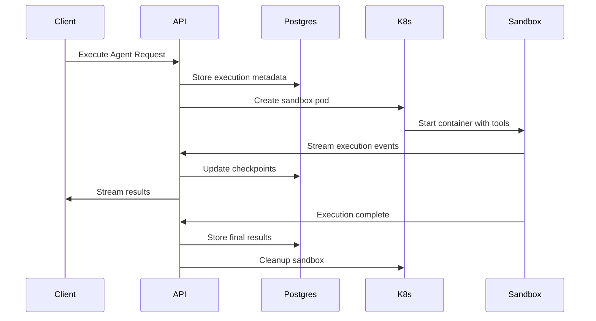
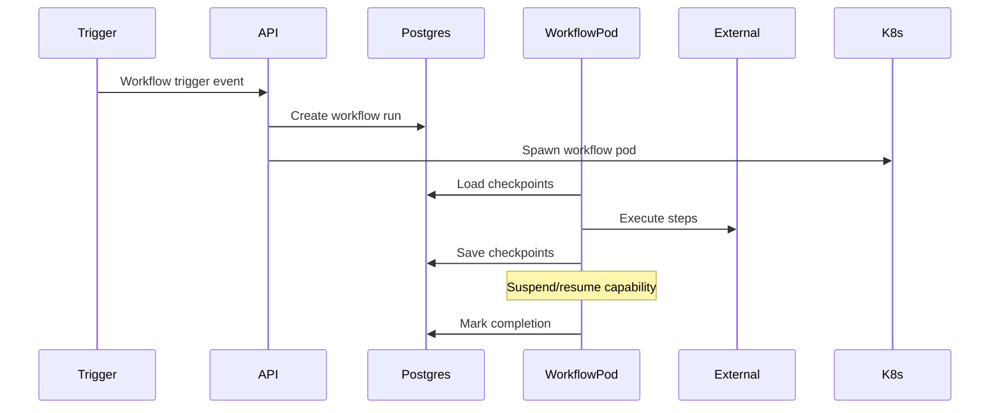
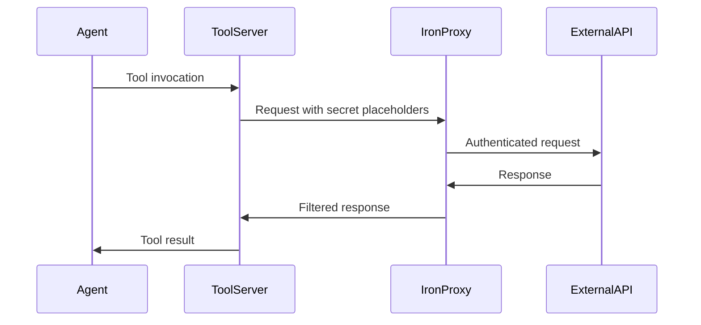

# Centaur Architecture Documentation

## System Overview

Centaur is an AI-first platform that orchestrates intelligent agent executions across a rich ecosystem of tools and services. The platform provides a comprehensive framework for building, deploying, and managing AI agents that can interact with external systems, perform complex workflows, and deliver results through multiple channels including Slack, APIs, and web interfaces.

The architecture follows a **distributed microservice pattern** with **container orchestration**, **event-driven workflows**, and **tool composition** at its core. The system is designed for scalability, reliability, and extensibility, enabling rapid development and deployment of AI-powered tools and agents.

## Core Architecture Principles

1. **Tool Composability**: Individual tools are self-contained, discoverable packages that can be combined into complex workflows
2. **Sandboxed Execution**: All agent execution happens in isolated Kubernetes containers with security policies
3. **Event-Driven Coordination**: Components communicate through events, webhooks, and streaming protocols
4. **Durable State Management**: Execution state persists across failures through checkpointing and replay mechanisms
5. **Multi-Channel Delivery**: Results are delivered through multiple interfaces (Slack, API, web) based on context

## System Components

### Core Platform Services

#### 1. Centaur API (`centaur-api`)
**Role**: Central orchestration hub and control plane for the entire system.

**Key Responsibilities**:
- Agent execution orchestration and session management
- Kubernetes-based sandbox lifecycle management  
- Workflow engine with checkpoint-replay semantics
- Tool discovery and REST API generation
- Real-time streaming via Server-Sent Events
- Integration with external systems (Slack, Linear, Google Workspace)

**Architecture Pattern**: Layered microservice with control-plane orchestration

**Key Technologies**: FastAPI, PostgreSQL, Kubernetes, AsyncPG, OpenTelemetry

**API Endpoints**:
- `/agent/execute` - Execute agents with streaming responses
- `/agent/spawn` - Create new agent sessions
- `/workflows/runs` - Workflow execution management
- `/tools/{tool_name}` - Dynamic tool execution
- `/attachments` - File upload/download management

#### 2. Slackbot Service (`slackbot`)
**Role**: Bridge between Slack workspace events and the Centaur platform.

**Key Responsibilities**:
- Slack event normalization and processing
- Real-time agent session streaming in Slack
- Final delivery polling and result distribution
- User interaction management and session state
- Linear integration for user feedback

**Architecture Pattern**: Event-driven gateway with webhook processing

**Key Technologies**: TypeScript, Hono, Slack Web API, OpenTelemetry

**Integration Flows**:
- Webhook events → Normalization → Centaur workflow triggering
- Agent sessions → Real-time Slack message streaming
- Background polling → Final result delivery

#### 3. Centaur SDK (`centaur-sdk`)
**Role**: Foundational library for tool development and runtime integration.

**Key Responsibilities**:
- Secret management with pluggable backends
- Tool context and thread-safe execution state
- Attachment handling and file operations
- Structured logging and CLI utilities
- Security isolation between CLI and server modes

**Architecture Pattern**: Layered library with pluggable backends

**Key Features**:
- Server mode: Stub backend for firewall secret injection
- CLI mode: Environment variable backend
- Context management via Python contextvars
- Rich table rendering for CLI tools

### Tool Ecosystem

The Centaur ecosystem includes **72 specialized tools** organized across functional domains:

#### Business & CRM Tools (3 tools)
- **Ashby**: ATS for candidate and job management
- **Attio**: CRM for objects, records, and tasks
- **Pylon**: Support issue and account management

#### Communication Tools (2 tools)  
- **Telegram**: Message sending and chat context gathering
- **Twitter**: Profile analysis, tweet search, and follower data

#### Crypto & DeFi Tools (20 tools)
- **Blockchain Data**: Alchemy, Etherscan, Nansen for on-chain analytics
- **Market Data**: CoinGecko, CoinMetrics, Messari for price and metrics
- **DeFi Analytics**: DefiLlama, DeBank, Token Terminal for protocol data
- **Prediction Markets**: Polymarket, Kalshi for event-based trading
- **Governance**: Snapshot, Tally, Karma for DAO operations
- **News & Research**: CoinDesk, The Block for industry updates

#### Infrastructure & Monitoring Tools (11 tools)
- **Observability**: Grafana, Sentry, VictoriaMetrics/Logs for monitoring
- **Cloud Services**: CloudWatch, PostHog for AWS and product analytics
- **Performance Analysis**: Profslice, Reth tools for system optimization
- **Chart Generation**: Matplotlib-based visualization for Slack

#### Media & Content Tools (4 tools)
- **Generation**: Nano Banana (Gemini images), Veo3 (video)
- **Processing**: Transcriber (Whisper-based), general media tools

#### Productivity Tools (10 tools)
- **Data Management**: Airtable, Company Context (search), Notion
- **Google Workspace**: Gmail, Calendar, Drive, Docs, Sheets, Analytics
- **Development**: Linear (issues), Slack (messaging), Figma (design)
- **Meetings**: Granola (note-taking), OpenTable (reservations)
- **Integration**: Composio (1000+ service connector)

#### Research & Intelligence Tools (22 tools)
- **Web Research**: Websearch (Parallel-powered), Google News RSS
- **Business Intelligence**: Crunchbase, Harmonic.AI, SimilarWeb
- **Government Data**: Congress.gov, Federal Register, OpenFEC
- **Academic & Media**: Listen Notes (podcasts), YouTube API
- **Document Processing**: DocSend downloader, Investment memos
- **Mobile Analytics**: SensorTower for app market intelligence

### Documentation & Frontend

#### Centaur Docs (`centaur-docs`)
**Role**: Developer-facing documentation and API reference.

**Key Technologies**: React 19, Vocs documentation framework, Waku

**Content Areas**:
- Tool usage guides and API references
- Architecture documentation and best practices
- Integration guides for external systems

## Data Architecture

### Primary Data Store: PostgreSQL
**Role**: Central persistence layer with advanced extensions.

**Key Features**:
- **pgVector**: Vector similarity search for embeddings
- **ParadeDB**: BM25 full-text search for document indexing
- **AsyncPG**: High-performance async connection pooling

**Schema Areas**:
- Agent execution state and session metadata
- Workflow checkpoints and replay logs
- Tool definitions and configuration
- User sessions and interaction history
- Document index for company context

### Data Flows

#### Agent Execution Data Flow

#### Workflow Orchestration Data Flow

#### Tool Execution Security Flow

## Technology Stack

### Core Technologies
- **Languages**: Python (backend), TypeScript (frontend/slackbot)
- **Web Frameworks**: FastAPI (API), Hono (Slackbot), React (Docs)
- **Database**: PostgreSQL with pgVector and ParadeDB extensions
- **Orchestration**: Kubernetes for container management
- **Observability**: OpenTelemetry, Grafana, VictoriaMetrics
- **AI Integration**: Anthropic Claude, OpenAI GPT models

### Development & Deployment
- **Package Management**: Python pyproject.toml, Node.js package.json
- **Runtime**: Bun for TypeScript services
- **Testing**: Pytest (Python), custom frameworks (TypeScript)
- **Code Quality**: Ruff (Python), Oxlint/Oxfmt (TypeScript)
- **Documentation**: Vocs framework with React components

### Security & Networking
- **Secret Management**: Iron-proxy for secure external connectivity
- **Network Policies**: Kubernetes-native security boundaries
- **Authentication**: OAuth2, HMAC, AWS SigV4 across integrations
- **Isolation**: Container-based sandboxing with security policies

## External System Integrations

### AI & ML Platforms
- **Anthropic Claude**: Primary LLM for agent reasoning and synthesis
- **OpenAI**: GPT models and Codex for specialized tasks
- **Google GenAI**: Gemini for image/video generation capabilities

### Communication & Collaboration
- **Slack**: Primary user interface and notification channel
- **Linear**: Project management and issue tracking
- **Google Workspace**: Email, calendar, docs integration
- **Telegram**: Alternative messaging channel

### Data & Analytics
- **Blockchain Networks**: Ethereum via Alchemy, Etherscan
- **Financial Markets**: Multiple crypto/tradfi data providers
- **Web Search**: Parallel Web Systems for research capabilities
- **Government APIs**: Congress.gov, Federal Register, OpenFEC

### Infrastructure Services
- **AWS CloudWatch**: Logging and monitoring
- **Sentry**: Error tracking and alerting
- **PostHog**: Product analytics and user behavior
- **Various APIs**: 1000+ services via Composio integration

## Security Architecture

### Multi-Layer Security Model

#### 1. Container Isolation
- **Kubernetes Pods**: Each agent execution runs in isolated containers
- **Security Policies**: Network policies and resource constraints
- **Ephemeral Sandboxes**: Containers destroyed after execution

#### 2. Secret Management
- **Iron-Proxy**: Sidecar proxy handling secret injection and filtering
- **Pluggable Backends**: Different security models for CLI vs server
- **Credential Isolation**: Secrets never exposed directly to agent code

#### 3. Network Security  
- **Service Mesh**: Controlled communication between components
- **Authentication**: Multi-method auth (OAuth2, HMAC, AWS SigV4)
- **Request Filtering**: Proxy-based request/response filtering

#### 4. Data Protection
- **PII Redaction**: Automatic scrubbing of sensitive data in logs
- **Encryption**: TLS for all external communications
- **Access Controls**: Role-based access through Slack/Linear integration

## Scalability & Reliability

### Horizontal Scaling
- **Stateless Services**: API and Slackbot services can scale horizontally
- **Database Pooling**: Connection pooling with asyncpg for efficiency
- **Container Orchestration**: Kubernetes handles workload distribution

### Reliability Features
- **Checkpoint-Replay**: Durable execution state for failure recovery
- **Circuit Breakers**: Tenacity-based retry logic with exponential backoff
- **Health Checks**: Comprehensive monitoring and alerting
- **Graceful Degradation**: Fallback mechanisms across service boundaries

### Performance Optimization
- **Async/Await**: Non-blocking I/O throughout the stack
- **Streaming**: Real-time event streaming for immediate user feedback
- **Caching**: Strategic caching for frequently accessed data
- **Resource Management**: Kubernetes resource limits and requests

## Development Patterns

### Tool Development Lifecycle
1. **Tool Creation**: Independent Python packages with standardized structure
2. **Integration**: Automatic discovery and registration via tool manager
3. **Testing**: Isolated testing with mock backends and fixtures
4. **Deployment**: Containerized deployment with hot-reload capability
5. **Monitoring**: Built-in observability and error tracking

### Workflow Patterns
- **Event-Driven**: Workflows triggered by external events (Slack, webhooks)
- **Checkpoint-Replay**: Durable execution with recovery capabilities
- **Composition**: Complex workflows built from simple tool combinations
- **Streaming**: Real-time feedback and progress updates

### API Design Patterns
- **RESTful Services**: Consistent HTTP API design across services
- **OpenAPI**: Automatic schema generation and documentation
- **Streaming**: Server-Sent Events for real-time capabilities
- **Webhooks**: Event ingestion from external systems

## Monitoring & Observability

### Distributed Tracing
- **OpenTelemetry**: End-to-end request tracing across services
- **Span Correlation**: Request flow visibility across system boundaries
- **Performance Analysis**: Latency and bottleneck identification

### Metrics & Alerting
- **Custom Metrics**: Business logic and performance indicators
- **System Metrics**: Infrastructure health and resource usage
- **User Analytics**: Agent execution patterns and success rates

### Logging Strategy
- **Structured Logging**: JSON-formatted logs with consistent schemas
- **PII Protection**: Automatic redaction of sensitive information
- **Centralized Collection**: Log aggregation for analysis and debugging

## Future Architecture Considerations

### Planned Enhancements
- **Multi-Region**: Geographic distribution for latency optimization
- **Advanced Scheduling**: More sophisticated workflow orchestration
- **Plugin System**: Enhanced tool plugin architecture
- **Performance**: Further optimization of execution speed and resource usage

### Extensibility Points
- **Tool Ecosystem**: Continued expansion of specialized tools
- **Integration**: Additional external system connectors
- **AI Models**: Support for new LLM providers and capabilities
- **User Interfaces**: Additional channels beyond Slack and API

---

This architecture enables Centaur to serve as a comprehensive platform for AI agent development and deployment, with strong emphasis on security, scalability, and developer experience. The modular design allows for continuous evolution while maintaining system stability and performance.