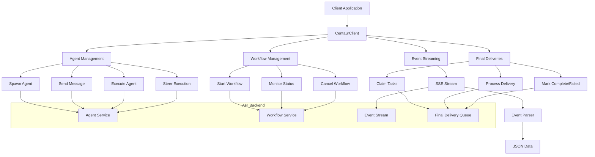

Now I have a comprehensive understanding of the codebase. Let me write the analysis based on my exploration:

# @centaur/api-client Analysis

The `@centaur/api-client` component is a TypeScript library that provides a comprehensive HTTP client for interacting with the Centaur AI platform's REST API. This library abstracts the complexity of API communication, offering type-safe interfaces for agent spawning, message handling, workflow execution, and real-time event streaming.

## Architecture

The component follows a **client-server architectural pattern** with a single main client class (`CentaurClient`) that encapsulates all HTTP interactions with the Centaur API. The design emphasizes type safety through comprehensive TypeScript interfaces and provides both synchronous REST operations and asynchronous streaming capabilities via Server-Sent Events (SSE).

## Key Components

### CentaurClient Class
- **Path**: `src/client.ts` (lines 117-419)
- **Description**: Main client class providing authenticated HTTP access to all Centaur API endpoints
- **Features**: Configurable timeouts, bearer token authentication, comprehensive error handling

### Agent Lifecycle Management
- **Spawn Operations**: Creates new agent instances with configurable harness and persona settings
- **Message Handling**: Supports both structured messages with content blocks and event-based communication
- **Execution Control**: Manages agent execution lifecycle including steering, cancellation, and status monitoring

### Workflow Management
- **Workflow Operations**: Complete CRUD operations for workflow runs including creation, listing, and cancellation
- **Child Workflow Support**: Hierarchical workflow management with parent-child relationships
- **Event-Driven Communication**: Workflow event publishing for external coordination

### Real-Time Event Streaming
- **Path**: `src/client.ts` (lines 247-293)
- **Description**: Server-Sent Events streaming with automatic JSON parsing and error recovery
- **Features**: Resumable streams via `afterEventId`, execution filtering, configurable polling intervals

### Final Delivery System
- **Lease-Based Processing**: Distributed task processing with consumer leasing mechanisms
- **Retry Logic**: Configurable retry policies with backoff and non-retryable error classification
- **Delivery Tracking**: Complete delivery lifecycle from claim to completion or failure

### Type Definitions
- **Path**: `src/client.ts` (lines 4-115), `src/types.ts`
- **Description**: Comprehensive TypeScript interfaces for all API operations and data structures
- **Coverage**: Input validation, response shapes, configuration options, and streaming events

## Data Flows



### Message Flow
1. **Client Request**: Application creates request options with thread keys and content
2. **Authentication**: Client adds bearer token and constructs HTTP request
3. **API Call**: Axios makes authenticated POST/GET request to appropriate endpoint
4. **Response Processing**: JSON response parsed into typed interfaces
5. **Error Handling**: Failed requests throw `AxiosError` wrapped as `ApiError`

### Event Streaming Flow
1. **Stream Initialization**: Client creates SSE connection with resume parameters
2. **Event Processing**: Raw SSE events parsed through `EventSourceParserStream`
3. **Data Transformation**: JSON parsing with fallback to raw data for malformed events
4. **Event Delivery**: Typed `StreamEvent` objects yielded to consuming application

## External Dependencies

### External Libraries

- **axios** (^1.13.6) [networking]: HTTP client library providing the core request/response functionality with interceptors, timeouts, and automatic JSON handling. Used throughout `CentaurClient` as the primary HTTP transport layer. Imported in: `src/client.ts`, `src/types.ts`.

- **eventsource-parser** (^3.0.6) [streaming]: Server-Sent Events parsing library that converts raw SSE streams into structured events. Provides `EventSourceParserStream` for processing real-time event streams from the Centaur API. Imported in: `src/client.ts` line 1.

### Development Dependencies

- **typescript** (5.9.3) [build-tool]: TypeScript compiler providing static type checking and transpilation. Enables the comprehensive type safety throughout the library.

- **vitest** (^4.1.0) [testing]: Modern testing framework providing unit test execution, mocking capabilities, and test coverage. Used for comprehensive client behavior testing including SSE stream processing and URL encoding.

## Internal Dependencies

### @centaur/harness-events
The dependency on `@centaur/harness-events` is declared in `package.json` but **not actively used** in the current codebase. No imports or direct usage patterns were found. This suggests either:
1. The dependency is planned for future integration with event normalization
2. It's a legacy dependency that should be removed
3. It's used indirectly through type definitions or build processes

The client currently handles raw event data through the `StreamEvent` interface without leveraging the harness event normalization capabilities.

## API Surface

### Public Exports
- **CentaurClient**: Main client class for API interaction
- **ApiError**: Re-exported `AxiosError` for standardized error handling
- **Type Definitions**: Comprehensive interfaces for all operations including `ExecuteOptions`, `MessageOptions`, `WorkflowRunOptions`, `ThreadMessageRecord`

### Authentication
All requests use Bearer token authentication configured during client instantiation. The auth header is consistently applied through Axios defaults.

### Core Operations

#### Agent Management
- `spawn(opts)`: Create new agent instances with harness/persona configuration
- `message(opts)`: Send structured messages or events to agent threads  
- `execute(opts)`: Trigger agent execution with platform-specific delivery options
- `steerExecution(id, opts)`: Modify running executions with replacement content

#### Workflow Operations
- `startWorkflowRun(opts)`: Initiate workflow execution with input parameters
- `getWorkflowRun(id)`: Retrieve workflow status and output
- `listWorkflowRuns(opts)`: Query workflows with filtering options
- `cancelWorkflowRun(id)`: Terminate running workflows

#### Streaming & Monitoring
- `streamEvents(opts)`: Real-time SSE stream of thread events with resume capability
- `getExecution(id)`: Retrieve execution status and results
- `listExecutions(threadKey)`: Get execution history for threads

#### Final Delivery Processing  
- `claimFinalDeliveries(opts)`: Lease-based task claiming for distributed processing
- `renewFinalDeliveryLease(id, opts)`: Extend processing lease duration
- `markFinalDelivered(id)`: Mark successful delivery completion
- `markFinalFailed(id, error, opts)`: Report delivery failures with retry policies

## Analysis Data

```json
{
  "summary": "A TypeScript HTTP client library providing type-safe access to the Centaur AI platform API, featuring agent lifecycle management, workflow execution, real-time event streaming, and distributed task processing with comprehensive error handling and authentication.",
  "architecture_pattern": "client-server",
  "key_modules": [
    {"name": "CentaurClient", "path": "src/client.ts", "description": "Main HTTP client class with authentication and request handling"},
    {"name": "TypeDefinitions", "path": "src/client.ts", "description": "Comprehensive TypeScript interfaces for API operations"},
    {"name": "StreamEvents", "path": "src/client.ts", "description": "Real-time event streaming via Server-Sent Events"},
    {"name": "AgentOperations", "path": "src/client.ts", "description": "Agent spawning, messaging, and execution management"},
    {"name": "WorkflowManagement", "path": "src/client.ts", "description": "Workflow lifecycle and hierarchy management"},
    {"name": "FinalDeliveries", "path": "src/client.ts", "description": "Distributed task processing with lease-based coordination"}
  ],
  "api_endpoints": [
    {"path": "/agent/spawn", "method": "POST", "description": "Create new agent instances"},
    {"path": "/agent/message", "method": "POST", "description": "Send messages to agent threads"},
    {"path": "/agent/execute", "method": "POST", "description": "Trigger agent execution"},
    {"path": "/agent/threads/{thread}/events", "method": "GET", "description": "Stream real-time thread events"},
    {"path": "/workflows/runs", "method": "POST", "description": "Start workflow execution"},
    {"path": "/workflows/runs/{id}", "method": "GET", "description": "Get workflow status"},
    {"path": "/agent/final-deliveries/claim", "method": "POST", "description": "Claim delivery tasks"}
  ],
  "data_flows": [
    {"name": "Agent Execution", "steps": ["Spawn Agent", "Send Message", "Execute", "Monitor via Events", "Handle Final Delivery"]},
    {"name": "Workflow Processing", "steps": ["Start Workflow", "Monitor Status", "Handle Child Workflows", "Process Completion"]},
    {"name": "Event Streaming", "steps": ["Connect SSE Stream", "Parse Events", "Transform JSON", "Yield to Consumer"]}
  ],
  "tech_stack": ["typescript", "axios", "eventsource-parser", "vitest"],
  "external_integrations": [
    {"service": "centaur-api", "category": "api", "description": "Primary Centaur platform REST API"},
    {"service": "sse-events", "category": "streaming", "description": "Real-time event streaming endpoint"}
  ],
  "component_interactions": [
    {"target": "@centaur/harness-events", "type": "depends-on", "protocol": "import", "description": "Declared dependency but not actively used in current implementation"}
  ]
}
```

## Citations

```json
[
  {
    "file_path": "packages/api-client/package.json",
    "start_line": 1,
    "end_line": 20,
    "claim": "Component is a TypeScript library with dependencies on axios, eventsource-parser, and @centaur/harness-events",
    "section": "External Dependencies"
  },
  {
    "file_path": "packages/api-client/src/index.ts",
    "start_line": 1,
    "end_line": 10,
    "claim": "Public API surface exports CentaurClient class, ApiError, and comprehensive type definitions",
    "section": "API Surface"
  },
  {
    "file_path": "packages/api-client/src/client.ts",
    "start_line": 117,
    "end_line": 133,
    "claim": "CentaurClient class provides authenticated HTTP access with configurable timeouts and bearer token authentication",
    "section": "Key Components"
  },
  {
    "file_path": "packages/api-client/src/client.ts",
    "start_line": 140,
    "end_line": 150,
    "claim": "Agent spawning functionality with harness and persona configuration options",
    "section": "Key Components"
  },
  {
    "file_path": "packages/api-client/src/client.ts",
    "start_line": 152,
    "end_line": 170,
    "claim": "Message handling supports both structured messages and event-based communication",
    "section": "Key Components"
  },
  {
    "file_path": "packages/api-client/src/client.ts",
    "start_line": 186,
    "end_line": 196,
    "claim": "Workflow management with comprehensive run options and timeout configuration",
    "section": "Key Components"
  },
  {
    "file_path": "packages/api-client/src/client.ts",
    "start_line": 247,
    "end_line": 293,
    "claim": "Real-time event streaming implementation using Server-Sent Events with resume capability and JSON parsing",
    "section": "Key Components"
  },
  {
    "file_path": "packages/api-client/src/client.ts",
    "start_line": 363,
    "end_line": 413,
    "claim": "Final delivery system with lease-based processing and retry logic",
    "section": "Key Components"
  },
  {
    "file_path": "packages/api-client/src/client.ts",
    "start_line": 1,
    "end_line": 2,
    "claim": "Dependencies on eventsource-parser for SSE streaming and axios for HTTP requests",
    "section": "External Dependencies"
  },
  {
    "file_path": "packages/api-client/src/types.ts",
    "start_line": 1,
    "end_line": 2,
    "claim": "ApiError is re-exported from axios AxiosError for standardized error handling",
    "section": "API Surface"
  },
  {
    "file_path": "packages/api-client/src/client.ts",
    "start_line": 4,
    "end_line": 115,
    "claim": "Comprehensive TypeScript interfaces define all API operation parameters and response shapes",
    "section": "Type Definitions"
  },
  {
    "file_path": "packages/api-client/test/client.test.ts",
    "start_line": 35,
    "end_line": 69,
    "claim": "SSE parsing handles event IDs, JSON data, [DONE] markers, and invalid JSON with fallback",
    "section": "Data Flows"
  },
  {
    "file_path": "packages/api-client/test/client.test.ts",
    "start_line": 71,
    "end_line": 96,
    "claim": "URL encoding properly handles complex thread keys like Slack identifiers in streaming endpoints",
    "section": "API Surface"
  },
  {
    "file_path": "packages/api-client/test/client.test.ts",
    "start_line": 144,
    "end_line": 171,
    "claim": "Execution steering supports content replacement with metadata merging and delivery suppression",
    "section": "Key Components"
  },
  {
    "file_path": "packages/api-client/test/client.test.ts",
    "start_line": 173,
    "end_line": 232,
    "claim": "Final delivery operations include claiming, lease renewal, completion marking, and failure reporting with retry policies",
    "section": "Key Components"
  }
]
```