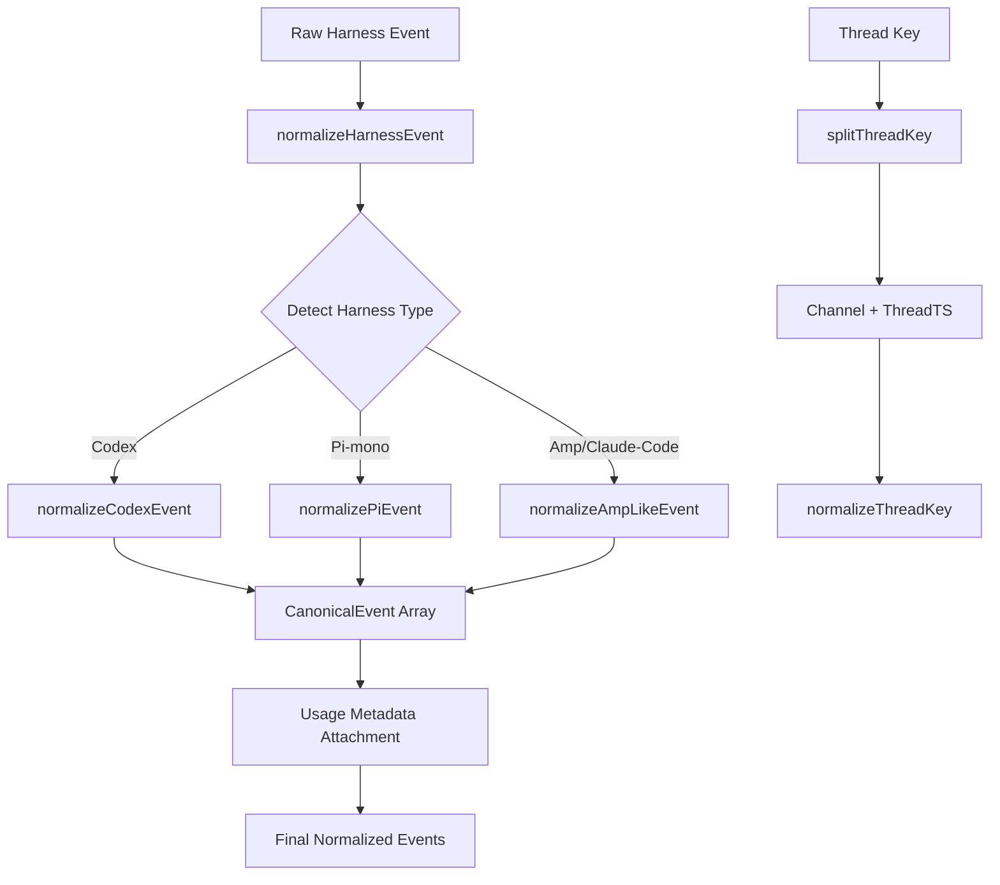
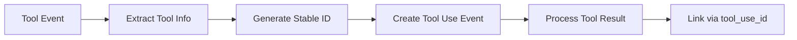

# @centaur/harness-events Analysis

## Overview

The `@centaur/harness-events` component is a TypeScript library that normalizes event data from different AI harness systems into a unified canonical format. This library acts as an adapter layer, converting disparate event structures from various harness implementations (Amp/Claude-Code, Codex, and Pi-mono) into standardized event shapes that can be consumed by the thread UI stream mapper and other downstream components.

## Architecture

The library follows a **translator/adapter pattern** with separate normalization functions for each supported harness type. The main architecture consists of:

1. **Type Definitions**: Canonical event types and content blocks
2. **Parse Utilities**: Safe type conversion functions
3. **Normalization Engine**: Harness-specific event translators
4. **Thread Key Management**: Utilities for parsing thread identifiers
5. **Main Dispatcher**: Routes events to appropriate normalizers

The design prioritizes **type safety** and **defensive parsing**, handling malformed or unexpected input gracefully while producing consistent output shapes.

## Key Components

### Core Normalizer (`normalize.ts`)
The central normalization engine containing harness-specific translators:
- **Amp/Claude-Code Normalizer**: Handles events from Amp and Claude-Code harnesses
- **Codex Normalizer**: Processes Codex-specific event formats with passthrough types
- **Pi-mono Normalizer**: Converts Pi-mono harness events
- **Usage Metadata Attachment**: Adds token usage information to events

### Type System (`types.ts`)
Defines the canonical event structure with discriminated unions:
- **ContentBlock**: Text, tool use, and tool result content types
- **CanonicalEvent**: Union of all supported event types (assistant, tool, reasoning, etc.)
- **SubagentActivity**: Structured representation of subagent actions

### Parse Utilities (`parse-utils.ts`)
Type-safe conversion functions that handle undefined/null inputs gracefully:
- **asString**: Converts unknown values to strings
- **asRecord**: Safely extracts object properties
- **asList**: Converts to arrays with fallbacks
- **asNumber/asBoolean**: Safe numeric/boolean conversion

### Thread Key Management (`thread-key.ts`)
Utilities for parsing and normalizing thread identifiers:
- **splitThreadKey**: Extracts channel and thread timestamp
- **normalizeThreadKey**: Standardizes thread key format

### Entry Point (`index.ts`)
Exports the public API surface for external consumption.

## Data Flows



The main data flow follows this pattern:

1. **Event Reception**: Raw JSON events from various harness systems
2. **Harness Detection**: Automatic detection based on event type patterns
3. **Normalization**: Harness-specific transformation to canonical format  
4. **Metadata Enhancement**: Addition of usage/model information where available
5. **Output**: Array of normalized canonical events

### Tool Call Processing Flow



## External Dependencies

### External Libraries

- **typescript** (5.9.3) [build-tool]: TypeScript compiler for type checking and compilation. Used for the `typecheck` script via `tsc --noEmit`. This is a dev dependency only, not used at runtime.

The library has minimal external dependencies, using only Node.js built-in modules:
- **crypto** (Node.js built-in) [crypto]: Used in `normalize.ts` for SHA-1 hashing to generate stable tool call IDs. Imported dynamically via `require('crypto')` at line 97.

## API Surface

### Public Exports

The library exposes the following public interface:

#### Functions
- **normalizeHarnessEvent(harness: string, event: Record<string, unknown>): CanonicalEvent[]**: Main normalization function that converts raw harness events to canonical format
- **asString(value: unknown): string**: Safe string conversion utility
- **asRecord(value: unknown): Record<string, unknown>**: Safe object conversion utility  
- **asList(value: unknown): T[]**: Safe array conversion utility
- **asNumber(value: unknown): number | null**: Safe numeric conversion utility
- **asBoolean(value: unknown): boolean | null**: Safe boolean conversion utility
- **splitThreadKey(threadKey: string): {channel: string, threadTs: string}**: Parse thread key components
- **normalizeThreadKey(threadKey: string): string**: Normalize thread key format

#### Types
- **CanonicalEvent**: Union type representing all supported normalized event shapes
- **ContentBlock**: Union type for message content (text, tool_use, tool_result)
- **SubagentActivity**: Structure for subagent activity descriptions

### Event Type Support

The library supports normalization of these canonical event types:

- **assistant**: Assistant messages with content blocks and usage metadata
- **tool**: Tool execution results linked to tool calls  
- **reasoning**: Internal reasoning/thinking text
- **command_execution**: Command execution with output and exit codes
- **file_change**: File modification events with change lists
- **subagent**: Subagent status updates (started/working/completed/failed)
- **result**: Final task results
- **error**: Error conditions and failures
- **system**: System-level events (session init, etc.)
- **usage**: Token usage metadata
- **Codex passthrough events**: Direct passthrough for Codex-specific event types

### Harness Support

The normalizer automatically detects and supports these harness types:

- **Codex**: Events with `item.*`, `turn.*`, `thread.started` patterns
- **Pi-mono**: Events like `session`, `agent_*`, `message_*`, `tool_execution_*`
- **Amp/Claude-Code**: Default fallback for other event patterns

## Analysis Data

```json
{
  "summary": "A TypeScript library that normalizes heterogeneous AI harness event formats into a unified canonical structure. Acts as an adapter layer converting events from Amp/Claude-Code, Codex, and Pi-mono harnesses into standardized shapes for consumption by thread UI components and other downstream systems.",
  "architecture_pattern": "adapter",
  "key_modules": [
    {"name": "normalize", "path": "src/normalize.ts", "description": "Main normalization engine with harness-specific event translators"},
    {"name": "types", "path": "src/types.ts", "description": "Canonical event type definitions and content block structures"},
    {"name": "parse-utils", "path": "src/parse-utils.ts", "description": "Type-safe utility functions for converting unknown values"},
    {"name": "thread-key", "path": "src/thread-key.ts", "description": "Thread identifier parsing and normalization utilities"},
    {"name": "index", "path": "src/index.ts", "description": "Public API exports and entry point"}
  ],
  "api_endpoints": [],
  "data_flows": [
    {"name": "Event Normalization", "steps": ["Raw event input", "Harness type detection", "Harness-specific transformation", "Usage metadata attachment", "Canonical event output"]},
    {"name": "Tool Call Processing", "steps": ["Tool event detection", "ID generation/extraction", "Tool use event creation", "Tool result linking"]}
  ],
  "tech_stack": ["typescript", "node.js"],
  "external_integrations": [],
  "component_interactions": []
}
```

## Citations

```json
[
  {
    "file_path": "packages/harness-events/package.json",
    "start_line": 1,
    "end_line": 12,
    "claim": "The component is a private TypeScript package with minimal dependencies",
    "section": "Overview"
  },
  {
    "file_path": "packages/harness-events/src/index.ts",
    "start_line": 1,
    "end_line": 4,
    "claim": "The library exports normalizeHarnessEvent function, canonical types, parse utilities, and thread key utilities",
    "section": "API Surface"
  },
  {
    "file_path": "packages/harness-events/src/types.ts",
    "start_line": 1,
    "end_line": 67,
    "claim": "Defines ContentBlock, SubagentActivity, and CanonicalEvent types with discriminated unions",
    "section": "Type System"
  },
  {
    "file_path": "packages/harness-events/src/normalize.ts",
    "start_line": 1,
    "end_line": 10,
    "claim": "The normalization module converts harness-specific JSON events into canonical thread events",
    "section": "Core Normalizer"
  },
  {
    "file_path": "packages/harness-events/src/normalize.ts",
    "start_line": 23,
    "end_line": 36,
    "claim": "Defines Codex passthrough event types that are forwarded without transformation",
    "section": "Codex Normalizer"
  },
  {
    "file_path": "packages/harness-events/src/normalize.ts",
    "start_line": 63,
    "end_line": 73,
    "claim": "Generates stable tool call IDs using SHA-1 hashing for consistent identification",
    "section": "Tool Call Processing"
  },
  {
    "file_path": "packages/harness-events/src/normalize.ts",
    "start_line": 95,
    "end_line": 99,
    "claim": "Uses Node.js crypto module for SHA-1 hashing functionality",
    "section": "External Dependencies"
  },
  {
    "file_path": "packages/harness-events/src/normalize.ts",
    "start_line": 844,
    "end_line": 883,
    "claim": "Main dispatcher function detects harness type and routes to appropriate normalizer",
    "section": "Main Dispatcher"
  },
  {
    "file_path": "packages/harness-events/src/parse-utils.ts",
    "start_line": 1,
    "end_line": 25,
    "claim": "Provides type-safe conversion utilities for handling unknown input values",
    "section": "Parse Utilities"
  },
  {
    "file_path": "packages/harness-events/src/thread-key.ts",
    "start_line": 1,
    "end_line": 15,
    "claim": "Handles parsing and normalization of thread key identifiers",
    "section": "Thread Key Management"
  },
  {
    "file_path": "packages/harness-events/src/normalize.ts",
    "start_line": 257,
    "end_line": 462,
    "claim": "Amp/Claude-Code normalizer handles various event types including assistant, tool, subagent, and system events",
    "section": "Amp/Claude-Code Normalizer"
  },
  {
    "file_path": "packages/harness-events/src/normalize.ts",
    "start_line": 633,
    "end_line": 677,
    "claim": "Codex normalizer processes Codex-specific events and includes passthrough handling",
    "section": "Codex Normalizer"
  },
  {
    "file_path": "packages/harness-events/src/normalize.ts",
    "start_line": 711,
    "end_line": 838,
    "claim": "Pi-mono normalizer handles Pi-mono harness events including tool execution and message events",
    "section": "Pi-mono Normalizer"
  },
  {
    "file_path": "packages/harness-events/src/normalize.ts",
    "start_line": 206,
    "end_line": 251,
    "claim": "Usage metadata attachment function adds token usage information to canonical events",
    "section": "Usage Metadata Attachment"
  },
  {
    "file_path": "packages/harness-events/src/normalize.ts",
    "start_line": 850,
    "end_line": 873,
    "claim": "Harness type detection uses event type patterns to automatically identify the source harness",
    "section": "Harness Detection"
  }
]
```