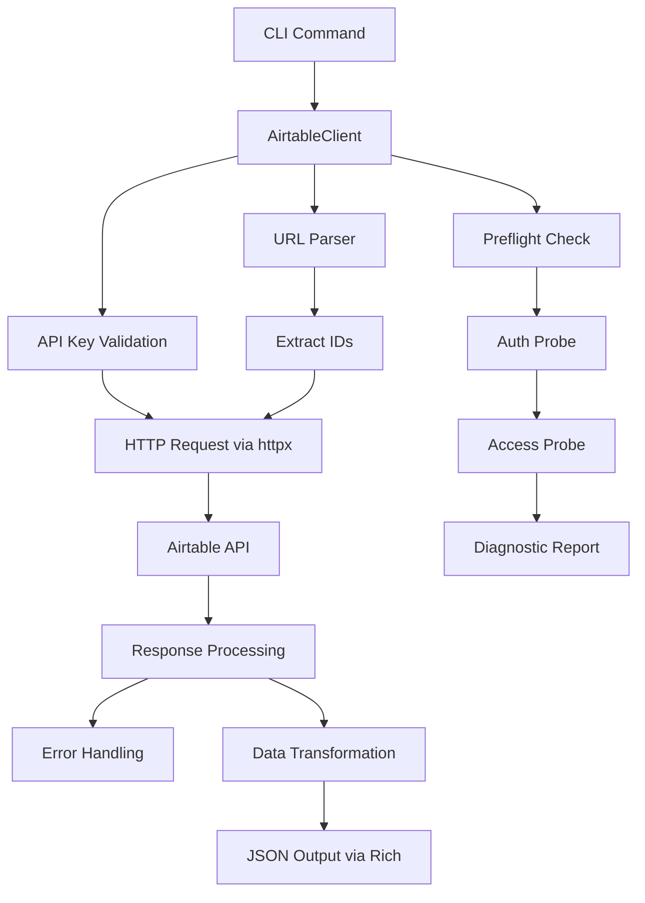

# Airtable API Client Component Analysis

## Architecture

The airtable component follows a **layered architecture** pattern with clear separation between the CLI interface layer, client abstraction layer, and underlying HTTP transport layer. The component is structured as a Python package with two main modules:

- **CLI Layer** (`cli.py`): Provides command-line interface using Typer for user interaction
- **Client Layer** (`client.py`): Implements the core Airtable API client with comprehensive error handling and data transformation
- **Test Layer** (`test_client.py`): Contains unit tests with HTTP mocking capabilities

The architecture emphasizes robust error handling, with dedicated functions for parsing API errors, validating authentication, and providing detailed diagnostic information through preflight checks.

## Key Components

### AirtableClient Class
The core client class that encapsulates all Airtable API interactions. It manages authentication via API keys, handles HTTP requests with proper error checking, and provides methods for accessing bases, schemas, tables, views, and records. The client supports both direct API calls and URL-based operations.

### CLI Application (app)
A Typer-based command-line interface that exposes four primary commands: `bases` (list visible bases), `schema` (get base schema), `records` (list records from tables/views), and `from_url` (snapshot from Airtable URLs). Each command uses Rich for formatted JSON output.

### Data Transformation Functions
A suite of utility functions including `_simplify_cell()` for cleaning Airtable attachment and collaborator data, `_compact_record()` for creating streamlined record representations, and `_match_text()` for implementing text search across nested data structures.

### Authentication & Error Handling System
Comprehensive authentication management including API key validation, token refresh mechanisms, and detailed error classification. The `preflight_access()` method provides extensive diagnostics for auth and permission issues before attempting data operations.

### URL Parser
The `parse_url()` method extracts base, table, view, page, and record IDs from Airtable URLs, enabling seamless integration with shared Airtable links in workflows.

### HTTP Transport Layer
Built on httpx with configurable timeouts, proper authorization headers, and structured error responses. Includes mock transport capabilities for testing without network dependencies.

## Data Flows

### Request Processing Flow
1. **CLI Input**: User invokes command with parameters (base ID, table name, etc.)
2. **Client Initialization**: AirtableClient loads API key from environment or 1Password
3. **Authentication**: Client validates API key and refreshes if needed
4. **Request Construction**: HTTP parameters are built with proper URL encoding
5. **API Communication**: httpx sends requests to Airtable's REST endpoints
6. **Response Processing**: JSON responses are parsed and transformed
7. **Output Formatting**: Rich console displays formatted results

### URL-Based Operations Flow
1. **URL Parsing**: Extract base, table, and view IDs from Airtable URLs
2. **Validation**: Ensure URL belongs to airtable.com domain
3. **API Translation**: Convert parsed IDs to appropriate API calls
4. **Data Retrieval**: Fetch records using standard API methods
5. **Snapshot Creation**: Transform records into tabular format with consistent column ordering

## External Dependencies

### Runtime Libraries

- **httpx** (>=0.27.0) [networking]: Modern HTTP client library providing async/sync request capabilities with connection pooling and timeout management. Used throughout `client.py` for all Airtable API communication via the `_client` instance and request methods.

- **typer** (>=0.12.0) [cli]: CLI framework built on Click that provides type hints, automatic help generation, and command grouping. Powers the entire CLI interface in `cli.py` including the `app` instance and all command decorators.

- **rich** (>=13.0.0) [cli]: Advanced terminal formatting library for colored output, progress bars, and structured data display. Used in `cli.py` via the `Console` class for JSON pretty-printing in the `_print()` function.

- **python-dotenv** (>=1.0.0) [configuration]: Environment variable management for loading `.env` files automatically. Imported in `cli.py` to enable local development with environment-based configuration.

### Development Dependencies

The component relies on the internal `centaur_sdk` for secret management, specifically the `secret()` function used in `client.py` for retrieving the AIRTABLE_API_KEY from 1Password or environment variables.

## API Surface

### CLI Commands

- **airtable bases** `[--limit N]`: Lists visible Airtable bases with optional result limiting
- **airtable schema** `<base_id>`: Retrieves complete schema for a base including tables, fields, and views
- **airtable records** `<base_id> <table> [--view VIEW] [--max-records N]`: Lists records from specified table or view
- **airtable from-url** `<url> [--max-records N]`: Creates snapshot from Airtable URL with automatic ID extraction

### Python API

The `AirtableClient` class provides programmatic access with methods including:

- **Authentication**: `whoami()`, `preflight_access()` for token validation and capability testing
- **Base Operations**: `list_bases()`, `find_bases()`, `schema()` for base-level metadata
- **Table Operations**: `list_tables()`, `find_tables()` for table discovery and schema retrieval  
- **Record Operations**: `list_records()`, `get_record()`, `search_records()` for data retrieval with filtering
- **URL Operations**: `parse_url()`, `records_from_url()`, `snapshot_from_url()` for URL-based workflows

### Configuration

The component expects the `AIRTABLE_API_KEY` environment variable or 1Password secret for authentication. The tool configuration in `pyproject.toml` specifies this as an HTTP secret that matches Authorization headers for api.airtable.com.

## External Systems

### Airtable REST API
The component integrates with Airtable's official REST API at `api.airtable.com/v0` for data operations and `api.airtable.com/v0/meta` for metadata operations. It handles rate limiting, authentication errors, and permission validation through comprehensive error checking.

### 1Password Integration
Authentication leverages the centaur SDK's secret management system to retrieve API keys from 1Password vaults, providing secure credential storage for production environments.

## Component Interactions

This component operates independently with no direct calls to other components in the centaur codebase. It serves as a standalone productivity tool that can be invoked by other systems or used directly by developers for Airtable data access and manipulation.
