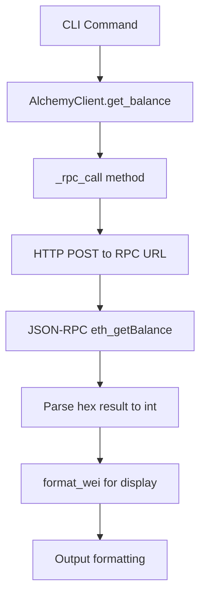
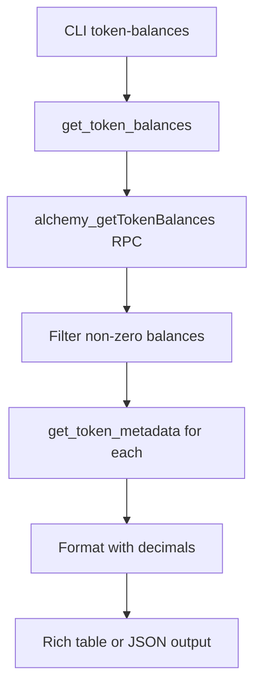
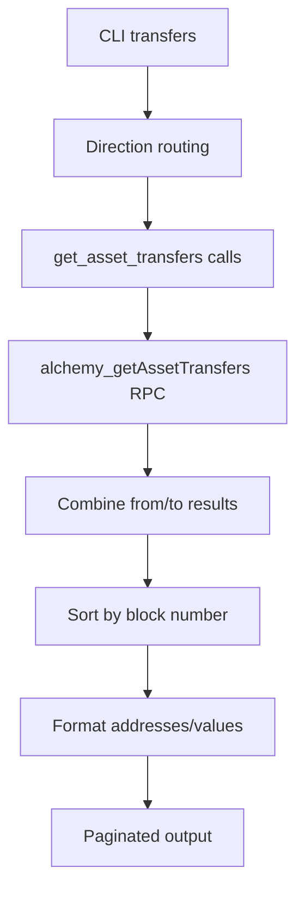

Now I'll analyze the data flows and create a comprehensive analysis.

# Alchemy Component Analysis

The Alchemy component is a Python library that provides both a programmatic client and a command-line interface for interacting with Alchemy's blockchain APIs. It enables querying blockchain data, token balances, transaction information, and token prices across multiple chains.

## Architecture

The component follows a **layered architecture** with clear separation between the API client logic and the CLI interface:

- **Client Layer** (`client.py`): Core `AlchemyClient` class that handles HTTP communication with Alchemy's JSON-RPC and Prices APIs
- **CLI Layer** (`cli.py`): Typer-based command-line interface that wraps client functionality with user-friendly commands
- **Configuration**: Environment-based API key management through the centaur-sdk secret system

The architecture supports multiple output formats (table, JSON, CSV, markdown) and provides consistent error handling across all operations.

## Key Components

### 1. AlchemyClient Class (`client.py`)
The main API client that manages HTTP connections to Alchemy's services. It maintains separate HTTP clients for RPC calls and Prices API calls, with proper resource management through context manager support.

### 2. Chain Support System (`client.py`)
A comprehensive mapping system supporting 17+ blockchain networks including Ethereum, Polygon, Arbitrum, Optimism, Base, Solana, and others. The `get_chain_url()` function normalizes chain names to Alchemy's URL format.

### 3. RPC Methods (`client.py`)
Implements standard Ethereum JSON-RPC methods including:
- Balance queries (`eth_getBalance`)
- Token operations (`alchemy_getTokenBalances`, `alchemy_getTokenMetadata`)
- Transfer tracking (`alchemy_getAssetTransfers`)
- Transaction details (`eth_getTransactionByHash`, `eth_getTransactionReceipt`)
- Network status (`eth_blockNumber`, `eth_gasPrice`)

### 4. Prices API Integration (`client.py`)
Dedicated client for Alchemy's Prices API with support for:
- Symbol-based price lookups
- Address-based price queries
- Historical price data retrieval

### 5. CLI Command System (`cli.py`)
Typer-based CLI with 10 main commands organized around common blockchain use cases:
- Account queries (`balance`, `token-balances`)
- Token information (`token-metadata`, `price`, `price-address`)
- Transaction analysis (`transfers`, `tx`)
- Network status (`chains`, `block-number`, `gas-price`)

### 6. Output Formatting (`cli.py`)
Unified formatting system supporting table (Rich), JSON, CSV, and markdown output formats with consistent data presentation across all commands.

### 7. Utility Functions (`client.py`)
Helper functions for blockchain data formatting:
- `format_wei()`: Converts wei amounts to human-readable format
- `format_gwei()`: Formats gas prices in gwei

## Data Flows

### 1. Balance Query Flow


### 2. Token Balances Flow


### 3. Price Query Flow
```mermaid
graph TD
    A[CLI price command] --> B[AlchemyClient.get_prices_by_symbol]
    B --> C[HTTP GET to Prices API]
    C --> D[/tokens/by-symbol endpoint]
    D --> E[Parse price data]
    E --> F[Format currency values]
    F --> G[Output with timestamps]
```

### 4. Transfer Analysis Flow


## Dependencies

### External Libraries

- **httpx** (>=0.27.0) [networking]: Modern HTTP client for making API requests to Alchemy's RPC and Prices endpoints. Used for all blockchain data queries with proper async support and connection pooling. Imported in: `client.py`.

- **typer** (>=0.12.0) [cli]: Framework for building the command-line interface with automatic help generation, type hints, and argument parsing. Provides all CLI commands and option handling. Imported in: `cli.py`.

- **rich** (>=13.0.0) [cli]: Terminal formatting library for colorized output, tables, and progress indicators. Used for all non-JSON output formatting including balance displays and transfer tables. Imported in: `cli.py` via Console and Table classes.

- **centaur_sdk** [internal-sdk]: Centaur framework SDK providing the `secret()` function for secure API key management from environment variables. Used for ALCHEMY_API_KEY retrieval. Imported in: `client.py`.

## API Surface

### Public Client Interface

The `AlchemyClient` class exposes the following public methods:

**Account & Balance Methods:**
- `get_balance(address, chain=None) -> int`: Native token balance in wei
- `get_token_balances(address, token_addresses=None, chain=None) -> dict`: ERC-20 token balances
- `get_token_metadata(token_address, chain=None) -> dict`: Token name, symbol, decimals

**Transaction Methods:**
- `get_asset_transfers(from_address=None, to_address=None, ...) -> dict`: Historical transfers
- `get_transaction(tx_hash, chain=None) -> dict`: Transaction details
- `get_transaction_receipt(tx_hash, chain=None) -> dict`: Transaction receipt

**Network Methods:**
- `get_block_number(chain=None) -> int`: Current block height
- `get_gas_price(chain=None) -> int`: Current gas price in wei
- `get_logs(address=None, topics=None, ...) -> list[dict]`: Event logs

**Prices Methods:**
- `get_prices_by_symbol(symbols) -> dict`: Current token prices by symbol
- `get_prices_by_address(addresses) -> dict`: Prices by contract address
- `get_historical_prices(symbol=None, address=None, ...) -> dict`: Historical price data

### CLI Commands

**Account Commands:**
- `alchemy balance <address>`: Native token balance
- `alchemy token-balances <address>`: ERC-20 token holdings
- `alchemy token-metadata <address>`: Token information

**Transaction Commands:**
- `alchemy transfers <address>`: Transfer history
- `alchemy tx <hash>`: Transaction details

**Network Commands:**
- `alchemy chains`: List supported chains
- `alchemy block-number`: Current block height
- `alchemy gas-price`: Current gas cost

**Price Commands:**
- `alchemy price <symbols>`: Token prices by symbol
- `alchemy price-address <address>`: Price by contract address

All CLI commands support `--chain`, `--output` (table/json/csv), and `--markdown` options.

### Utility Functions

- `format_wei(wei, decimals=18) -> str`: Convert wei amounts to readable format
- `format_gwei(wei) -> str`: Convert wei to gwei for gas prices
- `get_chain_url(chain) -> str`: Normalize chain names to Alchemy URL format
