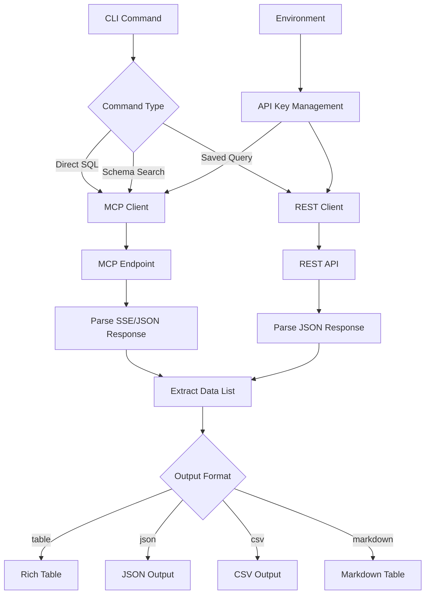
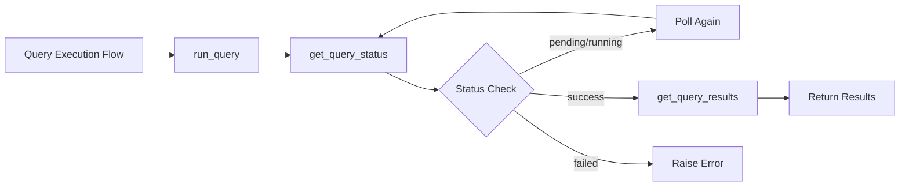

# Allium Component Analysis

The allium component is a comprehensive command-line interface (CLI) tool for Allium on-chain analytics, focusing on stablecoin analysis, prediction markets, and Hyperliquid DEX data. It provides both direct SQL execution capabilities and pre-built analytical commands for blockchain data exploration.

## Architecture

The component follows a modular CLI architecture with three main layers:

- **CLI Layer** (`cli.py`): Command definitions using Typer framework with rich output formatting
- **Client Layer** (`client.py`): HTTP client for Allium API interactions with both REST and MCP (Model Context Protocol) endpoints
- **Configuration Layer**: Environment-based API key management integrated with centaur_sdk

The architecture implements a context manager pattern for HTTP client lifecycle management and supports both synchronous and asynchronous query execution patterns.

## Key Components

### CLI Command Router (`cli.py`)
The main CLI application built on Typer, providing 23 commands organized into categories: general analytics, stablecoin analysis, and Hyperliquid-specific queries. Commands support multiple output formats (table, JSON, CSV, markdown) with rich console formatting.

### Allium API Client (`client.py`)
A comprehensive HTTP client that interfaces with two Allium endpoints:
- **REST API** (`api.allium.so`): For saved query management and status tracking
- **MCP Endpoint** (`mcp.allium.so`): For direct SQL execution and schema operations

The client handles both JSON-RPC and Server-Sent Events (SSE) responses, with intelligent response parsing and error handling.

### Query Management System
Supports both direct SQL execution and saved query workflows:
- **Direct SQL**: Immediate execution via MCP endpoint
- **Saved Queries**: Async execution with polling for results
- **Pre-built Templates**: Seven analytical query templates for stablecoin analysis

### Output Formatting Engine
Multi-format output system supporting:
- **Rich Tables**: Interactive console tables with styling
- **JSON/CSV Export**: Machine-readable formats
- **Markdown Tables**: Documentation-friendly output

### Hyperliquid Integration
Specialized command set for Hyperliquid DEX analytics including trades, volume, orders, funding rates, and builder metrics with predefined table mappings and optimized queries.

## Data Flows

## External Dependencies

### External Libraries

- **httpx** (>=0.27.0) [networking]: Modern async-capable HTTP client used for API communication with Allium endpoints. Handles both REST and MCP protocol interactions. Imported in: `tools/crypto/allium/client.py`.

- **typer** (>=0.12.0) [cli]: CLI framework providing command parsing, argument validation, and help generation. Powers all 23 CLI commands with type hints and automatic documentation. Imported in: `tools/crypto/allium/cli.py`.

- **rich** (>=13.0.0) [cli]: Terminal formatting library providing styled tables, progress indicators, and colored output. Used for all interactive console output and table rendering. Imported in: `tools/crypto/allium/cli.py`.

- **python-dotenv** (>=1.0.0) [configuration]: Environment variable loader for development configuration. Loads `.env` files for API key management during development. Imported in: `tools/crypto/allium/cli.py`.

## API Surface

The component exposes a comprehensive CLI interface through the `allium` command with the following primary categories:

### Core Analytics Commands
- `sql <query>`: Execute arbitrary SQL against Allium database
- `search-schemas <query>`: Semantic search for relevant tables
- `describe <table>`: Get table schema and metadata
- `check-freshness [tables]`: Check data freshness for prediction/hyperliquid tables

### Query Management Commands  
- `query <id> [--params]`: Execute saved queries with optional parameters
- `status <run_id>`: Check async query execution status
- `results <run_id>`: Retrieve completed query results

### Stablecoin Analysis Commands
- `stablecoin-volume --query-id <id>`: Analyze stablecoin transfer volumes
- `top-contracts <chain> --query-id <id>`: Find top contracts by stablecoin volume
- `sql-examples [name]`: Display pre-built analytical query templates
- `tables`: List key Allium tables for stablecoin analysis

### Hyperliquid DEX Commands
- `hl-trades`: Query DEX trades with filtering options
- `hl-volume`: Aggregate trading volume by coin
- `hl-orders`: Order book data and status tracking
- `hl-metrics`: Daily overview metrics (transactions, users, TVL)
- `hl-funding`: Perpetual funding rates and open interest
- `hl-builders`: Builder fee analysis and activity metrics
- `hl-tables`: List available Hyperliquid data tables

### Utility Commands
- `raw <method> <endpoint>`: Make direct API calls for debugging
- Global flags: `--output (table|json|csv)`, `--markdown`, `--limit`

## External Systems

The component integrates with the following external systems at runtime:

- **Allium Analytics Platform**: Primary blockchain data provider via REST API (`api.allium.so`) for query management and MCP endpoint (`mcp.allium.so`) for direct SQL execution
- **Centaur SDK**: Internal dependency for secret management and table formatting utilities

## Component Interactions

This component operates as a standalone CLI tool with no direct interactions with other components in the codebase. It integrates with:

- **centaur_sdk**: Uses the `secret()` function for API key management and `Table` class for rich output formatting
- **Environment Configuration**: Reads `ALLIUM_API_KEY` from environment variables or `.env` files
