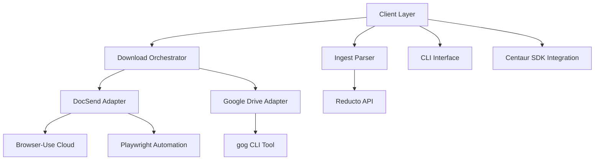
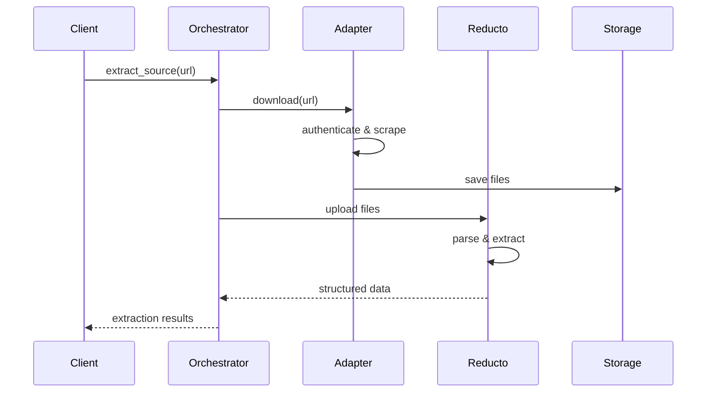
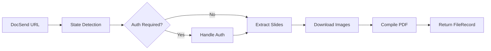
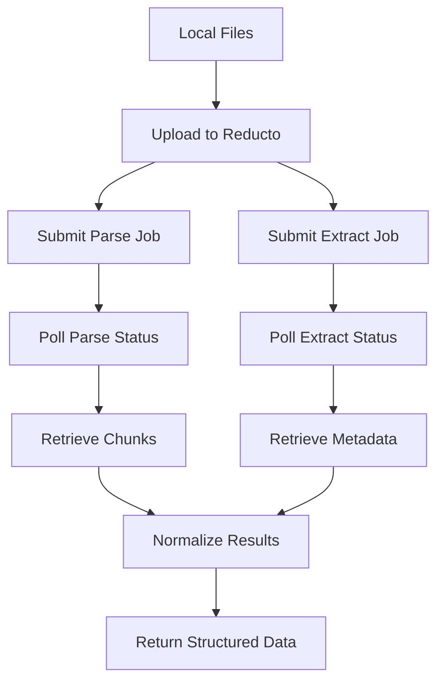

Now I have comprehensive understanding of the archiver component. Let me write the analysis.

# Archiver Component Analysis

The archiver component is a sophisticated document extraction library designed for processing investment materials using Reducto AI and multiple document source adapters. It serves as a unified interface for downloading documents from DocSend and Google Drive sources, then extracting structured metadata and content using Reducto's AI parsing capabilities.

## Architecture

The component follows a **layered architecture** with clear separation between download, ingestion, and client abstraction layers:

The architecture employs a **facade pattern** through `ArchiverClient`, providing simplified methods that orchestrate complex multi-stage workflows involving document downloading, parsing, and metadata extraction.

## Key Components

### 1. ArchiverClient (`client.py`)
The primary interface providing high-level methods for document extraction workflows. Key methods include:
- `download()` - Downloads from DocSend/Google sources to local files
- `extract_source()` - One-shot download and extraction pipeline
- `extract_files()` - Direct extraction from local files
- `parse()` - Reducto parsing from existing manifest files

### 2. Download Orchestrator (`download/orchestrator.py`)
Central dispatcher routing download requests to appropriate adapters based on URL patterns:
- Detects source type (DocSend vs Google Drive) from URL structure
- Handles fallback strategies for DocSend downloads
- Manages file record creation and ZIP expansion
- Implements error recovery and manual download suggestions

### 3. DocSend Adapter (`download/docsend.py`)
Sophisticated DocSend document scraping system using browser automation:
- **State Detection**: Identifies password protection, email gates, download availability
- **Browser-Use Integration**: Leverages cloud browsers to avoid headless detection
- **Playwright Control**: Deterministic automation for slide extraction
- **PDF Generation**: Compiles scraped slides into searchable PDFs

### 4. Google Drive Adapter (`download/google.py`)
Handles Google Workspace document downloads via multiple strategies:
- Direct HTTP exports for public documents
- gog CLI tool integration for authenticated access
- Support for Docs, Sheets, Slides, and Drive files/folders
- Recursive folder traversal with configurable depth limits

### 5. Reducto Parser (`ingest/parse.py`)
Manages document parsing and metadata extraction through Reducto AI:
- **Parallel Processing**: Concurrent upload and job submission for multiple files
- **Structured Extraction**: Uses JSON schema for consistent investment document metadata
- **Content Chunking**: Breaks documents into indexed chunks for search
- **Job Polling**: Asynchronous monitoring of Reducto processing jobs

### 6. CLI Interface (`cli.py`)
Typer-based command-line interface with commands:
- `download` - Download sources to local directory
- `parse` - Parse from existing manifest
- `extract` - Unified extraction command supporting multiple input modes
- Interactive prompts for missing authentication credentials

### 7. Utilities (`utils.py`)
Common data structures and helper functions:
- `FileRecord` dataclass for standardized file metadata
- Hash computation, MIME type detection, URL normalization
- JSON serialization with datetime support

### 8. DocSend Playwright Module (`docsend/playwright.py`)
Low-level DocSend automation primitives:
- Browser session management via Browser-Use cloud API
- Password and email form handling
- Slide URL extraction via DocSend's internal APIs
- Image downloading and PDF compilation

## Data Flows

### Primary Extraction Flow

### DocSend Scraping Flow

### Reducto Processing Pipeline

## External Dependencies

### Runtime Libraries

- **typer** (>=0.12.0) [cli]: Modern Python CLI framework providing command parsing, option handling, and interactive prompts. Used in `cli.py` for the main application interface.

- **browser-use-sdk** (>=2.0.14) [automation]: Cloud browser automation service providing headless browsers via WebSocket. Used in `docsend/playwright.py` and `download/docsend.py` for DocSend scraping to avoid anti-bot detection.

- **httpx** (>=0.28.1) [networking]: Modern async HTTP client for API calls and direct downloads. Used extensively in `ingest/parse.py` for Reducto API integration and `download/google.py` for Google Drive direct exports.

- **pillow** (>=12.1.0) [image]: Python Imaging Library for image processing and PDF creation. Used in `docsend/playwright.py` for compiling scraped slide images into searchable PDFs.

- **playwright** (>=1.58.0) [automation]: Browser automation framework providing programmatic control over Chromium/Firefox. Used in `docsend/` modules for deterministic DocSend interaction and slide extraction.

- **python-dotenv** (>=1.2.1) [config]: Environment variable management from .env files. Used for configuration loading across multiple modules.

- **requests** (>=2.32.5) [networking]: HTTP library for simple synchronous requests. Used as fallback HTTP client in some download scenarios.

### Internal Dependencies

- **centaur_sdk**: Internal SDK providing `secret()` function for secure credential management and `save_attachment_from_path()` for file attachment handling. Used in `client.py` and `ingest/parse.py`.

### External Tools

- **gog**: External CLI tool for authenticated Google Drive access when direct HTTP exports fail due to permissions. Invoked via subprocess in `download/google.py`.

### Cloud Services

- **Reducto AI Platform** (platform.reducto.ai): Document parsing and metadata extraction service. Requires `REDUCTO_API_KEY` authentication.

- **Browser-Use Cloud** (connect.browser-use.com): Cloud browser automation service. Requires `BROWSER_USE_API_KEY` authentication.

## API Surface

### Public Library Interface

The `ArchiverClient` class exposes these primary methods for external consumption:

- `download(source_url, company, account, password, email, max_depth) -> dict`: Downloads documents from DocSend or Google Drive sources
- `extract_source(source_url, ..., context) -> dict`: One-shot download and extraction pipeline
- `extract_files(file_paths, context, source_url) -> dict`: Direct extraction from local file paths  
- `extract_manifest(manifest_path, context) -> dict`: Extraction from pre-downloaded manifest
- `parse(manifest_path, context) -> dict`: Alias for extract_manifest

### CLI Commands

- `archiver download --source <url> --output <dir>`: Download source to directory
- `archiver parse --manifest <path>`: Parse from existing manifest
- `archiver extract [--source|--manifest|--file]`: Unified extraction command

### Configuration Options

- Environment variables: `REDUCTO_API_KEY`, `BROWSER_USE_API_KEY`, `DOCSEND_EMAIL`
- Timeout controls: `PARSE_TIMEOUT_S`, `EXTRACT_TIMEOUT_S`
- Feature flags: `EXTRACT_OPTIMIZE_FOR_LATENCY`
