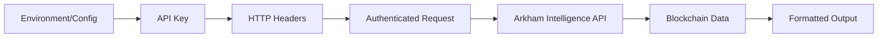

# Arkham Intelligence CLI Library

## Architecture

The arkham component follows a **client-library pattern** with a CLI wrapper architecture. The library is structured around two core modules:

- **`ArkhamClient`**: A comprehensive HTTP client that wraps the Arkham Intelligence REST API, providing 35+ methods for blockchain analytics
- **CLI Interface**: A feature-rich command-line interface built with Typer that exposes client functionality to end users

The architecture emphasizes separation of concerns, with the client handling all API communication logic while the CLI focuses on user experience, formatting, and output presentation.

## Key Components

### ArkhamClient (`client.py`)
The core HTTP client class that manages all interactions with the Arkham Intelligence API. It provides a comprehensive set of methods covering intelligence gathering, portfolio analysis, transaction tracking, and market data retrieval. The client implements proper error handling, timeout management, and API key authentication.

### CLI Application (`cli.py`)  
A rich command-line interface built with Typer that exposes 13 user-facing commands. Each command corresponds to different blockchain analytics use cases, from address intelligence to token trending analysis. The CLI provides multiple output formats (JSON, markdown, rich console) and extensive filtering options.

### Authentication & Configuration
API key management is handled through environment variables or direct initialization, with integration into the centaur_sdk secret management system. The client automatically retrieves credentials and handles authentication headers for all requests.

### Data Formatting & Presentation
Sophisticated output formatting functions handle USD value formatting with B/M/K suffixes, timestamp conversion, string truncation, and table rendering in both rich console and markdown formats.

### Command Structure
The CLI organizes functionality into logical command groups:
- **Identity Commands**: `address`, `entity` - Get intelligence on blockchain addresses and entities
- **Transaction Commands**: `transfers`, `tx` - Analyze token transfers and transaction details  
- **Portfolio Commands**: `portfolio`, `counterparties` - View holdings and trading relationships
- **Market Commands**: `token`, `token-holders`, `trending`, `networks` - Market data and token analytics
- **Utility Commands**: `health`, `chains`, `raw` - API status and raw endpoint access

## Data Flows

```mermaid
graph TD
    A[CLI Command] --> B[Command Handler]
    B --> C[get_client()]
    C --> D[ArkhamClient]
    D --> E[_request() Method]
    E --> F[API Key Resolution]
    F --> G[HTTPX Client]
    G --> H[Arkham API]
    H --> I[JSON Response]
    I --> J[Data Processing]
    J --> K{Output Format}
    K -->|JSON| L[Raw JSON Output]
    K -->|Rich| M[Rich Console Tables]
    K -->|Markdown| N[Markdown Tables]
```

The data flow follows a consistent pattern where CLI commands invoke client methods, which make authenticated HTTP requests to the Arkham Intelligence API. Responses are processed and formatted according to user preferences before being displayed.



## External Dependencies

### External Libraries

- **httpx** (>=0.27.0) [networking]: Modern async-capable HTTP client library used for all API requests. Provides robust connection management, timeout handling, and HTTP status error handling. Used in: `client.py` for the core `_request()` method and health check endpoints.

- **typer** (>=0.12.0) [cli]: Feature-rich CLI framework that provides argument parsing, command grouping, help generation, and type validation. Powers the entire command-line interface structure with decorators like `@app.command()`. Used in: `cli.py` for all command definitions and argument handling.

- **rich** (>=13.0.0) [cli]: Advanced terminal formatting library that provides styled console output, tables, progress bars, and color formatting. Enables the attractive table displays and colored output throughout the CLI. Used in: `cli.py` for console output, table rendering, and text styling.

### Internal Dependencies

- **centaur_sdk**: Internal SDK providing `Table` class for enhanced table rendering and `secret()` function for secure API key management. The `Table` class extends rich's table functionality while `secret()` integrates with the platform's secret management system.

- **dotenv**: Environment variable loading from `.env` files, loaded automatically at CLI startup to ensure API keys and configuration are available. Used in: `cli.py` at module initialization.

## API Surface

The component exposes a comprehensive public API through both programmatic and command-line interfaces:

### Programmatic API (ArkhamClient)

**Intelligence Methods:**
- `get_address_intelligence(address)` - Get intelligence for blockchain addresses
- `get_address_enriched(address, include_tags, include_clusters)` - Enhanced address data
- `get_entity(entity_id)` - Entity details and metadata
- `get_entity_summary(entity_id)` - Statistical summaries for entities

**Portfolio & Holdings:**
- `get_portfolio_address(address, chain)` - Token holdings by address
- `get_portfolio_entity(entity, chain)` - Entity portfolio analysis
- `get_balances_address(address, chain)` - Current token balances

**Transaction Analysis:**
- `get_transfers(base, flow, chain, token_id, usd_gte, limit)` - Filtered token transfers
- `get_transaction(tx_hash)` - Transaction details by hash
- `get_counterparties_address(address, flow, limit)` - Top trading partners

**Market Data:**
- `get_token(pricing_id)` - Token information and metrics
- `get_token_holders(pricing_id, limit)` - Top token holders
- `get_token_trending(chain)` - Trending tokens by chain
- `get_networks_status()` - Network status and prices

### CLI Interface

**Core Commands:**
- `arkham address <addr>` - Address intelligence with enrichment options
- `arkham entity <entity_id>` - Entity analysis with summary statistics
- `arkham transfers` - Token transfer analysis with extensive filtering
- `arkham portfolio <entity_id>` - Portfolio holdings visualization
- `arkham token <token_id>` - Token information and market data
- `arkham trending` - Trending token discovery

**Output Format Options:**
- `--json` - Raw JSON output for programmatic consumption
- `--markdown` - Markdown tables for documentation
- Rich console tables with styling (default)

All commands support comprehensive filtering options including chain selection, value thresholds, time ranges, and flow directions (in/out/all).
