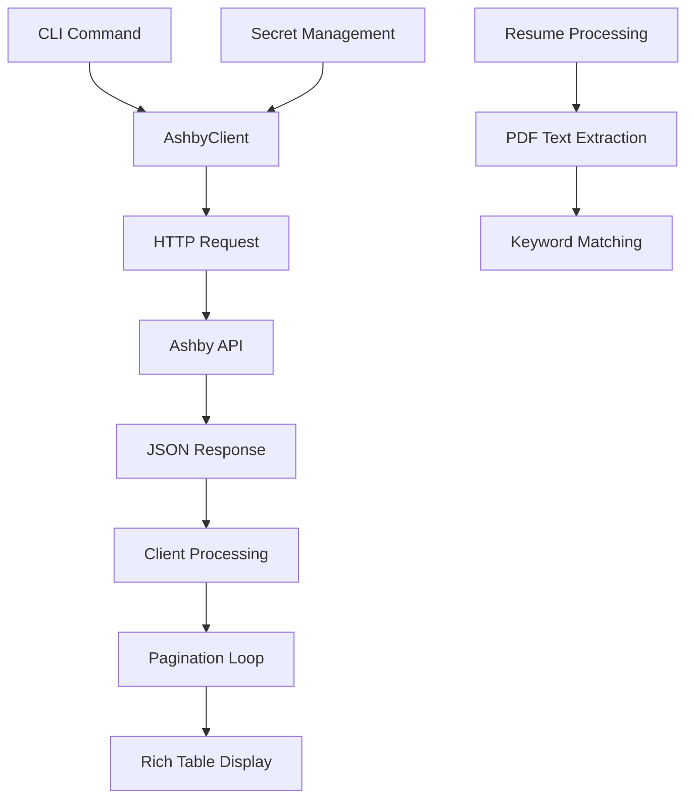

# Ashby Component Analysis

## Architecture

The ashby component follows a **layered architecture pattern** with clear separation between API client functionality and CLI interface. The component is structured as a Python library that provides both programmatic access to the Ashby ATS API and a comprehensive command-line interface for AI agents.

The architecture consists of three main layers:
1. **API Client Layer** (`client.py`) - Handles HTTP communication with Ashby API
2. **CLI Layer** (`cli.py`) - Provides command-line interface with rich formatting
3. **Entry Point** (`__init__.py`) - Minimal module initialization

## Key Components

### AshbyClient (client.py)
The core API client class that provides authenticated access to all Ashby ATS endpoints. It implements:
- **Authentication**: Uses HTTP basic auth with API key
- **Error Handling**: Comprehensive error handling for 401/403 responses and API errors
- **Pagination Support**: Automatic pagination handling for large result sets
- **Rate Limiting**: 30-second timeout configuration

Key methods include:
- Job management: `jobs()`, `job()`, `applications()`
- Candidate operations: `candidates()`, `candidate()`, `search_candidates()`
- Interview functionality: `interviews()`, `interview()`, `stages()`
- User management: `users()`, `user()`, `api_key_info()`
- File operations: `file_url()`, `resume_url()`, `resume_text()`

### CLI Application (cli.py)
A comprehensive Typer-based CLI that exposes all API functionality through structured commands:
- **Job Commands**: List and inspect jobs with filtering options
- **Candidate Commands**: Search, list, and analyze candidate data
- **Application Commands**: Track application status and history
- **Interview Commands**: Manage interview scheduling and feedback
- **Screening Commands**: Advanced candidate screening with resume analysis
- **Access Control**: Employee data protection mechanisms

### Data Flow Architecture



## Data Flows

### Authentication Flow
1. Client initialization retrieves API key from `ASHBY_API_KEY` environment variable or centaur_sdk secret
2. HTTP client configured with basic auth using API key as username
3. All requests include authentication headers and version specification

### Candidate Search Flow
1. CLI command receives search parameters (name/email, filters)
2. AshbyClient constructs appropriate API request based on search type
3. API returns paginated results with candidate basic information
4. For detailed view, additional API calls fetch full candidate profiles
5. Results formatted into Rich tables with truncated IDs and formatted dates

### Resume Analysis Flow
1. Candidate ID used to fetch candidate details including file handles
2. Resume file handle identified from candidate's file attachments
3. File URL generated through Ashby's file API
4. PDF downloaded and processed using pypdf library
5. Text extracted and searched for keywords with case-insensitive matching

## External Dependencies

### External Libraries

- **httpx** (>=0.27.0) [networking]: Modern async-capable HTTP client used for all Ashby API communication. Provides timeout configuration, authentication, and JSON handling. Used throughout `client.py` for API requests.

- **typer** (>=0.12.0) [cli]: CLI framework that provides command parsing, help generation, and option handling. Core framework for the entire CLI interface in `cli.py`. Handles argument validation and command routing.

- **rich** (>=13.0.0) [cli]: Terminal formatting library providing colored output, tables, and progress indicators. Used extensively in `cli.py` for formatting command output, creating tables, and console styling.

- **pypdf** (>=6.6.0) [document-processing]: PDF parsing library for extracting text from candidate resume files. Used in resume analysis commands like `resume-text` and `resume-search` for processing downloaded PDF files.

### Internal Dependencies

- **centaur_sdk**: Provides secret management through `secret()` function and table formatting through `Table` class. Used for secure API key retrieval and consistent table display formatting.

- **dotenv**: Environment variable loading for development. Called via `load_dotenv()` at CLI startup to load `.env` files.

## API Surface

The component exposes two primary interfaces:

### Programmatic API (AshbyClient)
```python
from ashby.client import AshbyClient

client = AshbyClient()
jobs = client.jobs(status="open", limit=10)
candidate = client.candidate("candidate_id")
```

### CLI Interface
```bash
ashby jobs --status open --limit 10
ashby candidate-search "John Smith"
ashby screen job_id --stage "Phone Screen"
ashby check-access candidate_id
```

### Key CLI Commands

- **Data Retrieval**: `jobs`, `candidates`, `applications`, `interviews`
- **Search Operations**: `candidate-search`, `resume-search` 
- **Analysis Tools**: `screen`, `interviewer-stats`, `feedback`
- **Access Control**: `check-access` (prevents sharing employee data)
- **File Operations**: `resume-url`, `resume-text`

## External Systems

### Ashby ATS API
- **Endpoint**: `https://api.ashbyhq.com`
- **Authentication**: HTTP Basic Auth with API key
- **Protocol**: REST API with JSON payloads
- **Rate Limits**: 30-second timeout per request
- **Pagination**: Cursor-based pagination with `nextCursor` field

### PM Admin Database
The CLI includes integration with an internal "pmadmin" database for employee verification:
- **Access Method**: Shell command execution via `reshift db`
- **Purpose**: Fetch employee emails and names for access control
- **Query**: PostgreSQL query joining User and Person tables
- **Timeout**: 30-second command timeout

## Component Interactions

This component has **no direct internal dependencies** on other centaur components, but integrates with:

### centaur_sdk
- **Type**: Library dependency
- **Usage**: Secret management and UI utilities
- **Integration Points**: `secret()` for API key retrieval, `Table` for consistent formatting

### External Tool Integration
- **reshift**: Database CLI tool for employee data queries
- **Purpose**: Employee verification for access control
- **Method**: Subprocess execution with captured output
