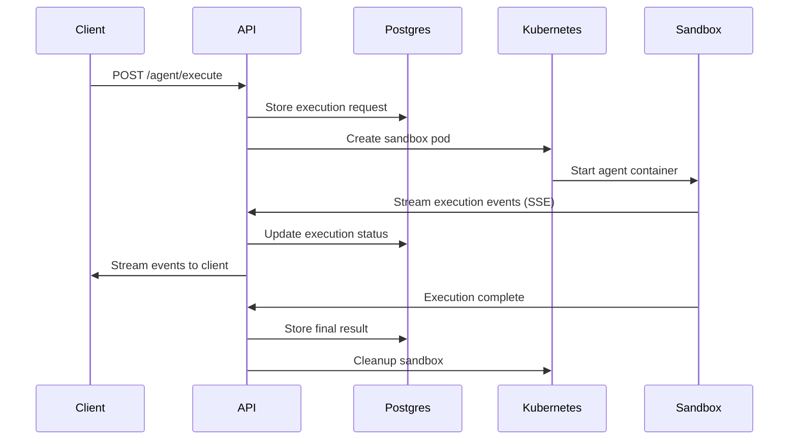
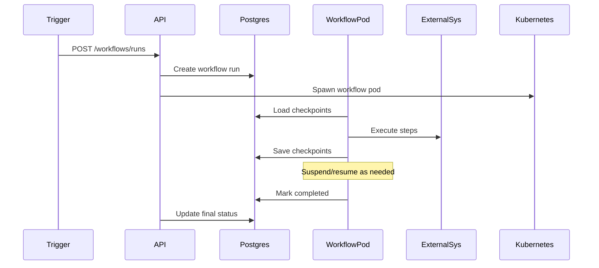
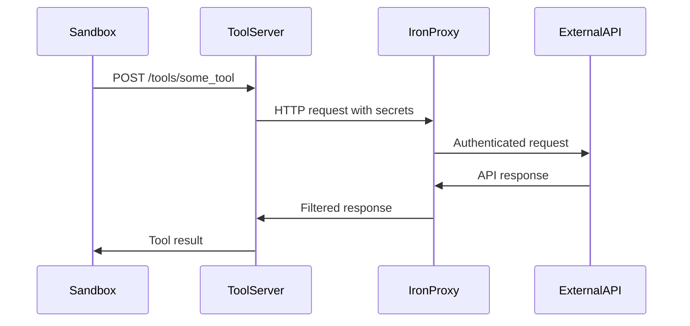

Now I have a comprehensive understanding of the centaur-api component. Let me write the analysis.

# Centaur API Analysis

## Architecture

The Centaur API follows a **layered microservice architecture** with clear separation of concerns. It serves as the central orchestration hub for the Centaur AI agent system, implementing a **control-plane pattern** for managing agent executions, workflows, and sandboxed environments. The architecture consists of:

1. **HTTP API Layer**: FastAPI-based REST endpoints with comprehensive middleware
2. **Control Plane**: Durable execution orchestration with PostgreSQL persistence
3. **Sandbox Management**: Kubernetes-based container orchestration for agent environments
4. **Workflow Engine**: Checkpoint-replay workflow execution system
5. **Integration Layer**: External system connectors (Slack, Linear, G Suite)
6. **Tool Management**: Dynamic tool discovery and REST API generation

## Key Components

### 1. **FastAPI Application** (`api/app.py`)
- Central HTTP server with comprehensive middleware stack
- Graceful shutdown handling with request draining
- OpenTelemetry instrumentation and structured logging
- CORS configuration and trace context propagation
- Tool discovery and namespace management

### 2. **Agent Control Plane** (`api/agent.py`, `api/runtime_control.py`)
- Session lifecycle management with PostgreSQL persistence
- Sandbox orchestration with Kubernetes backend
- Real-time streaming via Server-Sent Events (SSE)
- Turn-based execution model with replay capability
- Comprehensive error handling and retry logic

### 3. **Kubernetes Sandbox Backend** (`api/sandbox/kubernetes.py`)
- Pod-based sandbox isolation with security policies
- Iron-proxy sidecar for secure external connectivity
- Tool-server sidecar for in-sandbox tool execution
- Volume mounting for overlay and state persistence
- Network policies and service account management

### 4. **Workflow Engine** (`api/workflow_engine.py`)
- Checkpoint-replay execution model inspired by Cloudflare Workflows
- Step-based execution with automatic retry and backoff
- Event-driven coordination with external systems
- Scheduled workflow execution with cron support
- Hierarchical workflow composition with parent-child relationships

### 5. **Tool Manager** (`api/tool_manager.py`)
- Dynamic Python module discovery and loading
- REST API generation from tool definitions
- Secret management with iron-proxy integration
- OAuth2, HMAC, and AWS SigV4 authentication support
- Real-time tool reloading with file watching

### 6. **Database Layer** (`api/db.py`)
- AsyncPG connection pooling with retry logic
- Migration management with dbmate integration
- Schema compatibility validation
- Support for core and overlay migration sets

### 7. **Integration Modules**
- **Linear Client** (`api/integrations/linear/client.py`): GraphQL API wrapper
- **G Suite Integrations** (`api/integrations/gsuite/`): Calendar, Drive, Docs
- **Slack Client** (`api/slackbot_client.py`): Message delivery and session management

### 8. **Router Modules**
- **Agent Router** (`api/routers/agent.py`): Execution and session management
- **Workflow Router** (`api/routers/workflows.py`): Workflow lifecycle operations
- **Webhooks Router** (`api/routers/webhooks.py`): External event ingestion
- **Attachments Router** (`api/routers/attachments.py`): File upload/download

### 9. **Observability Stack**
- **OpenTelemetry** (`api/otel.py`): Distributed tracing and metrics
- **VM Metrics** (`api/vm_metrics.py`): Custom application metrics
- **Structured Logging** (`api/logging_config.py`): JSON-formatted logs

### 10. **Configuration Management** (`api/config.py`)
- Pydantic-based settings with environment variable support
- Database URL configuration and CORS policy management

## Data Flows

### Agent Execution Flow

### Workflow Execution Flow

### Tool Execution Flow

## External Dependencies

### Runtime Libraries

- **fastapi** (>=0.115.0) [web-framework]: Core HTTP framework providing REST API endpoints, dependency injection, and OpenAPI schema generation. Used in `api/app.py`, `api/tool_server_app.py`, and all router modules.

- **uvicorn[standard]** (>=0.34.0) [web-framework]: ASGI server for serving FastAPI applications. Provides HTTP/2, WebSocket support, and process management. Used as the main application server.

- **asyncpg** (>=0.30.0) [database]: High-performance PostgreSQL driver for async database operations. Used in `api/db.py` for connection pooling and query execution across all data access patterns.

- **pgvector** (>=0.3.6) [database]: PostgreSQL vector similarity search extension. Used for embeddings and similarity operations in agent memory and retrieval systems.

- **pydantic** (>=2.10.0) [serialization]: Data validation and serialization library. Used extensively for request/response models in `api/models.py` and configuration in `api/config.py`.

- **pydantic-settings** (>=2.7.0) [serialization]: Environment variable configuration management. Used in `api/config.py` for centralized settings with type validation.

- **structlog** (>=24.4.0) [logging]: Structured logging library providing consistent JSON log format. Configured in `api/logging_config.py` and used throughout the codebase.

- **httpx** (>=0.28.0) [networking]: Modern async HTTP client for external API calls. Used in integration modules like `api/integrations/linear/client.py` and `api/slackbot_client.py`.

- **sse-starlette** (>=3.2.0) [web-framework]: Server-Sent Events implementation for FastAPI. Used in `api/routers/agent.py` for real-time execution streaming.

### AI and ML Libraries

- **anthropic** (>=0.54.0) [ai-api]: Official Anthropic Claude API client. Used for Claude model integrations in agent harnesses.

- **openai** (>=1.60.0) [ai-api]: Official OpenAI API client. Used for GPT model integrations and Codex functionality.

### Infrastructure Libraries

- **kubernetes-asyncio** (>=33.3.0) [cloud-sdk]: Async Kubernetes API client for container orchestration. Used extensively in `api/sandbox/kubernetes.py` for pod lifecycle management.

- **aiodocker** (>=0.22.0) [cloud-sdk]: Async Docker API client. Used for container management in development and testing environments.

- **psycopg2-binary** (>=2.9.11) [database]: PostgreSQL adapter for Python. Used alongside asyncpg for certain synchronous database operations.

### Observability and Monitoring

- **opentelemetry-api** (>=1.42.1) [monitoring]: OpenTelemetry tracing API. Used in `api/otel.py` for distributed tracing across the service mesh.

- **opentelemetry-sdk** (>=1.42.1) [monitoring]: OpenTelemetry SDK implementation. Provides trace export and processing capabilities.

- **opentelemetry-exporter-otlp-proto-http** (>=1.42.1) [monitoring]: OTLP HTTP exporter for sending traces to observability backends like Jaeger or DataDog.

- **opentelemetry-instrumentation-fastapi** (>=0.63b1) [monitoring]: Auto-instrumentation for FastAPI applications. Provides automatic HTTP request tracing.

- **opentelemetry-instrumentation-httpx** (>=0.63b1) [monitoring]: Auto-instrumentation for httpx HTTP client calls.

- **opentelemetry-instrumentation-asyncpg** (>=0.63b1) [monitoring]: Auto-instrumentation for PostgreSQL database queries.

### Workflow and Scheduling

- **croniter** (>=6.2.2) [scheduling]: Cron expression parsing for scheduled workflows. Used in `api/workflow_engine.py` for workflow scheduling.

- **tenacity** (>=9.0.0) [reliability]: Retry library with exponential backoff. Used throughout for resilient external API calls.

### Protocol and Format Libraries

- **mcp** (>=1.0.0) [protocol]: Model Context Protocol implementation for agent communication standards.

- **toon-format** (git+https://github.com/toon-format/toon-python.git) [serialization]: Custom serialization format for agent data exchange.

- **feedparser** (>=6.0.0) [parsing]: RSS/Atom feed parsing for content ingestion workflows.

### Development Dependencies

- **pytest** (>=9.0.2) [testing]: Test framework for unit and integration tests.
- **pytest-asyncio** (>=0.25.0) [testing]: Async test support for pytest.
- **asgi-lifespan** (>=2.1.0) [testing]: ASGI lifespan management for testing.
- **ruff** (>=0.15.5) [build-tool]: Fast Python linter and formatter.

## Internal Dependencies

### centaur-sdk
The API extensively uses the Centaur SDK for:

- **Tool Context Management**: Uses `ToolContext`, `set_tool_context`, and `reset_tool_context` from `centaur_sdk` in `api/tool_manager.py` for maintaining execution context during tool calls.

- **Secret Management**: Uses `secret()` function from `centaur_sdk` in `api/integrations/linear/client.py` for secure credential access within sandboxed environments.

- **Backend Registry**: References `centaur_sdk.backends.registry` in test files for mock backend implementations during testing.

The SDK provides the foundational abstractions for tool development, secret management, and execution context that the API orchestrates across distributed sandbox environments.

## External Systems

### Infrastructure Services

- **PostgreSQL Database**: Primary data store for execution state, workflow checkpoints, session metadata, and application configuration. Accessed via asyncpg with connection pooling.

- **Kubernetes Cluster**: Container orchestration platform hosting agent sandboxes, workflow execution pods, and supporting services. Managed through kubernetes-asyncio client.

- **Iron-Proxy**: Security proxy service deployed as sidecars to handle authentication, secret injection, and network policy enforcement for sandbox communications.

### External APIs

- **Slack Workspace APIs**: Message delivery, thread management, and user interaction through the Slack Bot API. Integrated via `api/slackbot_client.py`.

- **Linear GraphQL API**: Issue tracking and project management integration. Accessed through `api/integrations/linear/client.py` with OAuth authentication.

- **Google Workspace APIs**: Calendar, Drive, and Docs integration for productivity workflows. Implemented in `api/integrations/gsuite/` modules with service account authentication.

- **Anthropic Claude API**: Large language model access for AI agent capabilities via the anthropic client library.

- **OpenAI API**: GPT model access and Codex functionality via the openai client library.

### Observability Infrastructure

- **OpenTelemetry Collector**: Distributed tracing and metrics aggregation. Traces exported via OTLP HTTP protocol.

- **Prometheus/Grafana**: Custom metrics collection and dashboarding through `api/vm_metrics.py` metric definitions.

## Component Interactions

### HTTP API Calls
- **Slackbot Service**: Bidirectional HTTP communication for message delivery and session management
- **External Webhooks**: Inbound HTTP requests from Linear, GitHub, and other services trigger workflow execution

### Database Sharing
- **Shared PostgreSQL**: All components share the same database instance with separate connection pools
- **Tool Server**: Lightweight database access for metadata queries without schema ownership

### Kubernetes Resources
- **Pod Lifecycle**: API creates and manages sandbox pods, workflow execution pods, and proxy pods
- **ConfigMap Management**: Dynamic configuration updates for token broker and proxy services
- **Network Policies**: Enforcement of security boundaries between components

### Message Queuing (Implicit)
- **PostgreSQL as Queue**: Execution and workflow queues implemented as database tables with worker polling
- **Event Broadcasting**: Database triggers and polling for workflow event distribution
