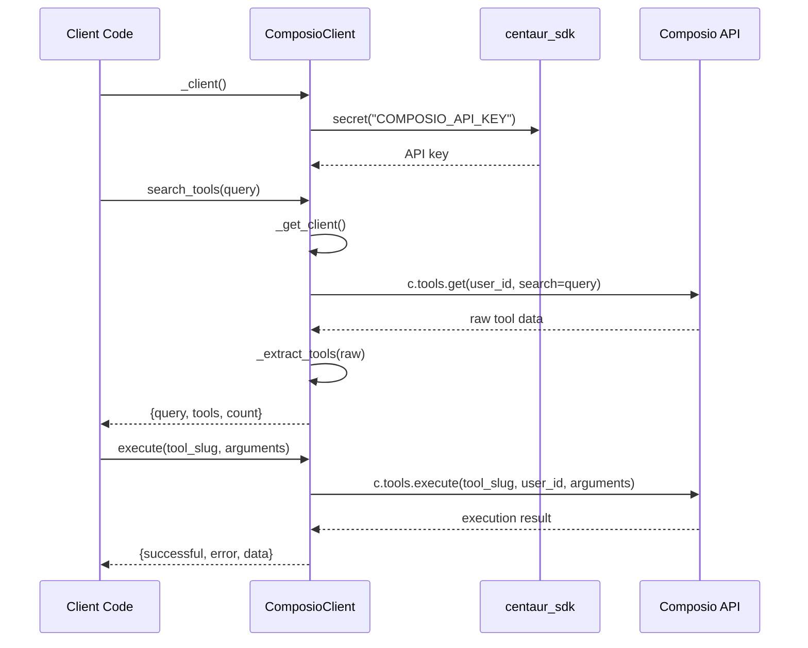

Based on my analysis of the code, let me now write the comprehensive analysis:

# Centaur Composio Tool Analysis

The centaur-composio-tool is a Python library that provides a unified interface for executing actions across 1000+ third-party services through Composio's cloud API platform. It serves as a productivity tool bridge, enabling seamless integration with popular services like GitHub, Gmail, Slack, and Notion through a consistent API surface.

## Architecture

The component follows a **client-wrapper architecture pattern** that abstracts Composio's complex API into a simplified, consistent interface. The design prioritizes:

- **Lazy initialization**: The Composio client is instantiated only when needed to reduce startup overhead
- **Error isolation**: All external API calls are wrapped in try-catch blocks with structured error responses
- **User scoping**: Supports multi-tenancy through user_id parameters while providing sensible defaults
- **Stateless design**: Each method call is independent, making the client thread-safe

The architecture consists of a single client class that encapsulates all Composio interactions, with helper functions for data transformation and a factory function for easy instantiation.

## Key Components

### ComposioClient Class
**Location**: `client.py:33-133`  
The core client that manages authentication and API interactions with Composio's platform. Provides four main methods for tool discovery and execution, with consistent error handling and response formatting across all operations.

### _extract_tools Function
**Location**: `client.py:17-30`  
Data transformation utility that normalizes Composio's tool metadata into a simplified format. Extracts essential fields (name, description, required parameters) from Composio's complex tool definitions for easier consumption.

### Authentication Layer
**Location**: `client.py:36-45`  
Handles API key management through the centaur_sdk secret system. Supports both explicit API key passing and automatic secret resolution from the configured secret store.

### Tool Discovery Methods
**Location**: `client.py:47-72`  
Two complementary methods for finding available tools: `list_tools()` for browsing by toolkit (service category) and `search_tools()` for cross-toolkit text search with result limiting.

### Tool Execution Engine
**Location**: `client.py:74-110`  
The primary execution method that handles tool invocation with flexible argument passing. Bypasses Composio's version checking for practical deployment scenarios where toolkit versions aren't pre-known.

### Schema Introspection
**Location**: `client.py:112-133`  
Provides runtime schema discovery for tools, enabling dynamic parameter validation and documentation generation without hard-coding tool definitions.

### Factory Function
**Location**: `client.py:136-137`  
Simple factory that returns a configured ComposioClient instance, following the component's convention for easy instantiation.

## Data Flows



The data flow follows a consistent pattern: authentication → tool discovery → execution, with each step providing structured responses that include success indicators and error details.

## External Dependencies

### External Libraries

- **composio** (>=0.13.0) [cloud-sdk]: Composio's official Python SDK for accessing their tool execution platform. Used throughout the client for all API interactions including tool discovery, schema introspection, and execution. Imported lazily in: `client.py:42`.

- **centaur_sdk** (implicit) [framework]: Centaur's internal SDK providing the `secret()` function for secure credential management. Used for retrieving the Composio API key from the configured secret store. Imported in: `client.py:7`.

- **logging** (stdlib) [logging]: Python's standard logging module for error tracking and debugging. Used for warning-level logging when API calls fail. Imported in: `client.py:5`.

## API Surface

The component exposes a clean, consistent API surface through the `ComposioClient` class:

### Public Methods

```python
def list_tools(toolkit: str, user_id: str = "centaur") -> dict
```
Returns available tools for a specific toolkit (e.g., "github", "slack"). Response includes toolkit name, tool list, and count.

```python
def search_tools(query: str, user_id: str = "centaur") -> dict
```
Searches tools across all toolkits by description text. Limited to 20 results for performance. Returns query, matching tools, and count.

```python
def execute(tool_slug: str, arguments: dict = None, user_id: str = "centaur") -> dict
```
Executes a specific tool action identified by slug (e.g., "GITHUB_LIST_REPOS_FOR_USER"). Returns structured success/error response with execution data.

```python
def get_tool_schema(tool_slug: str, user_id: str = "centaur") -> dict
```
Retrieves the input/output schema for a tool, enabling dynamic validation and documentation. Returns parameter definitions and descriptions.

### Factory Function

```python
def _client() -> ComposioClient
```
Creates a pre-configured client instance using default authentication. Follows centaur's tool instantiation conventions.

### Response Format

All methods return consistent dictionary structures with `successful` boolean flags, optional `error` strings, and method-specific data fields, enabling reliable error handling across the API.
