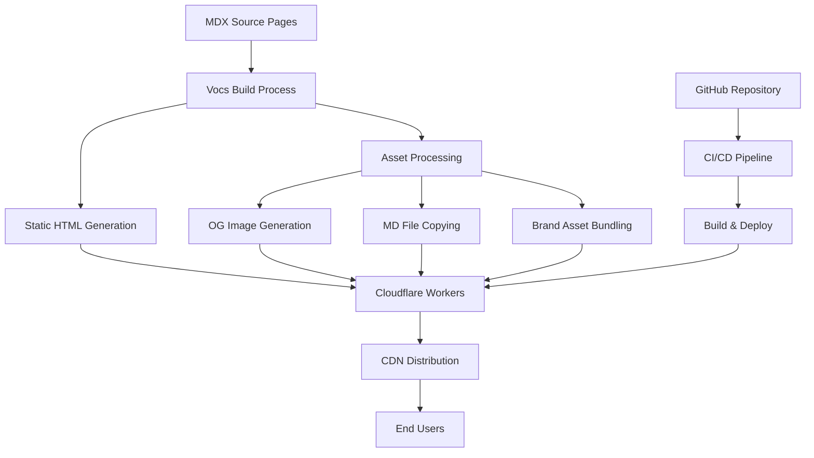

# centaur-docs Component Analysis

The centaur-docs component is a modern documentation website service built with Vocs (a React-based documentation framework) and deployed to Cloudflare Workers. It serves as the primary documentation portal for the Centaur project at https://centaur.run.

## Architecture

The component follows a **static site generator pattern** with build-time optimization:

- **Static Generation**: Uses Vocs to generate fully static HTML/CSS/JS assets
- **Edge Deployment**: Deploys to Cloudflare Workers as a static site with CDN distribution
- **Build-Time Processing**: Pre-generates Open Graph images, copies markdown files, and bundles brand assets
- **Client-Side Interactivity**: Minimal JavaScript for search, navigation, and interactive components

The architecture emphasizes performance and SEO through static generation while maintaining rich interactivity through React hydration.

## Key Components

### Configuration and Build System

- **vocs.config.ts**: Central configuration defining site structure, themes, metadata, and build behavior
- **sidebar.ts**: Hierarchical navigation structure with categories like "Start", "Operate", "Extend Centaur", "Secrets", and "Reference"
- **build-og.ts**: Advanced Open Graph image generator that creates personalized social cards for each page using SVG templates and Google Fonts
- **build-md.sh**: Script that copies MDX pages to `/public/md/` as plain markdown for agent consumption
- **build-brand-zip.sh**: Bundles brand assets into a downloadable zip file for media kit distribution

### Content Management

- **MDX Pages**: 23+ documentation pages organized in a hierarchical structure covering architecture, deployment, security, and extension guides
- **ThreadPanel.tsx**: Interactive React component showcasing real Slack conversation examples with rich formatting
- **Brand Assets**: Comprehensive visual identity system with SVG logos, color schemes, and typography definitions

### User Interface Features

- **Dynamic Theming**: Supports light/dark modes with CSS custom properties and coordinated color schemes
- **Interactive Search**: Built-in search with document boosting (prioritizes getting-started content)
- **Brand Menu**: Right-click context menu on logo offering brand downloads and GitHub access
- **Typography System**: Custom font stack including PolySans, Sagittaire Display, and Perfectly Nineties for brand consistency

### Deployment Infrastructure

- **Cloudflare Workers**: Configured via `wrangler.jsonc` with custom domain routing to centaur.run
- **Static Asset Optimization**: HTML handling, 404 pages, and trailing slash normalization
- **SEO Optimization**: Sitemap generation, canonical URLs, and meta tag management

## Data Flows

The build process transforms MDX content through multiple stages: Vocs compilation, asset generation (Open Graph images, markdown copies, brand bundles), and final deployment to Cloudflare's edge network.

## Dependencies

### External Libraries

- **react** (^19.0.0) [web-framework]: React 19 for component-based UI and server-side rendering capabilities. Used throughout the documentation site for interactive components and page layouts. Imported in: `components/ThreadPanel.tsx`, `vocs.config.ts`.

- **react-dom** (^19.0.0) [web-framework]: React DOM rendering for client-side hydration and server rendering. Provides the runtime for React components in the browser. Imported in: component files, Vocs build system.

- **vocs** (https://pkg.pr.new/vocs@3f54829) [build-tool]: Modern documentation framework built on React and Vite. Provides static site generation, MDX processing, built-in search, theming, and navigation. Core system imported in: `vocs.config.ts`, used for entire build pipeline.

- **waku** (1.0.0-alpha.6) [web-framework]: React framework for building fast web applications. Likely used by Vocs internally for rendering and routing capabilities. Integrated through Vocs build system.

### Development Dependencies  

- **@resvg/resvg-wasm** (^2.6.2) [build-tool]: WebAssembly-based SVG rasterization library for generating PNG images from SVG templates. Used for creating Open Graph social media cards at build time. Imported in: `scripts/build-og.ts`.

- **gray-matter** (^4.0.3) [serialization]: Parses YAML frontmatter from markdown/MDX files to extract metadata like titles and descriptions. Used for processing page metadata during OG image generation. Imported in: `scripts/build-og.ts`.

- **typescript** (5.9.3) [build-tool]: TypeScript compiler providing static type checking and ES module compilation. Used for all TypeScript source files including configuration and build scripts. Imported in: all `.ts` and `.tsx` files.

- **wrangler** (^4.14.0) [cloud-sdk]: Cloudflare Workers CLI for deployment, development, and configuration management. Handles building and deploying the static site to Cloudflare's edge network. Used in: npm scripts and CI/CD pipeline.

## External Systems

The component integrates with several external services:

- **Cloudflare Workers**: Primary hosting platform providing global CDN distribution and edge computing capabilities
- **Google Fonts API**: Dynamically loads web fonts (Bodoni Moda, Source Serif 4, Geist Mono) for Open Graph image generation
- **GitHub**: Source code repository and CI/CD integration for automated deployments
- **Centaur.run Domain**: Custom domain routing through Cloudflare for production access

## Component Interactions  

The documentation service operates independently without direct API calls to other Centaur components, but serves as the primary information hub:

- **Provides Documentation**: Comprehensive guides for all other Centaur components including API usage, deployment, and extension patterns
- **Agent Integration**: Markdown files are copied to `/public/md/` to enable AI agents to curl and consume documentation content programmatically
- **Brand Consistency**: Serves downloadable brand assets used across other components and external materials

## API Surface

### Public Endpoints (Static Routes)

- **/** - Landing page with hero, overview, and interactive thread demo
- **/what-is-centaur** - Core product explanation and architecture overview  
- **/quickstart** - Getting started guide for new users
- **/architecture** - Detailed system architecture and component relationships
- **/extend/*** - Extension guides for tools, skills, workflows, and overlays
- **/secrets/*** - Security and credential management documentation
- **/operate/*** - Operational guides and maintenance procedures
- **/reference/*** - API reference and configuration documentation
- **/brand** - Brand guidelines and asset downloads

### Asset Endpoints

- **/md/*** - Machine-readable markdown versions of all documentation
- **/brand/*** - SVG logos, icons, and visual identity assets
- **/og/*** - Generated Open Graph social media preview images
- **/centaur-brand-assets.zip** - Complete brand kit download
