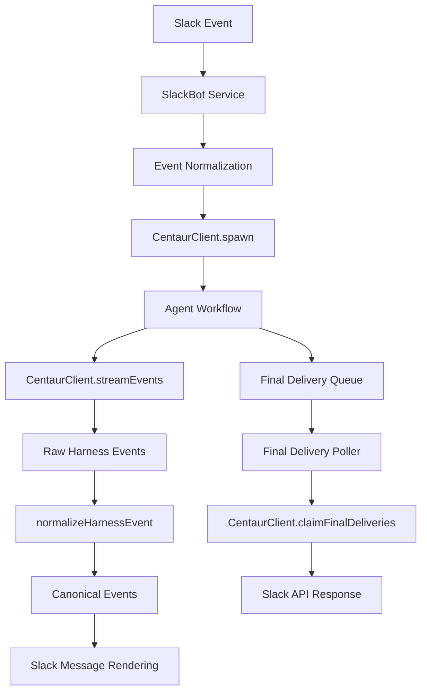
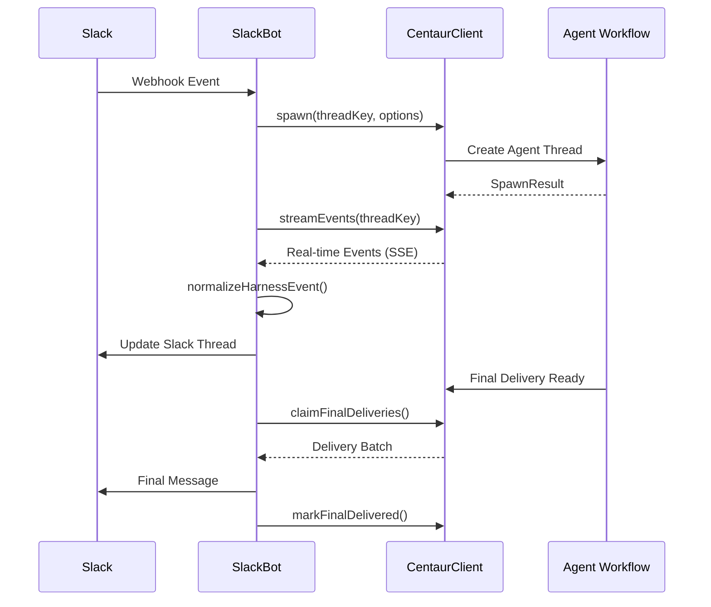

Now I have sufficient information about the codebase. Let me write the analysis.

# Centaur TypeScript Library Analysis

## Architecture

The centaur component is a TypeScript monorepo library providing a comprehensive API client and event processing system for interacting with AI agent workflows. The architecture follows a **modular package-based pattern** with clear separation of concerns across three main areas:

1. **API Communication Layer** (`@centaur/api-client`) - HTTP client for agent lifecycle management
2. **Event Processing Layer** (`@centaur/harness-events`) - Normalization of heterogeneous AI harness events  
3. **Service Integration Layer** (`slackbot`) - Slack integration service demonstrating real-world usage

The design emphasizes **type safety**, **streaming capabilities**, and **multi-harness compatibility** to support diverse AI agent execution environments.

## Key Components

### 1. **CentaurClient** (`packages/api-client/src/client.ts`)
The primary HTTP client providing comprehensive agent workflow management. Supports agent spawning, message handling, execution control, workflow orchestration, and real-time event streaming via Server-Sent Events.

### 2. **Event Normalizer** (`packages/harness-events/src/normalize.ts`)
A sophisticated event transformation system that converts harness-specific JSON events into canonical formats. Handles three major harness types: `amp`, `codex`, and `pi-mono` with different event schemas.

### 3. **Type Definitions** (`packages/harness-events/src/types.ts`, `packages/api-client/src/client.ts`)
Comprehensive TypeScript interfaces defining content blocks, canonical events, execution options, and workflow states across the entire system.

### 4. **Thread Key Management** (`packages/harness-events/src/thread-key.ts`)
Utilities for parsing and normalizing thread identifiers, particularly for Slack-style channel:timestamp formats.

### 5. **Parse Utilities** (`packages/harness-events/src/parse-utils.ts`)
Type-safe extraction functions for converting unknown JSON values into strongly-typed TypeScript values.

### 6. **Slack Integration Service** (`services/slackbot/`)
Production service demonstrating API client usage with Slack webhook handling, agent session management, final delivery polling, and comprehensive observability.

### 7. **Final Delivery System** (`services/slackbot/src/centaur/final-delivery.ts`)
Reliable message delivery mechanism with lease-based processing, retry logic, and error handling for Slack message delivery.

### 8. **Event Streaming Infrastructure** (`packages/api-client/src/client.ts:247-293`)
Async generator-based streaming system using EventSource parsing for real-time agent execution monitoring.

## Data Flows

## External Dependencies

### Runtime Dependencies

- **axios** (^1.13.6) [networking]: HTTP client library providing request/response handling with interceptors and timeout support. Used throughout `CentaurClient` for all API communication. Imported in: `packages/api-client/src/client.ts`.

- **eventsource-parser** (^3.0.6) [networking]: Server-Sent Events parsing library enabling real-time event streaming. Used in `CentaurClient.streamEvents()` to parse SSE responses from agent execution streams. Imported in: `packages/api-client/src/client.ts`.

- **@opentelemetry/api** (^1.9.1) [monitoring]: OpenTelemetry tracing API for distributed tracing across microservices. Used in slackbot service for request correlation and performance monitoring. Imported in: `services/slackbot/src/otel.ts`.

- **@opentelemetry/exporter-trace-otlp-proto** (^0.218.0) [monitoring]: OTLP protocol exporter for sending traces to observability backends. Configured in slackbot for trace export. Imported in: `services/slackbot/src/otel.ts`.

- **@opentelemetry/resources** (^2.7.1) [monitoring]: Resource management for OpenTelemetry describing service metadata. Used for service identification in traces. Imported in: `services/slackbot/src/otel.ts`.

- **@opentelemetry/sdk-trace-base** (^2.7.1) [monitoring]: Base tracing SDK providing core tracing functionality. Used for span management in slackbot. Imported in: `services/slackbot/src/otel.ts`.

- **@opentelemetry/sdk-trace-node** (^2.7.1) [monitoring]: Node.js-specific tracing SDK extensions. Provides Node.js runtime integration for OpenTelemetry. Imported in: `services/slackbot/src/otel.ts`.

- **@opentelemetry/semantic-conventions** (^1.41.1) [monitoring]: Standard attribute names and values for OpenTelemetry spans. Used for consistent span annotation. Imported in: `services/slackbot/src/otel.ts`.

- **@slack/types** (^2.19.0) [web-framework]: TypeScript type definitions for Slack API objects and webhooks. Provides type safety for Slack message blocks and events. Imported throughout `services/slackbot/src/slack/`.

- **@slack/web-api** (^7.15.2) [web-framework]: Official Slack Web API client for bot interactions. Used for sending messages and managing Slack app installations. Imported in: `services/slackbot/src/slack/client.ts`.

- **@std/ulid** (npm:@jsr/std__ulid) [other]: ULID generation library for sortable unique identifiers. Used for request ID generation in HTTP middleware. Imported in: `services/slackbot/src/index.ts`.

- **hono** (^4.12.18) [web-framework]: Lightweight web framework for edge computing environments. Provides HTTP server functionality for the slackbot service. Imported in: `services/slackbot/src/index.ts`.

- **zod** (^4.4.3) [serialization]: TypeScript schema validation library. Used for runtime validation of configuration and request payloads. Imported in: `services/slackbot/src/config.ts`.

### Development Dependencies

- **typescript** (5.9.3/^6.0.3) [build-tool]: TypeScript compiler for static type checking and compilation. Used across all packages for type safety.

- **vitest** (^4.1.0) [testing]: Modern testing framework with native TypeScript support. Used for unit testing the API client. Configured in: `packages/api-client/vitest.config.ts`.

- **emulate** (^0.5.0) [testing]: Test framework for integration testing. Used for end-to-end Slack bot testing. Imported in: `services/slackbot/test/emulate/`.

- **oxfmt** (^0.49.0) [build-tool]: Fast code formatter for consistent code style. Used in slackbot service build process.

- **oxlint** (^1.64.0) [build-tool]: TypeScript-aware linter with automatic fixes. Provides code quality enforcement.

## API Surface

The library exposes the following public interfaces:

### CentaurClient Public Methods
- `spawn(opts)` - Create new agent thread
- `message(opts)` - Send message to agent thread  
- `execute(opts)` - Trigger agent execution
- `streamEvents(opts)` - Real-time event streaming
- `startWorkflowRun(opts)` - Initiate workflow execution
- `getWorkflowRun(runId)` - Retrieve workflow status
- `listWorkflowRuns(opts)` - Query workflow executions
- `cancelWorkflowRun(runId)` - Terminate workflow
- `steerExecution(executionId, opts)` - Modify running execution
- `claimFinalDeliveries(opts)` - Batch claim delivery tasks
- `markFinalDelivered(executionId)` - Acknowledge delivery completion

### Event Processing Functions
- `normalizeHarnessEvent(harness, event)` - Convert harness events to canonical format
- `splitThreadKey(threadKey)` - Parse thread identifier components
- `normalizeThreadKey(threadKey)` - Standardize thread key format

### Type Exports
- `CanonicalEvent` - Unified event interface
- `ContentBlock` - Content type definitions
- `ExecuteOptions`, `MessageOptions`, `WorkflowRunOptions` - Request interfaces
- `ThreadMessageRecord` - Message history format
