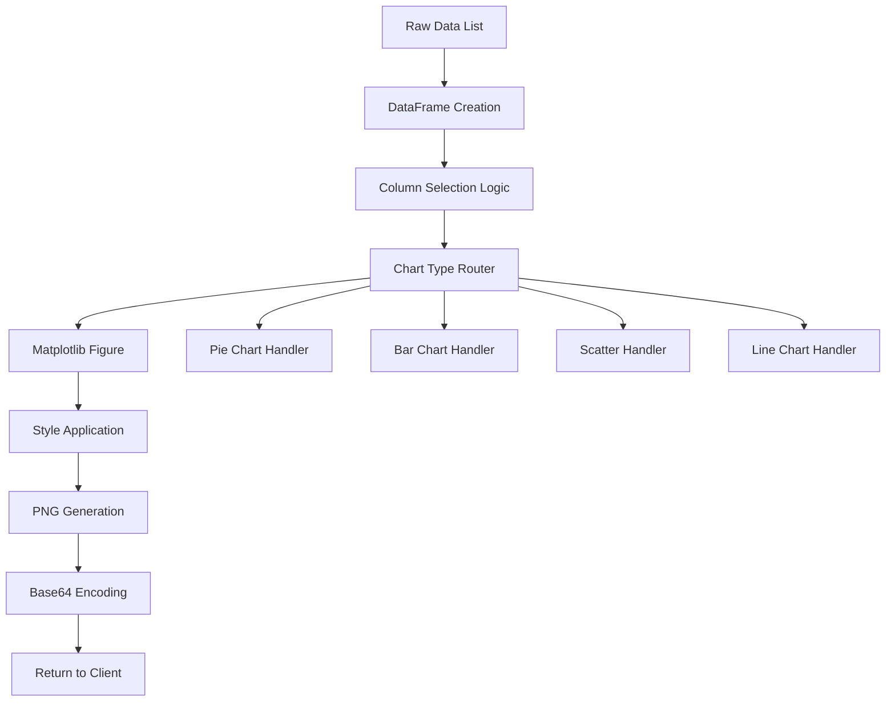

Now I have enough information to perform the analysis. The chart component is a standalone Python library with a single main file.

# Chart Component Analysis

## Overview

The chart component is a lightweight Python library providing programmatic chart generation capabilities for the Centaur system. It implements a single-purpose API through the `ChartClient` class, exposing one primary method `render_chart` that converts tabular data into base64-encoded PNG images suitable for Slack integration.

## Architecture

The component follows a **functional architecture pattern** with a thin object-oriented wrapper. The design emphasizes simplicity and single responsibility:

- **Data Processing Pipeline**: Raw data → DataFrame → Chart configuration → Matplotlib figure → Base64 PNG
- **Stateless Design**: The `ChartClient` maintains no internal state between calls
- **Functional Helpers**: Core logic is implemented as pure functions with clear separation of concerns
- **Backend-Agnostic Rendering**: Uses matplotlib's "Agg" backend for headless server environments

The architecture supports extensibility through the chart type routing system while maintaining a consistent API surface.

## Key Components

### ChartClient Class
The main API entry point providing chart generation services. Contains a single public method `render_chart` that handles all chart types through internal routing logic.

### Data Processing Functions
- `_pick_x()`: Automatically selects appropriate x-axis column from DataFrame
- `_pick_y()`: Intelligently chooses y-axis columns, prioritizing numeric data
- `_numeric_columns()`: Filters DataFrame columns to numeric types for plotting

### Chart Rendering Functions
- `_style_axes()`: Applies consistent styling including titles, subtitles, grid lines, and source attribution
- `_figure_to_base64()`: Converts matplotlib figures to base64-encoded PNG strings for web transmission

### Chart Type Handlers
The component supports multiple chart types through conditional routing:
- **Pie Charts**: Circular visualizations with percentage labels and Okabe-Ito color scheme
- **Bar Charts**: Vertical bar plots with support for multiple series and grouped bars
- **Scatter Plots**: Point-based visualizations for correlation analysis
- **Line Charts**: Default handler for time series and continuous data

### Visual Design System
- **Color Palette**: Uses the Okabe-Ito color scheme (`_OKABE_ITO`) for accessibility
- **Typography**: Consistent font sizing (title: 15pt, subtitle: 10pt, source: 8pt)
- **Layout**: 8:4.5 aspect ratio with tight layout and clean styling

## Data Flows

The component implements a linear data processing pipeline with type-specific branching for chart generation.

## External Dependencies

### Runtime Dependencies

- **matplotlib** (>=3.7.0) [visualization]: Core plotting library providing figure creation, chart rendering, and PNG export capabilities. Configured with "Agg" backend for server environments. Used throughout `client.py` for all chart generation operations.

- **pandas** (>=2.0.0) [data-manipulation]: DataFrame library for data processing and column type detection. Used in `render_chart()` method for converting input data to structured format and in helper functions for column selection and numeric type filtering.

### Standard Library Dependencies

- **base64** [encoding]: Converts PNG bytes to base64 strings for web transmission
- **typing** [type-hints]: Provides type annotations for function signatures
- **io.BytesIO** [streaming]: In-memory buffer for PNG data before base64 conversion

## API Surface

### Public Interface

The component exposes a minimal public API through the `ChartClient` class:

**`render_chart(chart_type, data, title="", question="", protagonist=None, subtitle=None, source="", theme_mode="light", x=None, y=None, extras=None) -> str`**

**Parameters:**
- `chart_type`: Chart variant (line, bar, pie, scatter, etc.)
- `data`: List of dictionaries representing tabular data
- `title`: Primary chart title (sentence case)
- `subtitle`: Optional units or context information
- `source`: Attribution text
- `x/y`: Column hints for axis selection
- `extras`: Handler-specific configuration options

**Returns:** Base64-encoded PNG image string

**Supported Chart Types:**
- Line charts (default): Time series and continuous data visualization
- Bar charts: Categorical comparisons with single or multiple series
- Pie charts: Proportional data with percentage labels
- Scatter plots: Correlation and distribution analysis

### Module-Level Factory

The `_client()` function provides a simple factory method for creating `ChartClient` instances, though direct instantiation is also supported.
