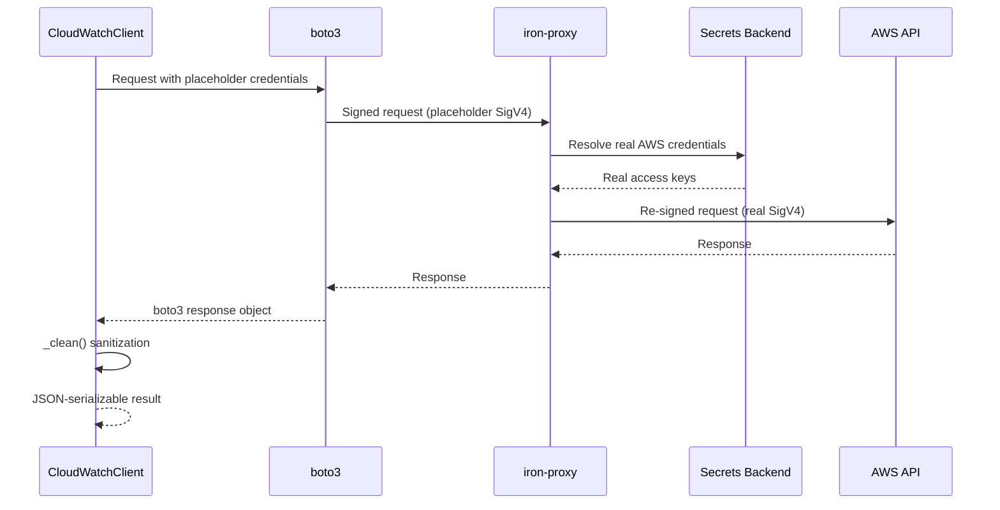

# AWS CloudWatch Library

The cloudwatch component is a read-only Python library that provides a comprehensive interface to AWS CloudWatch services including Logs, Metrics, and Alarms. It serves as a secure wrapper around boto3 with credential isolation through iron-proxy's AWS authentication transform.

## Architecture

The component follows a **security-first client wrapper** pattern, implementing credential isolation where boto3 signs requests with placeholder credentials, and iron-proxy re-signs them with real IAM keys resolved from a secrets backend. This ensures that actual AWS credentials never enter the tool process, maintaining security isolation while providing full CloudWatch functionality.

The architecture consists of:
- A single `CloudWatchClient` class that encapsulates all AWS CloudWatch operations
- Lazy initialization of boto3 clients to avoid network calls during tool discovery
- Helper functions for time window resolution and response cleaning
- A comprehensive test suite with mock boto3 clients

## Key Components

### 1. CloudWatchClient Class
The main interface providing read-only access to CloudWatch services. Implements context manager protocol and lazy client initialization for logs and monitoring services.

### 2. Logs Operations
- `list_log_groups()`: Discovers available log groups with optional name prefix filtering
- `filter_log_events()`: Searches log events within time windows using CloudWatch filter patterns
- `start_query()`, `get_query_results()`, `stop_query()`: CloudWatch Logs Insights query lifecycle management

### 3. Metrics Operations  
- `list_metrics()`: Discovers available metrics by namespace and name
- `get_metric_data()`: Retrieves time-series metric data with configurable statistics and periods

### 4. Alarms Operations
- `describe_alarms()`: Lists metric alarms with state and name filtering
- `get_alarm_history()`: Retrieves alarm state change history

### 5. Credential Security System
- Placeholder credential injection for boto3 (`_PLACEHOLDER_CREDENTIAL`)
- Region resolution from environment variables (non-secret configuration)
- AWS authentication delegation to iron-proxy's `aws_auth` transform

### 6. Response Processing
- `_clean()`: Sanitizes boto3 responses by removing metadata and converting datetimes to ISO-8601
- `_to_epoch_ms()`: Flexible timestamp parsing supporting ISO-8601 strings and epoch values
- Time window resolution with sensible defaults (1-hour lookback)

### 7. Error Handling
- `_call()`: Wraps boto3 operations with consistent error handling and argument sanitization
- Parameter validation with limit clamping for API safety

### 8. Testing Infrastructure
- `FakeBotoClient`: Records boto3 calls without network access
- `RecordingCloudWatchClient`: Test double for comprehensive unit testing
- Extensive test coverage for all operations and edge cases

## Data Flows

```mermaid
flowchart TD
    A[Client Request] --> B[CloudWatchClient]
    B --> C{Service Type}
    C -->|Logs| D[_logs() Client]
    C -->|Metrics| E[_cw() Client] 
    C -->|Alarms| E
    
    D --> F[boto3 Logs API]
    E --> G[boto3 CloudWatch API]
    
    F --> H[iron-proxy]
    G --> H
    
    H --> I[Credential Resolution]
    I --> J[Secrets Backend]
    I --> K[Real AWS API]
    
    K --> L[Raw Response]
    L --> M[_clean() Processing]
    M --> N[Sanitized Response]
    N --> O[Client Response]
    
    subgraph "Security Boundary"
        H
        I
        J
    end
```

### Authentication Flow


## Dependencies

### External Libraries

- **boto3** (>=1.34) [cloud-sdk]: AWS SDK for Python providing CloudWatch Logs and Metrics APIs. Used throughout the CloudWatchClient for all AWS service interactions. Imported lazily in `_session()` method to keep initialization lightweight. Integration points: `client.py` lines 55-72 for session and client creation.

### Development Dependencies
The component uses standard library modules and has minimal external dependencies, relying primarily on boto3 for AWS interactions. Testing uses the standard `importlib.util` for dynamic module loading to avoid circular imports.

## API Surface

The library exposes a single primary class `CloudWatchClient` with the following public interface:

### Log Management
- `list_log_groups(name_prefix=None, limit=50)`: List available log groups
- `filter_log_events(log_group_name, filter_pattern=None, start_time=None, end_time=None, limit=100)`: Search log events
- `start_query(log_group_names, query_string, start_time=None, end_time=None, limit=100)`: Begin Logs Insights query
- `get_query_results(query_id)`: Poll query status and results
- `stop_query(query_id)`: Cancel running query

### Metrics Access
- `list_metrics(namespace=None, metric_name=None, limit=100)`: Discover available metrics
- `get_metric_data(namespace, metric_name, dimensions=None, stat="Average", period=300, start_time=None, end_time=None)`: Retrieve metric time series

### Alarm Monitoring
- `describe_alarms(state_value=None, alarm_name_prefix=None, limit=50)`: List metric alarms
- `get_alarm_history(alarm_name=None, limit=50)`: Get alarm state change history

### Utility Functions
- `_client()`: Factory function returning a default CloudWatchClient instance
- Context manager support (`__enter__`, `__exit__`) for resource cleanup

All methods return JSON-serializable dictionaries with AWS metadata stripped and timestamps normalized to ISO-8601 format. Time parameters accept flexible formats including ISO-8601 strings and epoch timestamps (seconds or milliseconds).
