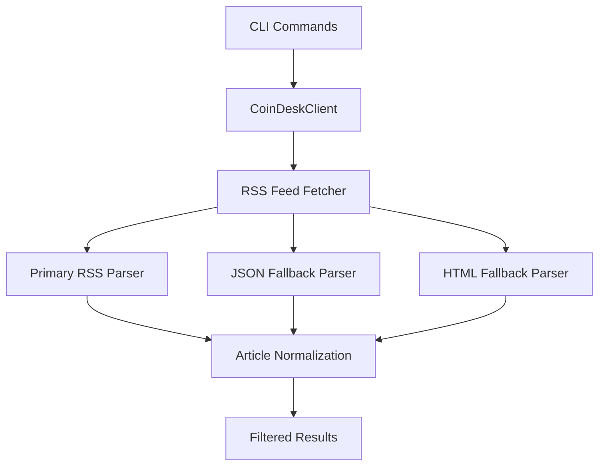
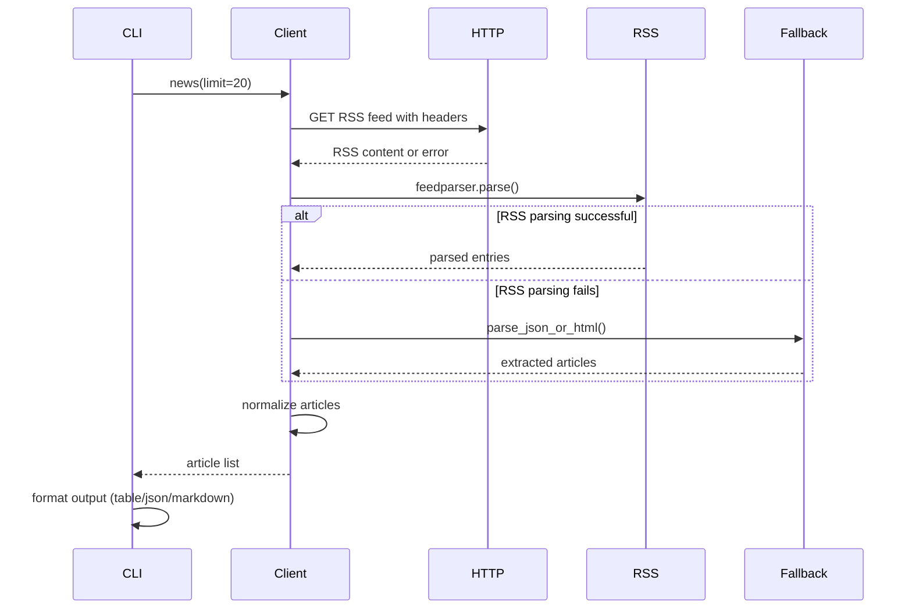

# CoinDesk Library Analysis

## Overview

The CoinDesk library is a Python-based crypto news aggregation tool that fetches and processes cryptocurrency news from CoinDesk's RSS feed. It provides both a programmatic API through the `CoinDeskClient` class and a command-line interface for users to retrieve and search crypto news articles.

## Architecture

The component follows a simple layered architecture pattern with three main layers:
- **Presentation Layer**: CLI interface (`cli.py`) with Typer for command parsing and Rich for output formatting
- **Business Logic Layer**: Client class (`client.py`) that handles RSS parsing and data processing
- **Data Access Layer**: HTTP client integration with CoinDesk's RSS feed and fallback parsers

The architecture emphasizes resilience with multiple fallback parsing strategies when the primary RSS feed fails or returns unexpected content.

## Key Components

### CoinDeskClient Class
The core client class handles all RSS feed operations with robust error handling and multiple parsing strategies. It implements a primary RSS parser using feedparser and two fallback parsers for JSON and HTML content when RSS parsing fails.

### RSS Feed Fetcher
A sophisticated HTTP client implementation that uses browser-like headers to avoid being blocked by CoinDesk's servers. It includes proper timeout handling, redirect following, and comprehensive error reporting.

### Fallback Parsers
Two alternative parsing strategies: a JSON parser that looks for common article field patterns in JSON responses, and an HTML parser that extracts article links using regex patterns. Both parsers normalize URLs and filter for legitimate CoinDesk articles.

### CLI Interface
A Typer-based command-line interface providing two main commands: `news` for latest articles and `search` for keyword-based filtering. Supports multiple output formats including JSON, markdown tables, and Rich-formatted console output.

### URL Validation
A strict URL validation system that ensures only legitimate CoinDesk article URLs are processed, filtering out external links and non-article pages based on domain and path patterns.

## Data Flows

### News Retrieval Flow
The primary data flow starts with the CLI command, proceeds through the client to fetch and parse the RSS feed, applies any necessary fallback parsing, normalizes the data structure, and returns formatted results to the user.

### Search Flow
Search functionality reuses the same feed fetching mechanism but applies client-side filtering based on title, summary, and tag content matching the search query.

## External Dependencies

### External Libraries

- **feedparser** (>=6.0.0) [rss-parsing]: Provides RSS/Atom feed parsing capabilities for processing CoinDesk's RSS feed. Used as the primary parsing mechanism in `_fetch_feed()` method. Imported in: `tools/crypto/coindesk/client.py`.

- **httpx** (>=0.27.0) [networking]: Modern HTTP client library for making requests to CoinDesk's RSS endpoint with proper timeout handling, redirect following, and comprehensive error handling. Dynamically imported and used within `_fetch_feed()` method. Imported in: `tools/crypto/coindesk/client.py`.

- **typer** (>=0.12.0) [cli]: Framework for building command-line interfaces with automatic help generation, type validation, and argument parsing. Used to create the main CLI application with `news` and `search` commands. Imported in: `tools/crypto/coindesk/cli.py`.

- **rich** (>=13.0.0) [cli]: Library for rich text and beautiful formatting in terminals, providing table rendering and colored console output for the CLI interface. Used for creating formatted tables and console output. Imported in: `tools/crypto/coindesk/cli.py`.

- **python-dotenv** (dev dependency) [configuration]: Loads environment variables from .env files for configuration management. Used in CLI module to load environment configuration. Imported in: `tools/crypto/coindesk/cli.py`.

## API Surface

The library exposes a clean public API through the `CoinDeskClient` class:

### CoinDeskClient Methods
- `news(limit: int = 20) -> list[dict]`: Retrieves the latest crypto news articles from CoinDesk
- `search(query: str, limit: int = 20) -> list[dict]`: Searches articles by keyword matching in title, summary, or tags

### CLI Commands
- `coindesk news [--limit N] [--json] [--markdown]`: Get latest crypto news with various output formats
- `coindesk search QUERY [--limit N] [--json] [--markdown]`: Search articles by keyword

### Article Data Structure
All methods return articles as dictionaries with standardized fields:
- `title`: Article headline
- `link`: Full URL to the article
- `published`: Publication timestamp
- `summary`: Article summary/excerpt
- `author`: Article author name
- `tags`: List of article tags/categories
