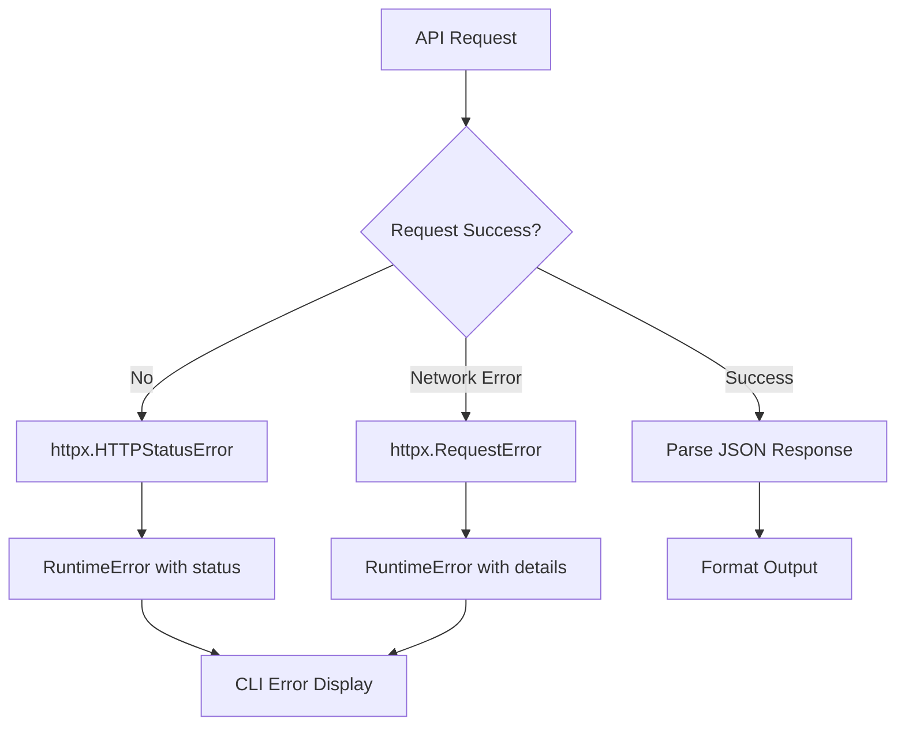

# CoinGecko CLI Component Analysis

## Architecture

The CoinGecko component follows a **layered architecture** pattern with clear separation between the CLI interface layer and the HTTP client layer. The component is designed as a command-line tool that provides structured access to the CoinGecko Pro API for cryptocurrency market data.

The architecture consists of two main layers:
1. **CLI Layer** (`cli.py`) - Handles user interaction, argument parsing, and output formatting
2. **Client Layer** (`client.py`) - Manages API communication and authentication with CoinGecko Pro API

## Key Components

### 1. CoinGeckoClient Class
**Location**: `tools/crypto/coingecko/client.py`  
**Purpose**: Core HTTP client for CoinGecko Pro API interactions

The client provides a comprehensive interface to the CoinGecko Pro API with methods for:
- Price retrieval (`get_price`)
- Market data (`get_markets`) 
- Coin details (`get_coin`)
- Historical data (`get_market_chart`)
- Search functionality (`search`)
- Trending coins (`get_trending`)
- Categories and exchanges listing

### 2. CLI Command Router
**Location**: `tools/crypto/coingecko/cli.py:14`  
**Purpose**: Main Typer application that defines the CLI interface

Defines the primary CLI application using Typer with the name "coingecko" and provides help text describing its purpose for cryptocurrency market data access.

### 3. Output Formatting System
**Location**: `tools/crypto/coingecko/cli.py:24-45`  
**Purpose**: Handles multiple output formats (console tables, JSON, markdown)

Key functions:
- `format_number()` - Formats large numbers with B/M/K suffixes
- `print_markdown_table()` - Generates markdown table output
- Rich console integration for styled terminal output

### 4. Command Implementations
**Location**: `tools/crypto/coingecko/cli.py:47-479`  
**Purpose**: Nine distinct CLI commands covering different CoinGecko API endpoints

Commands include: `price`, `markets`, `coin`, `trending`, `search`, `history`, `categories`, `exchanges`, and `raw`.

### 5. Authentication System
**Location**: `tools/crypto/coingecko/client.py:24-28, 36-41`  
**Purpose**: Manages CoinGecko Pro API key authentication

Uses the centaur_sdk secret management system to retrieve the API key from environment variables and includes it in requests via the `x-cg-pro-api-key` header.

### 6. Error Handling
**Location**: `tools/crypto/coingecko/client.py:47-50`  
**Purpose**: Comprehensive HTTP error handling with user-friendly messages

Catches both HTTP status errors and request errors, converting them to RuntimeError with descriptive messages.

### 7. HTTP Connection Management
**Location**: `tools/crypto/coingecko/client.py:19-22, 129-139`  
**Purpose**: Lazy-loaded HTTP client with context manager support

Provides both explicit resource management via `close()` and automatic cleanup through context manager protocol.

### 8. Configuration Management
**Location**: `tools/crypto/coingecko/cli.py:3-5`  
**Purpose**: Environment variable loading for API configuration

Uses python-dotenv to automatically load environment variables from `.env` files.

## Data Flows

### API Request Flow
```mermaid
graph TD
    A[User Command] --> B[CLI Parser]
    B --> C[get_client()]
    C --> D[CoinGeckoClient.__init__]
    D --> E[_get_api_key()]
    E --> F[secret('COINGECKO_API_KEY')]
    F --> G[_request()]
    G --> H[httpx.Client.get()]
    H --> I[CoinGecko Pro API]
    I --> J[JSON Response]
    J --> K[Format Output]
    K --> L[Console/JSON/Markdown]
```

### Output Format Selection Flow
```mermaid
graph TD
    A[Command Execution] --> B{json_output?}
    B -->|Yes| C[JSON.dumps()]
    B -->|No| D{markdown?}
    D -->|Yes| E[print_markdown_table()]
    D -->|No| F[Rich Console Table]
    C --> G[stdout]
    E --> G
    F --> G
```

### Error Handling Flow


## Dependencies

### External Libraries

- **httpx** (>=0.27.0) [networking]: Modern HTTP client library providing async and sync interfaces. Used in `client.py` for making authenticated requests to the CoinGecko Pro API. Imported in: `tools/crypto/coingecko/client.py:4`.

- **typer** (>=0.12.0) [cli]: Modern CLI framework that automatically generates help text and handles argument parsing. Powers the entire command-line interface. Imported in: `tools/crypto/coingecko/cli.py:9`.

- **rich** (>=13.0.0) [cli]: Rich text and beautiful formatting in the terminal. Used for styled console output including colored tables and formatted text. Imported in: `tools/crypto/coingecko/cli.py:10`.

- **python-dotenv** (>=1.0.0) [build-tool]: Loads environment variables from .env files. Used for development configuration management. Imported in: `tools/crypto/coingecko/cli.py:3`.

### Internal Dependencies

- **centaur_sdk** [internal]: Provides the `secret()` function for secure environment variable access and the `Table` class for rich console tables. Imported in: `tools/crypto/coingecko/client.py:6`, `tools/crypto/coingecko/cli.py:12`.

## API Surface

### CLI Commands

The component exposes a comprehensive command-line interface through the `coingecko` script:

- **price**: Get current prices for specified coins with market cap and volume data
- **markets**: List coins ranked by market capitalization  
- **coin**: Get detailed information about a specific coin including price history
- **trending**: Display currently trending cryptocurrencies
- **search**: Search for coins by name or symbol
- **history**: Get historical price data for a specified time period
- **categories**: List cryptocurrency categories with market data
- **exchanges**: List exchanges ranked by trading volume and trust score
- **raw**: Make direct API calls to any CoinGecko endpoint

### Output Formats

All commands support three output formats:
- **Console**: Rich-formatted tables with colors and styling (default)
- **JSON**: Machine-readable JSON output (`--json` flag)
- **Markdown**: Markdown-formatted tables (`--markdown` flag)

### Python API

The `CoinGeckoClient` class provides a programmatic interface:
- Authentication management with API key handling
- HTTP connection pooling and error handling
- Context manager support for resource cleanup
- Comprehensive coverage of CoinGecko Pro API endpoints

## External Systems

### CoinGecko Pro API
**Service**: pro-api.coingecko.com  
**Protocol**: HTTPS REST API  
**Authentication**: API key via `x-cg-pro-api-key` header  
**Purpose**: Primary data source for all cryptocurrency market data including prices, market caps, trading volumes, and historical data.
