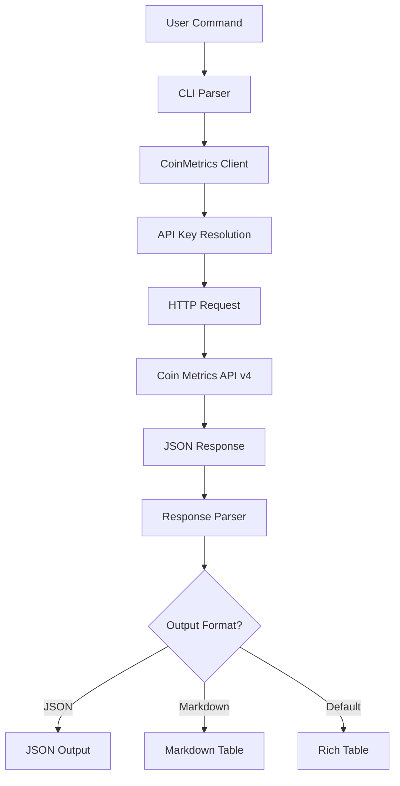

# Coinmetrics Component Analysis

## Architecture

The coinmetrics component follows a **layered CLI architecture** pattern, separating concerns into distinct layers: a command-line interface layer, an HTTP API client layer, and external API integration. The component is structured as a Python package with two primary modules - `cli.py` for user interaction and `client.py` for API communication with Coin Metrics' REST API v4.

The architecture employs a **facade pattern** where the CLI serves as a simplified interface to the underlying Coin Metrics API, providing multiple output formats (JSON, markdown tables, rich console tables) and common parameter handling across all commands.

## Key Components

### CLI Application (`cli.py`)
The main entry point providing a Typer-based command-line interface with 7 primary commands. Each command supports consistent output formatting options (JSON, markdown, rich tables) and implements standardized parameter validation and error handling.

### HTTP Client (`client.py`) 
A lightweight wrapper around the Coin Metrics API v4 that handles authentication, request formatting, and response parsing. Implements connection pooling via httpx and provides both high-level domain methods and raw API access.

### Command Router (`app`)
The central Typer application instance that registers all CLI commands and manages help text, argument parsing, and command dispatch.

### Output Formatters
Three formatting utilities: `print_markdown_table()` for markdown output, Rich Table integration for terminal display, and `format_number()` for human-readable numeric formatting with K/M/B/T suffixes.

### API Key Management
Centralized secret management through `centaur_sdk.secret()` with fallback to environment variables, supporting both explicit API key provision and automatic discovery.

### HTTP Session Management
Lazy-initialized httpx.Client with configurable timeouts and automatic connection reuse, supporting context manager pattern for resource cleanup.

### Error Handling
Comprehensive error handling with user-friendly messages for HTTP errors, network failures, and API rate limiting scenarios.

## Data Flows



### Request Flow
1. User invokes CLI command with arguments and options
2. Typer parses arguments and validates parameters
3. CLI instantiates CoinMetricsClient and calls appropriate method
4. Client resolves API key from centaur_sdk or environment
5. HTTP request constructed with base URL, endpoint, and query parameters
6. httpx executes request with timeout and error handling
7. JSON response parsed and returned as Python data structures

### Data Transformation Flow
1. Raw API response (JSON) received from Coin Metrics
2. Response unwrapped from `{"data": [...]}` envelope if present
3. Data limited to user-specified count via slicing
4. Output format determined from CLI flags
5. Data formatted as JSON, markdown table, or Rich table
6. Formatted output sent to stdout with appropriate styling

## External Dependencies

### Runtime Dependencies

- **httpx** (>=0.27.0) [networking]: Modern async-capable HTTP client for Python. Provides the core HTTP functionality for API requests with connection pooling, timeout handling, and comprehensive error handling. Used throughout `client.py` for all API communication.

- **typer** (>=0.12.0) [cli]: Modern CLI framework built on top of Click. Provides argument parsing, command registration, help generation, and type validation. Used in `cli.py` to define all 7 CLI commands with their parameters and options.

- **rich** (>=13.0.0) [cli]: Library for rich text and beautiful formatting in the terminal. Provides the Table class for tabular output and Console for styled terminal output. Used in `cli.py` for the default table display format across all commands.

- **python-dotenv** (>=1.0.0) [cli]: Loads environment variables from .env files. Used at CLI startup to automatically load configuration from local .env files. Imported and called in `cli.py` line 3-5.

### Internal Dependencies

- **centaur_sdk** [internal]: Provides the `Table` class for rich table formatting and `secret()` function for secure credential management. Used in both `cli.py` (Table import) and `client.py` (secret function for API key resolution).

## API Surface

### CLI Commands

The component exposes 7 CLI commands through the `coinmetrics` executable:

- **assets**: List available cryptocurrencies and digital assets with metadata
- **metrics**: List available on-chain and market metrics for assets  
- **timeseries**: Retrieve time-series data for specified assets and metrics
- **asset-metrics**: Get available metrics for a specific asset
- **market-data**: Retrieve market candles (OHLCV) or trade data
- **exchanges**: List supported cryptocurrency exchanges
- **raw**: Make direct API calls to any Coin Metrics endpoint

### Common CLI Options

All commands support standardized output formatting:
- `--json`: Output raw JSON data
- `--markdown/-m`: Output as markdown tables  
- `--limit/-n`: Limit number of results returned

### Python API

The component also exposes a programmatic API through the `CoinMetricsClient` class:

```python
from coinmetrics.client import CoinMetricsClient

client = CoinMetricsClient(api_key="optional")
assets = client.list_assets()
metrics = client.get_asset_metrics("btc,eth", "PriceUSD", frequency="1d")
```

## External Systems

### Coin Metrics API v4
The primary external system integration is with Coin Metrics' REST API v4 hosted at `api.coinmetrics.io`. The client authenticates using API keys passed as query parameters and supports both free and paid tiers. All requests use HTTPS with configurable timeouts (default 30 seconds).

### Environment Configuration
The component reads configuration from environment variables, particularly `COINMETRICS_API_KEY` for authentication. Supports `.env` file loading for local development environments.

## Component Interactions

This component has no direct interactions with other components in the centaur-src codebase. It operates as a standalone CLI tool that can be invoked independently or as part of larger workflows. The only internal dependency is on `centaur_sdk` for utility functions (Table formatting and secret management).
