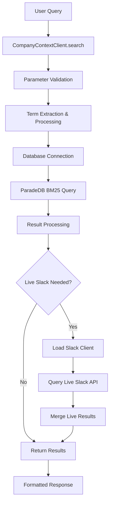
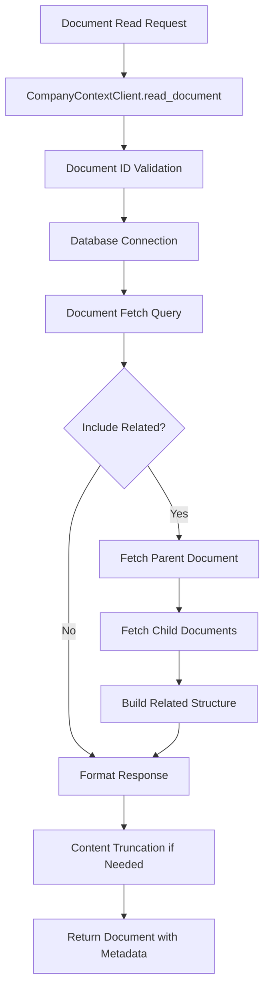

# Company Context Analysis

## Architecture

The company_context component implements a **layered architecture** with clear separation between data access, business logic, and client interfaces. The design centers around a single `CompanyContextClient` class that orchestrates search operations across both indexed documents and live Slack data. The architecture follows an async/sync pattern where internal operations use asyncio for database connections while exposing synchronous methods for tool integration.

The component uses a **hybrid search strategy** combining PostgreSQL full-text search with ParadeDB's BM25 ranking and live Slack API queries to provide comprehensive company history access. The search implementation includes sophisticated query processing with term extraction, stop word filtering, and relevance boosting.

## Key Components

### CompanyContextClient
The primary interface class exposing four main operations: search, list_documents, latest_date, and read_document. Each method implements proper error handling and parameter validation while delegating to async internal methods for actual database operations.

### Search Engine Core
A collection of utility functions implementing the search logic:
- `_search_terms()`: Extracts meaningful search terms while filtering stop words
- `_search_where_clause()`: Builds ParadeDB query clauses with relevance boosting
- `_body_preview()`: Creates contextual document previews centered on query matches

### Database Integration Layer
Async methods handling PostgreSQL connections and queries:
- `_search_async()`: Core search implementation with BM25 ranking
- `_list_documents_async()`: Document listing with date filtering
- `_latest_date_for_connection()`: Index freshness tracking

### Slack Integration
Dynamic loading and integration with the sibling Slack tool:
- `_load_slack_client()`: Runtime discovery and loading of Slack client
- `_live_slack_result()`: Normalization of live Slack messages to document format
- `_slack_after_query()`: Intelligent date modifier injection for gap queries

### Data Processing Utilities
Helper functions for data transformation and validation:
- `_document_summary()`: Standardizes document metadata extraction
- `_parse_datetime_filter()`: Robust ISO 8601 date parsing with timezone handling
- `_normalize_text()`: Text cleanup for consistent previews

## Data Flows

## External Dependencies

### External Libraries

- **asyncpg** (>=0.30.0) [database]: High-performance async PostgreSQL driver providing connection pooling and query execution. Used throughout all database operations via `CompanyContextClient._connect()` and query methods. Imported in: `client.py`.

- **slack-sdk** (>=3.27.0) [api-client]: Official Slack SDK for Python enabling Slack API interactions. Dynamically loaded via `_load_slack_client()` for live message search functionality when bridging indexed/live data gaps. Not directly imported but loaded at runtime.

### Runtime Dependencies

The component also relies on:
- **centaur_sdk.tool_sdk**: Provides the `secret()` function for secure configuration management
- **ParadeDB**: PostgreSQL extension providing BM25 full-text search capabilities (accessed via SQL)

## API Surface

### Primary Methods

**search(query, limit=10, source=None, source_type=None, occurred_after=None, occurred_before=None) -> dict**
- Core search functionality across indexed documents with optional live Slack integration
- Supports advanced filtering by source system, content type, and date ranges
- Returns ranked results with relevance scores and contextual previews

**list_documents(limit=10, source=None, source_type=None, occurred_after=None, occurred_before=None) -> dict**
- Lists documents without search ranking, useful for browsing by date or source
- Supports same filtering options as search but orders chronologically

**read_document(document_id, max_chars=0, include_related=False, max_related_children=25) -> dict**
- Retrieves full document content by ID with optional content truncation
- Can include parent/child document relationships for threaded content

**latest_date(source=None, source_type=None) -> dict**
- Returns indexing freshness information for gap detection and live query optimization
- Essential for determining when to supplement with live Slack data

### Module Entry Point

**_client() -> CompanyContextClient**
- Factory function providing the standard client instance for tool integration

## External Systems

### PostgreSQL Database
The component connects to a PostgreSQL database with ParadeDB extension for document storage and search. The database contains a `company_context_documents` table with full-text search indexes and metadata fields supporting multi-source document ingestion from Slack, Google Drive, Google Calendar, and Linear.

### Slack API
Runtime integration with Slack's search API through the sibling slack tool component. Used for live message queries when indexed data has gaps, automatically determining query date modifiers based on index freshness.

## Component Interactions

### Slack Tool Integration
The component dynamically loads and calls the slack tool's `search_messages()` method to supplement indexed results with live Slack data. This integration uses file system discovery to locate the sibling component and runtime module loading to avoid circular dependencies.
