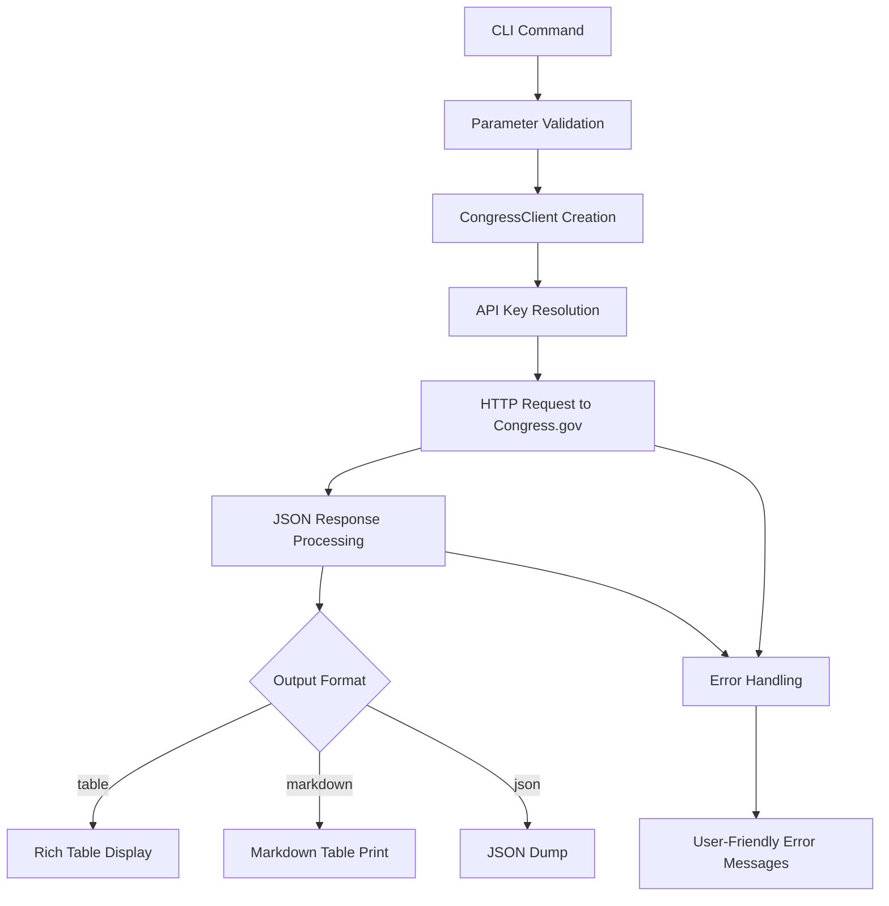

# Congress Component Analysis

## Architecture

The congress component implements a clean client-server architecture pattern with separation of concerns between the API client and CLI interface. It follows a command-based CLI architecture where each major Congress.gov API resource (bills, members, committees, etc.) is exposed as a separate command with consistent parameter handling and output formatting options.

The architecture consists of two main layers:
- **Client Layer**: HTTP client wrapper (`CongressClient`) that handles authentication, request formatting, and error handling for the Congress.gov API v3
- **CLI Layer**: Typer-based command interface that provides user-friendly access to congressional data with multiple output formats (table, markdown, JSON)

The component uses a stateless design where each command creates its own client instance and performs independent API calls. All data flows are synchronous with immediate response formatting and display.

## Key Components

### CongressClient (client.py)
The core API client that wraps the Congress.gov REST API v3. It handles authentication via DATAGOV_API_KEY, manages HTTP connections through httpx, and provides structured methods for each API endpoint. The client supports bills, members, committees, hearings, and roll call votes with consistent parameter validation and error handling.

### CLI Commands (cli.py)
Eight primary commands that expose congressional data:
- **bills**: Lists bills with optional filtering by congress, type, and pagination
- **bill**: Retrieves detailed bill information with optional sub-resources (actions, amendments, cosponsors, subjects, summaries, text)
- **members**: Lists members of Congress with optional state filtering
- **member**: Gets specific member details by bioguide ID
- **committees**: Lists congressional committees with chamber filtering
- **hearings**: Lists committee hearings by congress and chamber
- **votes**: Lists roll call votes with session and chamber filtering
- **search**: Keyword search through bill titles (client-side filtering)

### Output Formatters
Three output format handlers:
- **Rich Table**: Colored, formatted tables for terminal display using the Rich library
- **Markdown Table**: Plain text markdown-formatted tables for documentation
- **JSON**: Raw API response data for programmatic consumption

### Utility Functions
Helper functions for data presentation:
- **truncate()**: Limits text length with ellipsis for table display
- **print_markdown_table()**: Generates markdown table format
- **_print_bill_info()** and **_print_bill_detail()**: Specialized formatters for bill data

## Data Flows

The component follows a consistent request-response data flow pattern:



### Authentication Flow
```mermaid
graph LR
    A[Command Start] --> B[get_client()]
    B --> C[CongressClient.__init__]
    C --> D[API Key Check]
    D --> E[secret('DATAGOV_API_KEY')]
    E --> F[HTTP Client Setup]
    F --> G[API Request]
```

### Bill Detail Flow
The bill command supports multiple sub-resources with specialized formatting for each type (actions, amendments, cosponsors, subjects, summaries, text). Each sub-resource has its own table structure and field mapping optimized for the specific data type.

## External Dependencies

### External Libraries

- **httpx** (>=0.27.0) [networking]: Modern HTTP client library providing async/sync request capabilities. Used in CongressClient for all API communication with Congress.gov, including connection pooling, timeout handling, and error management. Imported in: `tools/research/congress/client.py`.

- **typer** (>=0.12.0) [cli]: Python library for building CLI applications with automatic help generation and type validation. Provides the main application framework, command registration, option/argument parsing, and help text generation. Core to all CLI functionality. Imported in: `tools/research/congress/cli.py`.

- **rich** (>=13.0.0) [cli]: Library for rich text and beautiful formatting in terminals. Provides the Console class for colored output and styled table display. Used for all formatted table output in the default display mode. Imported in: `tools/research/congress/cli.py`.

### Internal SDK Dependencies

- **centaur_sdk.tool_sdk.secret** [configuration]: Centaur SDK function for retrieving API keys and secrets from environment or configuration. Used to obtain the DATAGOV_API_KEY required for Congress.gov API authentication. Imported in: `tools/research/congress/client.py`.

- **centaur_sdk.cli_tables.Table** [cli]: Centaur SDK table component that extends Rich tables with additional formatting capabilities. Used as the primary table display mechanism for all tabular data output. Imported in: `tools/research/congress/cli.py`.

- **dotenv** (load_dotenv) [configuration]: Loads environment variables from .env files. Called at module initialization to ensure API keys are available from environment files. Imported in: `tools/research/congress/cli.py`.

## API Surface

The congress component exposes a comprehensive CLI interface for accessing Congress.gov data:

### Public CLI Commands
- `congress bills` - List bills with filtering options (congress, type, limit, page)
- `congress bill` - Get specific bill details with sub-resource support  
- `congress members` - List members with state filtering
- `congress member <bioguide_id>` - Get member details by ID
- `congress committees` - List committees with chamber filtering
- `congress hearings` - List hearings by congress and chamber
- `congress votes` - List roll call votes with session filtering
- `congress search <keyword>` - Search bills by title keyword

### Output Format Options
All commands support three output formats via flags:
- Default: Rich-formatted colored tables
- `--markdown`: Markdown table format
- `--json`: Raw JSON API responses

### Public Library Interface
The CongressClient class can be imported and used programmatically:

```python
from congress.client import CongressClient

client = CongressClient()
bills = client.list_bills(congress=119, limit=10)
member = client.get_member("L000174")
```

### Configuration Requirements
- **DATAGOV_API_KEY**: Required environment variable for Congress.gov API access
- API key must be valid for api.congress.gov domain

The component provides a complete interface to the Congress.gov API v3 with user-friendly CLI access and programmatic library usage for congressional data research and analysis.
