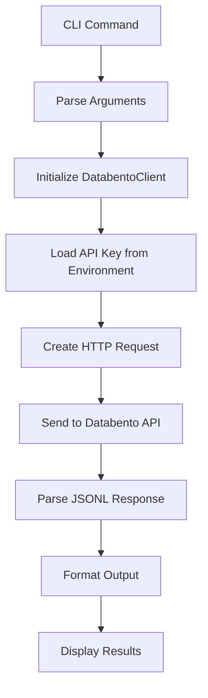

# Databento CLI Component Analysis

The databento component is a Python CLI tool that provides access to Databento's Historical API for retrieving stock market OHLCV (Open, High, Low, Close, Volume) data. This tool enables users to fetch historical stock price data through a command-line interface, targeting financial data analysis and research use cases.

## Architecture

The component follows a layered CLI architecture pattern with clear separation between the command-line interface layer and the API client layer. The design emphasizes simplicity and direct API interaction, with minimal abstraction over the underlying Databento HTTP API.

The architecture consists of three main layers:
1. **CLI Layer** (`cli.py`) - Handles command parsing, user interaction, and output formatting using Typer
2. **Client Layer** (`client.py`) - Manages HTTP communication with the Databento API using httpx
3. **Configuration Layer** - Environment-based configuration for API authentication

## Key Components

### DatabentoClient Class
The core HTTP client that handles all communication with the Databento Historical API. It implements connection pooling, authentication, error handling, and response parsing. The client uses basic authentication with the API key and supports context manager protocol for proper resource cleanup.

### CLI Command Handler
The `prices` command function serves as the primary user interface, accepting parameters for symbol, date range, and schema type. It provides rich console output with color-coded messages and supports both human-readable and JSON output formats.

### Authentication System
Integrates with the centaur SDK's secret management system to securely retrieve the DATABENTO_API_KEY from environment variables or secure storage, with clear error messages when credentials are missing.

### Error Handling Framework
Comprehensive error handling covering HTTP request failures, API errors (400+ status codes), and JSON parsing issues. Different error types receive appropriate handling - 422/403 errors return empty results while other errors raise RuntimeError exceptions.

### Configuration Management
Uses python-dotenv for loading environment variables from .env files, with an example configuration file provided for user setup.

## Data Flows

The primary data flow follows a simple request-response pattern:



**Error Flow**: When API errors occur, the system gracefully handles different error types - returning empty results for permission/validation errors (422/403) and raising exceptions with detailed error messages for other failures.

**Authentication Flow**: The client first attempts to use a provided API key, then falls back to the centaur SDK secret manager to retrieve DATABENTO_API_KEY, raising a descriptive error if neither is available.

## Dependencies

### External Libraries

- **httpx** (>=0.27.0) [networking]: Modern HTTP client library providing async/sync capabilities and connection pooling. Used in `client.py` for all API communication with the Databento Historical API, including authentication, request timeout handling, and error management.

- **typer** (>=0.12.0) [cli]: Modern CLI framework built on Click that provides type hints, automatic help generation, and rich command parsing. Used in `cli.py` to define the `prices` command with its options and arguments, handles parameter validation and help text generation.

- **rich** (>=13.0.0) [cli]: Advanced terminal formatting library providing colored output, progress bars, and styled console text. Used in `cli.py` for console output formatting with color-coded success/error messages and improved user experience.

- **python-dotenv** (>=1.0.0) [build-tool]: Environment variable loader that reads key-value pairs from .env files. Used in `cli.py` to automatically load environment variables including DATABENTO_API_KEY from local configuration files.

### Internal Dependencies

- **centaur_sdk.tool_sdk** [framework]: Internal Centaur framework providing the `secret` function for secure credential management. Used in `client.py` to retrieve the DATABENTO_API_KEY from the platform's secret management system with proper security handling.

## API Surface

### CLI Interface
```bash
databento prices --symbol AAPL --start 2026-01-01 --end 2026-01-31 [--schema ohlcv-1d] [--json]
```

**Parameters:**
- `--symbol/-s`: Required ticker symbol (e.g., AAPL, MSFT)
- `--start`: Required start date in YYYY-MM-DD format
- `--end`: Required end date in YYYY-MM-DD format  
- `--schema`: Optional data schema (default: ohlcv-1d, options: ohlcv-1m, ohlcv-1h)
- `--json/-j`: Optional flag for JSON output format

### Python API
```python
from databento.client import DatabentoClient

client = DatabentoClient(api_key="your_key")
data = client.get_stock_prices("AAPL", "2026-01-01", "2026-01-31", "ohlcv-1d")
```

## External Systems

### Databento Historical API
The component integrates with Databento's Historical API at `hist.databento.com` using HTTPS. It specifically uses:
- **Endpoint**: `/v0/timeseries.get_range`
- **Dataset**: XNAS.ITCH (NASDAQ ITCH feed)
- **Authentication**: HTTP Basic Auth with API key
- **Response Format**: JSONL (JSON Lines) with one record per line

The API requires valid subscription credentials and returns OHLCV data in structured JSON format. The client handles various response scenarios including successful data retrieval, empty results for invalid symbols/dates, and error conditions.
