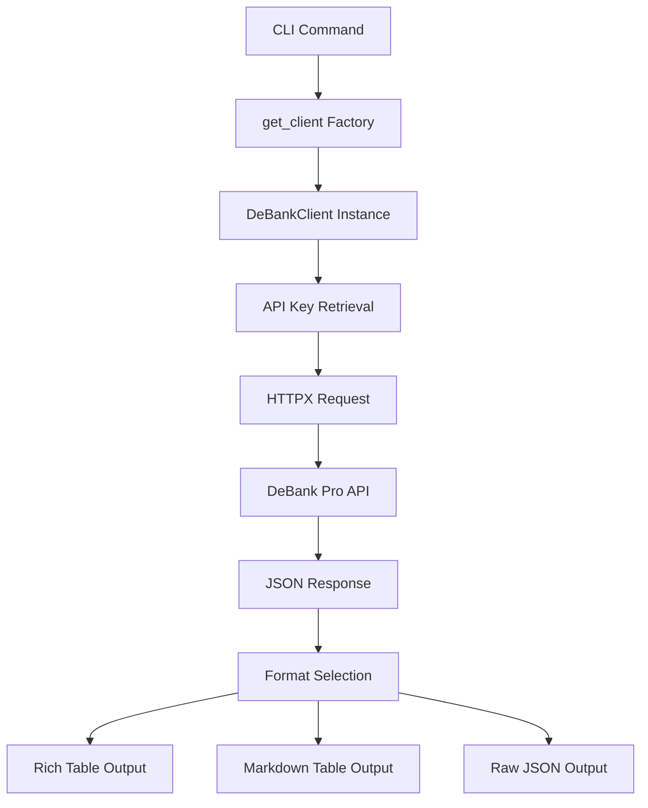
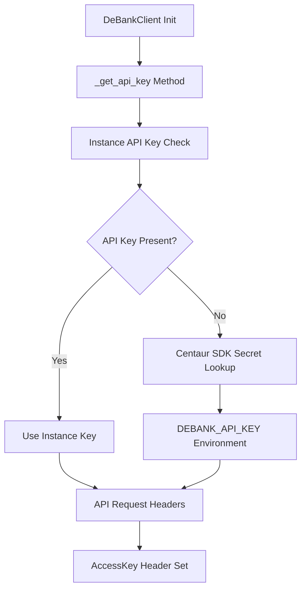
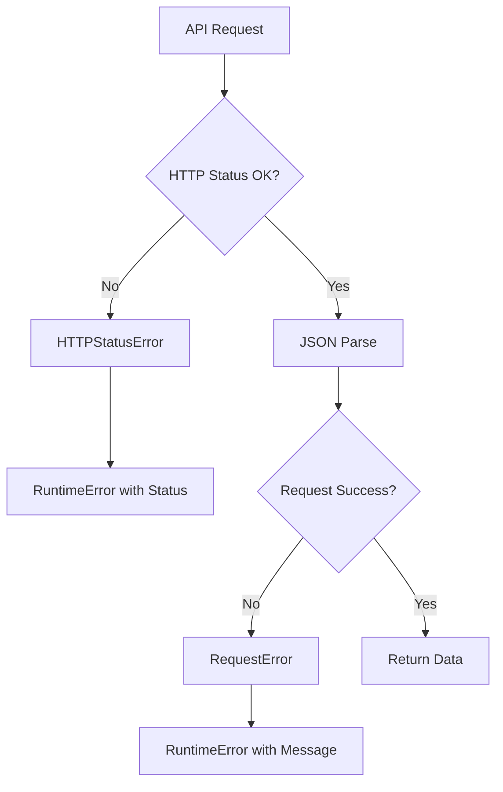

# DeBank Component Analysis

## Architecture

The DeBank component follows a clean separation between client library and command-line interface patterns. It implements a **client-facade** architecture where the `DeBankClient` class encapsulates all API interactions with DeBank's Pro API, while the CLI layer provides user-friendly commands with rich formatting options. The component uses dependency injection through the `get_client()` factory function and follows REST API client patterns with comprehensive error handling.

## Key Components

### DeBankClient (client.py)
The core API client class that handles HTTP communication with DeBank's Pro API. Implements a comprehensive set of methods covering user portfolios, token data, protocol positions, NFTs, and chain information. Uses httpx for HTTP requests with proper timeout handling and authentication via API keys retrieved from secrets management.

### CLI Command Interface (cli.py)
A Typer-based command-line application providing 11 distinct commands for various DeBank operations. Implements consistent output formatting with support for JSON, rich tables, and markdown formats. Commands are organized into logical groups: user data (`balance`, `tokens`, `protocols`, `positions`), chain information (`chains`), protocol discovery (`protocol-list`, `protocol-info`), token lookup (`token`), NFT viewing (`nfts`), and raw API access (`raw`).

### Output Formatting System
Provides three output modes across all commands: rich console tables with colors and styling, markdown tables for documentation, and raw JSON for programmatic consumption. Includes utility functions `format_number()` and `format_amount()` for consistent numerical formatting with K/M/B/T suffixes.

### Authentication & Configuration
Integrates with the Centaur SDK's secret management system to retrieve the DEBANK_API_KEY from environment variables or secure storage. The client gracefully handles missing API keys with descriptive error messages.

### HTTP Client Management
Implements proper resource management with context manager support (`__enter__`/`__exit__`) and lazy initialization of the httpx client. Provides comprehensive error handling for HTTP status errors and request failures.

### API Method Coverage
Exposes 19 distinct API endpoints covering:
- User balance and portfolio data (5 methods)
- Protocol position analysis (6 methods) 
- Token information and discovery (3 methods)
- NFT portfolio viewing (1 method)
- Chain and protocol metadata (4 methods)

## Data Flows

### User Portfolio Query Flow

### Authentication Flow

### Error Handling Flow

## External Dependencies

### External Libraries

- **httpx** (>=0.27.0) [networking]: Modern async-capable HTTP client library for making requests to the DeBank Pro API. Used throughout `DeBankClient` class for all API communications with proper timeout handling and connection pooling. Imported in: `tools/crypto/debank/client.py`.

- **typer** (>=0.12.0) [cli]: Command-line interface framework providing argument parsing, help generation, and command organization. Powers the entire CLI interface with 11 commands and consistent option handling. Imported in: `tools/crypto/debank/cli.py`.

- **rich** (>=13.0.0) [cli]: Terminal formatting library providing colored tables, progress bars, and styled console output. Used for all rich table formatting and console output throughout the CLI commands. Imported in: `tools/crypto/debank/cli.py`.

### Internal Dependencies

- **centaur_sdk** [internal]: Provides the `secret()` function for secure API key retrieval from environment variables or secret management systems. Used in `DeBankClient._get_api_key()` method for authentication. Imported in: `tools/crypto/debank/client.py`.

## API Surface

### Library Interface
The component exposes `DeBankClient` as its primary public interface, providing methods for:
- User portfolio queries: `get_user_total_balance()`, `get_user_all_token_list()`, `get_user_all_simple_protocol_list()`
- Protocol analysis: `get_user_protocol()`, `get_user_complex_protocol_list()`
- Token discovery: `get_token()`, `get_token_list_by_ids()`
- Chain metadata: `get_chain_list()`, `get_protocol_list()`
- NFT portfolio: `get_user_nft_list()`

### Command-Line Interface
Provides 11 commands accessible via the `debank` CLI:
- **balance** - Total wallet balance across all chains
- **tokens** - Token holdings with filtering and limits
- **protocols** - DeFi protocol positions (simple view)
- **positions** - Detailed protocol positions (complex view)
- **protocol** - Specific protocol position details
- **chains** - List supported blockchain networks
- **protocol-info** - Protocol metadata and TVL
- **protocol-list** - Protocols available on a chain
- **token** - Individual token information
- **nfts** - NFT portfolio viewing
- **raw** - Direct API endpoint access

All commands support `--json`, `--markdown`, and rich console output modes for flexible integration.
