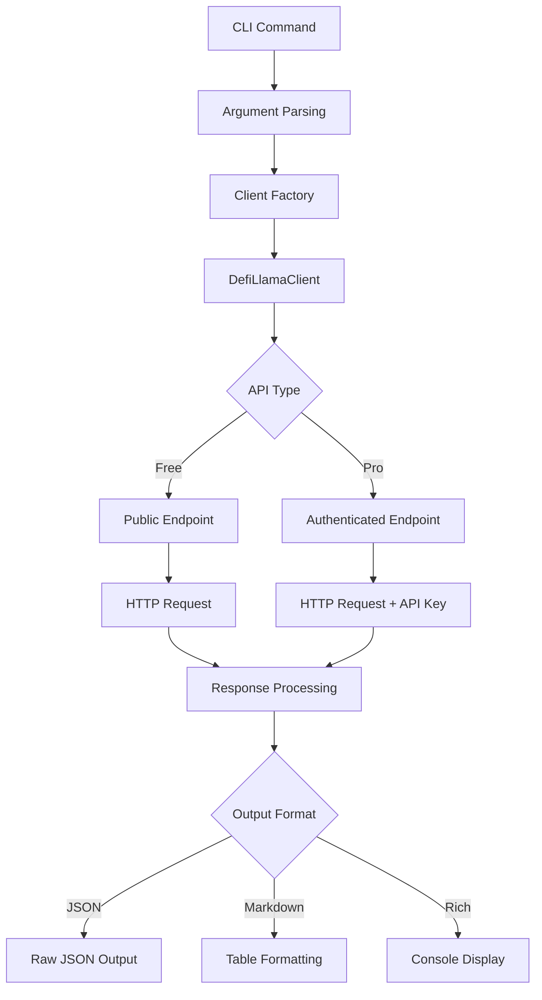

# DefiLlama CLI Component Analysis

## Architecture

The DefiLlama component implements a command-line interface architecture following a separation of concerns pattern. It consists of a client layer that handles HTTP interactions with multiple DefiLlama API endpoints, and a CLI layer that provides user-friendly commands with rich formatting options. The architecture is designed around the command pattern where each CLI command corresponds to specific DeFi analytics functionality.

The component uses a modular design where the `DefiLlamaClient` class abstracts all API interactions, while the CLI module (`cli.py`) focuses purely on user interface concerns including argument parsing, data formatting, and output presentation. This separation allows for easy testing and potential reuse of the client in other contexts.

## Key Components

### DefiLlamaClient Class
The core client class manages HTTP communications with four distinct DefiLlama API endpoints: main API (`api.llama.fi`), stablecoins API, bridges API, and pro API. It handles authentication for premium endpoints, request construction, error handling, and response parsing. The client supports both free and premium API tiers with automatic API key management.

### CLI Commands
The component exposes 11 primary commands covering the full spectrum of DeFi analytics:
- `stablecoins` and `stablecoin` for stablecoin market cap analysis
- `stablecoin-flows` for tracking capital movements
- `protocols` and `protocol` for TVL and protocol analysis  
- `chains` and `chain-tvl` for blockchain ecosystem metrics
- `dex-volume` for spot trading analytics
- `bridges` for cross-chain bridge statistics
- `fees` for protocol revenue analysis
- `raw` for direct API access

### Output Formatters
Multiple output formatting utilities support different use cases: `format_number()` for human-readable financial values, `print_markdown_table()` for documentation integration, and Rich console tables for interactive terminal usage. Each command supports JSON, markdown, and rich console output modes.

### API Request Handler
The `_request()` method centralizes HTTP handling with support for different base URLs, query parameters, and authentication schemes. It includes comprehensive error handling with context-specific error messages and intelligent fallback suggestions for common user mistakes.

### Perpetuals Detection System
A specialized heuristic system (`_looks_like_perps()`) helps users navigate DefiLlama's API separation between spot DEX volumes and perpetuals trading data, providing helpful error messages when users query perpetuals venues through the wrong endpoint.

## Data Flows

### Request Flow
User commands flow through Typer's argument parsing into command-specific handlers. Each handler instantiates a `DefiLlamaClient` and calls appropriate methods. The client determines the correct API endpoint, constructs the HTTP request with proper authentication if needed, and handles the response. Data flows back through formatters based on user-specified output preferences.

### Authentication Flow
The client checks for API keys in two locations: constructor parameters and environment variables via the centaur SDK's `secret()` function. For premium endpoints, it automatically appends authentication either as URL parameters or in the request path depending on the endpoint structure.

### Error Handling Flow
Errors propagate through multiple layers with context enrichment. HTTP errors are caught and wrapped with user-friendly messages. Special handling exists for perpetuals venues where users might query the wrong endpoint, providing intelligent suggestions for the correct API path.

## External Dependencies

### External Libraries

- **httpx** (>=0.27.0) [networking]: Provides async-capable HTTP client functionality. Used throughout `DefiLlamaClient` for all API communications including connection pooling, timeout management, and error handling. Imported in: `client.py`.

- **typer** (>=0.12.0) [cli]: Modern CLI framework providing decorative command definition, automatic help generation, and type-safe argument parsing. Used extensively in `cli.py` for all command definitions, options, and arguments. Imported in: `cli.py`.

- **rich** (>=13.0.0) [cli]: Advanced terminal formatting library providing styled console output, tables, and progress indicators. Used in `cli.py` for creating formatted tables and colored console output through the `Console` class. Imported in: `cli.py`.

- **python-dotenv** (>=1.0.0) [build-tool]: Environment variable loader for development configuration. Used in `cli.py` via `load_dotenv()` to automatically load `.env` files for API key configuration. Imported in: `cli.py`.

## API Surface

### Public Commands
The CLI exposes 11 commands accessible via the `defillama` executable:
- `stablecoins`: List stablecoins by market cap with filtering options
- `stablecoin <asset>`: Get detailed information for a specific stablecoin
- `stablecoin-flows <chain>`: Analyze stablecoin inflows/outflows for a blockchain
- `protocols`: List DeFi protocols by TVL with category and chain filters
- `protocol <slug>`: Get comprehensive protocol details and historical data
- `chains`: List all blockchains by total value locked
- `chain-tvl <chain>`: Historical TVL analysis for a specific blockchain
- `dex-volume`: DEX trading volume analytics across protocols
- `bridges`: Cross-chain bridge volume and statistics
- `fees`: Protocol fee and revenue analysis
- `raw <endpoint>`: Direct API access for advanced users

### Client API
The `DefiLlamaClient` class provides a programmatic Python API with 25+ methods organized by data category:
- Stablecoins: `list_stablecoins()`, `get_stablecoin()`, `get_stablecoin_charts()`
- TVL & Protocols: `list_protocols()`, `get_protocol()`, `list_chains()`
- DEX Volumes: `get_dex_volumes()`, `get_dex_summary()`
- Derivatives: `get_derivatives_volumes()`, `get_derivatives_summary()`  
- Bridges: `list_bridges()`, `get_bridge_volumes()`
- Fees: `get_fees()`, `get_protocol_fees()`

### Output Formats
All commands support three output formats controlled by command-line flags:
- Rich console tables (default) with styling and automatic formatting
- JSON output (`--json`) for programmatic consumption
- Markdown tables (`--markdown`) for documentation integration

## External Systems

The component integrates with the DefiLlama API ecosystem through four distinct endpoints:
- **Main API** (`api.llama.fi`): Core TVL, protocol, and chain data
- **Stablecoins API** (`stablecoins.llama.fi`): Stablecoin market cap and flow data
- **Bridges API** (`bridges.llama.fi`): Cross-chain bridge volume and statistics
- **Pro API** (`pro-api.llama.fi`): Premium endpoints requiring authentication

Authentication is managed through API keys configured via environment variables or the centaur SDK's secret management system. The component handles rate limiting gracefully and provides fallback behavior for quota-exceeded scenarios.
