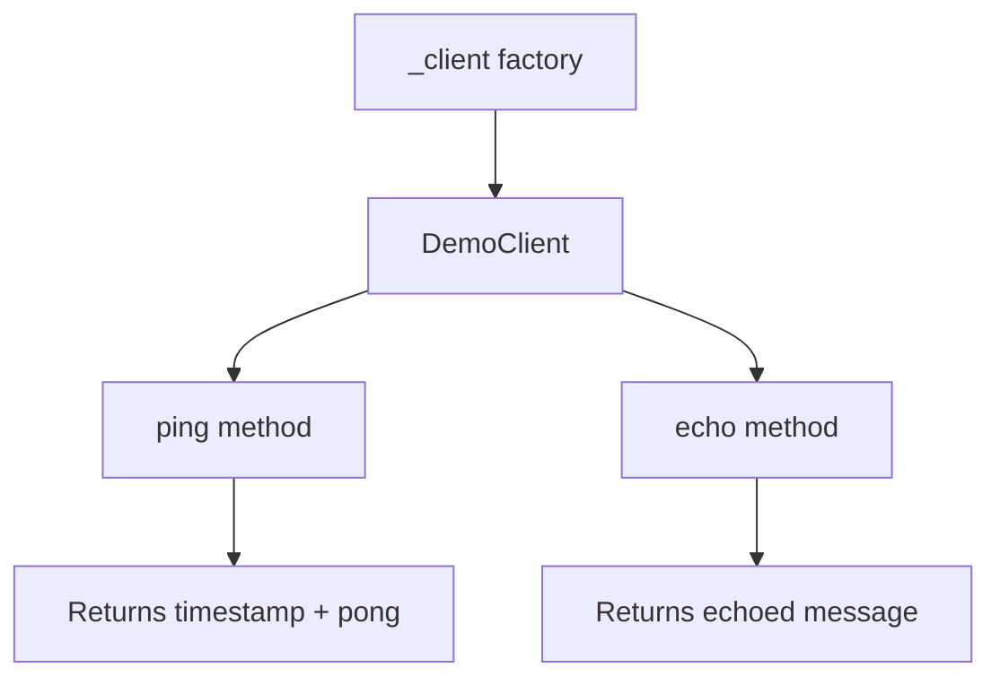
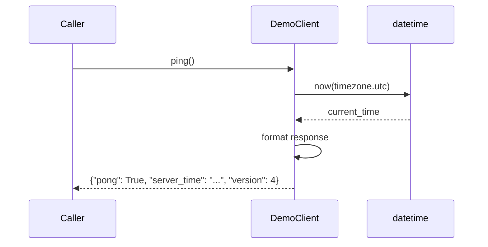
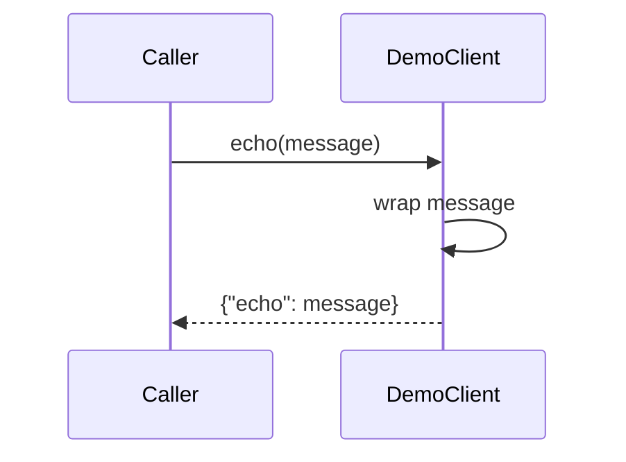

# Demo Component Analysis

## Overview

The demo component is a minimalist Python library designed specifically for testing continuous deployment (CD) hot-reload functionality. It provides a simple client interface with basic ping and echo operations that can be used to verify that hot-reload mechanisms are working correctly in deployment pipelines.

## Architecture

The component follows a simple **single-class architecture** pattern with no external dependencies. The design prioritizes simplicity and reliability for its testing purpose, avoiding any complexity that might interfere with hot-reload testing scenarios.

The architecture consists of:
- A single `DemoClient` class that implements core functionality
- A factory function `_client()` for instantiating the client
- No configuration, state management, or external integrations

## Key Components

### 1. DemoClient Class
**Location**: `tools/infra/demo/client.py` (lines 6-13)
**Purpose**: Main service class providing ping and echo functionality for hot-reload testing

The class implements two simple methods:
- `ping()`: Returns a response with current server time and version information
- `echo(message)`: Echoes back the provided message

### 2. Factory Function
**Location**: `tools/infra/demo/client.py` (lines 16-17)  
**Purpose**: Provides a factory method `_client()` for creating DemoClient instances

### 3. Version Management
**Location**: `tools/infra/demo/client.py` (line 9)
**Purpose**: Hardcoded version number (currently "4") in ping responses for tracking deployment updates

## Data Flows

### Ping Operation Flow

### Echo Operation Flow

## External Dependencies

### External Libraries

This component has **zero external dependencies** beyond Python's standard library. The only import is from Python's built-in `datetime` module:

- **datetime** (Python stdlib) [time-handling]: Provides timezone-aware timestamp generation for the ping method. Used to generate ISO format timestamps in UTC. Imported in: `tools/infra/demo/client.py` line 3.

This minimal dependency footprint is intentional for the component's role as a testing tool, ensuring it doesn't introduce variables that could affect hot-reload testing scenarios.

## API Surface

### Public Interface

The component exposes a simple programmatic API through the `DemoClient` class:

**DemoClient.ping() -> dict**
- Returns: `{"pong": True, "server_time": "<ISO timestamp>", "version": <int>}`
- Purpose: Health check endpoint that includes timing and version information

**DemoClient.echo(message: str) -> dict** 
- Parameters: `message` - string to echo back
- Returns: `{"echo": "<message>"}`
- Purpose: Simple echo functionality for testing message passing

**_client() -> DemoClient**
- Returns: New DemoClient instance
- Purpose: Factory function for client instantiation

### Configuration Interface

The component is configured through `pyproject.toml` with Centaur-specific settings:
- `module = "client.py"` - Specifies the main module
- `hosts = []` - Empty host configuration (no external service dependencies)
- `secrets = []` - No secrets required
