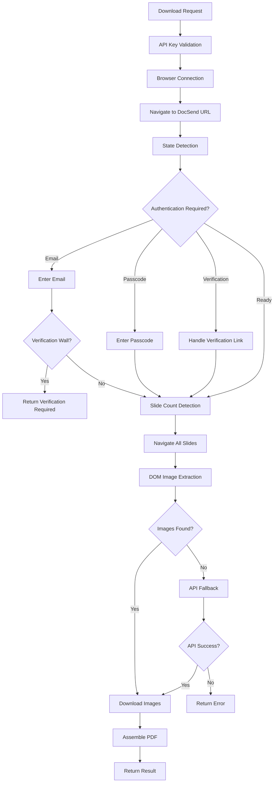
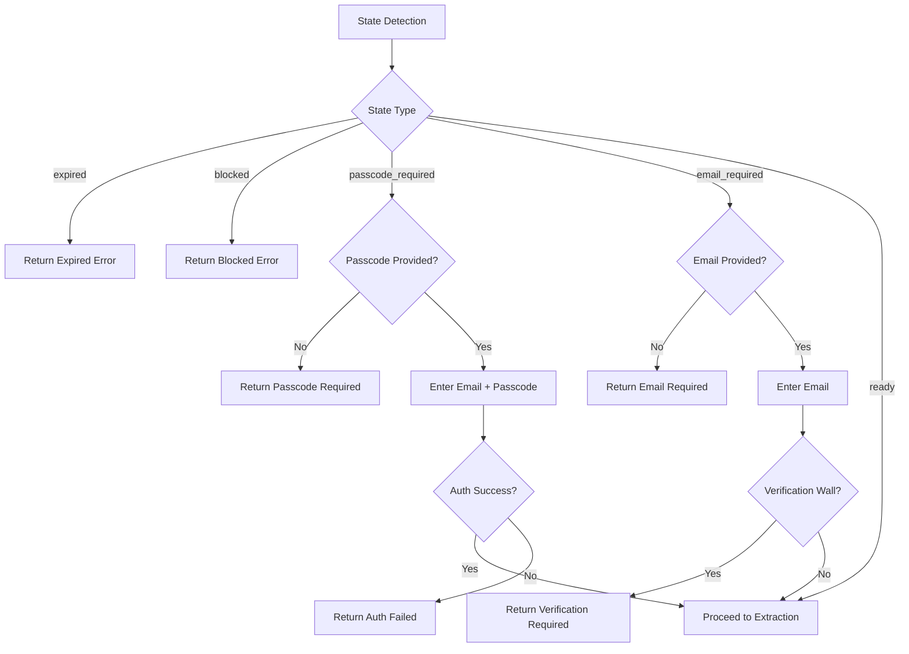

# DocSend Component Analysis

## Architecture

The DocSend component implements a browser automation-based document downloader that extracts PDF documents from DocSend's protected document sharing platform. The architecture follows a multi-strategy approach combining cloud browser automation with DOM extraction and API fallbacks.

The component uses a layered approach:
1. **Browser Management Layer**: Handles cloud browser connection via Browser-use service and Playwright
2. **Authentication Layer**: Manages DocSend's various authentication mechanisms (email, passcode, verification)
3. **State Detection Layer**: Identifies document access requirements and blockers
4. **Content Extraction Layer**: Multiple strategies for slide/page extraction
5. **Image Processing Layer**: Downloads and assembles images into PDF format

The design mirrors successful browser extension approaches, providing fallback mechanisms when primary extraction methods fail. The component integrates with Centaur's secret management system for API key handling.

## Key Components

### DocsendClient Class
The main interface providing a synchronous `download()` method that internally coordinates asynchronous operations. Handles both running and non-running event loops through thread pool execution.

### Authentication System
- `_detect_state()`: Identifies document protection state (expired, blocked, passcode required, email required, ready)
- `_enter_email()`: Handles email-gated document access with multiple selector strategies
- `_enter_passcode()`: Manages password-protected documents with email + passcode combination
- `_has_verification_wall()`: Detects email verification requirements after submission

### Content Extraction Engine
- `_navigate_all_slides()`: Forces rendering by navigating through all slides using keyboard events
- `_extract_dom_image_urls()`: Primary strategy extracting URLs from rendered DOM elements
- `_fetch_slide_urls()`: Fallback API strategy using DocSend's internal `/page_data/` endpoints
- `_download_images()`: Parallel image download and RGBA to RGB conversion

### Browser Management
- `_browser_use_ws_url()`: Constructs WebSocket connection URLs with proxy and profile configuration
- `_prepare_playwright_tls()`: Configures TLS certificates for corporate firewall environments
- `_browser_use_api_key()`: Retrieves API keys via Centaur SDK secret management

### Utility Functions
- `_slide_count()`: Determines total document pages through multiple detection methods
- `_dismiss_cookies()`: Handles cookie consent dialogs
- `_click_submit()`: Robust form submission across different button types
- `_redact_browser_use_secret()`: Security function removing API keys from error messages

## Data Flows

### Primary Download Flow


### Authentication Flow


## External Dependencies

### External Libraries

- **browser-use-sdk** (>=2.0.14) [cloud-browser]: Cloud browser automation service providing managed Chromium instances. Used for connecting to remote browsers via WebSocket. Imported indirectly through API key configuration and WebSocket URL construction.

- **httpx** (>=0.28.0) [networking]: Async HTTP client for downloading slide images from DocSend's CloudFront URLs. Used in `_download_images()` for parallel image fetching with proper timeout handling. Imported in: `client.py:22`.

- **pillow** (>=12.0.0) [image-processing]: Python Imaging Library for image manipulation and PDF generation. Handles RGBA to RGB conversion and multi-page PDF assembly. Used extensively in `_download_images()` and PDF creation. Imported in: `client.py:23`.

- **playwright** (>=1.50.0) [browser-automation]: Browser automation framework providing CDP connection capabilities. Dynamically imported for connecting to cloud browsers and DOM manipulation. Imported in: `client.py:116`.

### Runtime Dependencies

- **centaur_sdk** [internal]: Centaur platform SDK providing secret management functionality. Used for secure API key retrieval via `secret()` function. Imported in: `client.py:25`.

### System Dependencies

- **Node.js**: Required by Playwright for browser automation. Component configures Node.js CA certificates and options for corporate environments.

## API Surface

### Public Interface

The component exposes a single public class `DocsendClient` with one primary method:

```python
def download(
    url: str,
    email: str = "",
    passcode: str | None = None,
    verification_link: str | None = None,
) -> dict
```

**Parameters:**
- `url`: DocSend document URL (e.g., https://docsend.com/view/abc123)
- `email`: Email address for email-gated documents
- `passcode`: Password for password-protected documents  
- `verification_link`: Email verification URL when required by DocSend

**Return Format:**
```python
{
    "status": "ok" | "error" | "expired" | "blocked" | "passcode_required" | "email_required" | "verification_link_required",
    "filename": "docsend_{slug}.pdf",
    "data": "base64_encoded_pdf_content",
    "mime_type": "application/pdf",
    "page_count": int,
    "downloaded": int,
    "error": str | None
}
```

### Factory Function

- `_client() -> DocsendClient`: Factory function returning a configured client instance

### Configuration

The component uses environment variables and Centaur secrets:
- `BROWSER_USE_API_KEY`: API key for cloud browser service (via Centaur SDK)
- `BROWSER_USE_PROXY_COUNTRY`: Optional proxy country code
- `BROWSER_USE_PROFILE_ID`: Optional browser profile identifier
- `NODE_EXTRA_CA_CERTS`: TLS certificate path for corporate environments
- `NODE_OPTIONS`: Node.js runtime options

## External Systems

### Browser-use Cloud Service
The component connects to `connect.browser-use.com` via WebSocket for managed browser instances. Requires API authentication and supports proxy configuration and browser profiles.

### DocSend Platform
- **Main Service**: Accesses DocSend document viewer at `docsend.com/view/*` URLs
- **API Endpoints**: Uses internal `/page_data/{page_number}` API for slide URL extraction
- **CDN**: Downloads slide images from DocSend's CloudFront distribution

### Corporate Infrastructure
- **TLS/Firewall**: Configures Node.js CA certificates for corporate firewall environments
- **Proxy Support**: Optional proxy routing through specified country codes

## Component Interactions

This component has no internal dependencies on other Centaur components. It integrates only with:
- **centaur_sdk**: For secure secret management and API key retrieval
- **External Browser Service**: Cloud browser automation via Browser-use platform
- **DocSend Platform**: Target document extraction service

The component is designed as a self-contained library that other Centaur components can import and use for DocSend document extraction functionality.
