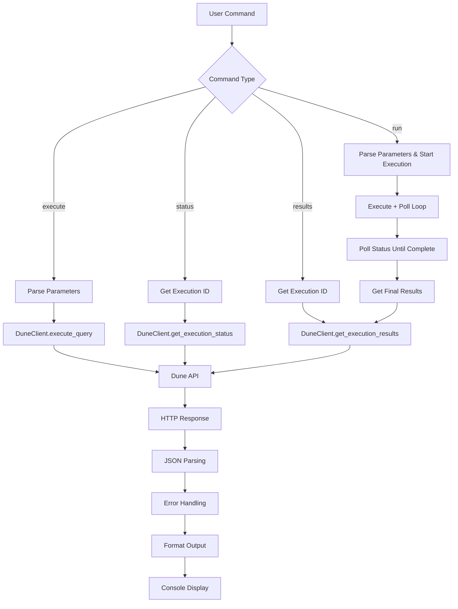

Now I have a complete understanding of the dune component. Let me analyze it.

# Dune Analytics CLI Component Analysis

The Dune component is a command-line interface (CLI) tool for interacting with Dune Analytics' API to execute SQL queries, monitor their status, and retrieve results. It provides a comprehensive set of commands for managing query executions on the Dune Analytics platform, which is a popular blockchain data analysis service.

## Architecture

The component follows a **layered architecture** with clear separation of concerns:

1. **CLI Layer** (`cli.py`) - User interface handling command parsing, argument validation, and output formatting
2. **Client Layer** (`client.py`) - HTTP client abstraction for Dune Analytics API
3. **Configuration Layer** - Environment-based configuration with `.env` support

The architecture emphasizes simplicity and direct API interaction, with minimal abstraction layers to maintain clarity and ease of debugging.

## Key Components

### DuneClient Class
The core HTTP client that handles all API communication with Dune Analytics. It provides authenticated requests with automatic error handling and response parsing. The client maintains a persistent HTTPX connection with base URL configuration and API key authentication headers.

### CLI Command Functions
Seven main command functions that form the public interface:
- `execute()` - Initiates query execution and returns execution ID
- `status()` - Checks execution status and queue position  
- `results()` - Retrieves and displays completed query results
- `run()` - Full workflow combining execution, polling, and result display
- `cancel()` - Cancels running executions
- `query()` - Fetches query metadata and parameters
- `raw()` - Direct API endpoint access for advanced usage

### Client Factory and Singleton Pattern
Global client instance management with lazy initialization ensures efficient resource usage while maintaining state across command invocations.

### Rich Console Integration
Sophisticated terminal output with colored status indicators, progress spinners, and formatted tables for enhanced user experience.

## Data Flows

The component implements several distinct data flows for different use cases:

### Execute-and-Wait Flow (run command)
The most complex flow that combines query execution with polling:
1. Parse and validate JSON parameters
2. Execute query via API
3. Enter polling loop with configurable intervals
4. Monitor execution status with timeout protection
5. Retrieve and format final results
6. Display formatted table or JSON output

### Simple Query Flow (execute/status/results commands)
Direct API operations for individual workflow steps:
1. Validate input parameters
2. Make authenticated API request
3. Handle errors and format response
4. Display results with appropriate styling

## External Dependencies

### External Libraries

- **httpx** (>=0.27.0) [networking]: Modern async-capable HTTP client library for Python. Provides the core HTTP functionality for API communication with connection pooling, timeout handling, and comprehensive request/response processing. Used in `client.py` for all Dune API interactions.

- **typer** (>=0.12.0) [cli]: Modern CLI framework built on top of Click with automatic help generation and type annotations. Handles command parsing, argument validation, option processing, and help text generation. Used throughout `cli.py` for all command definitions and decorators.

- **rich** (>=13.0.0) [cli]: Terminal formatting library providing colored output, progress indicators, tables, and status spinners. Used extensively in `cli.py` for console output formatting, table display, and interactive feedback. Integrates with typer for enhanced user experience.

- **python-dotenv** (>=1.0.0) [configuration]: Environment variable loading from .env files. Automatically loaded at module import to support local development configuration. Used in `cli.py` for loading environment variables including the required DUNE_API_KEY.

## API Surface

The component exposes a comprehensive CLI interface through the `dune` command with the following subcommands:

### Command Interface
- `dune execute <query_id>` - Execute a query and return execution ID
- `dune status <execution_id>` - Check execution status
- `dune results <execution_id>` - Get results from completed execution  
- `dune run <query_id>` - Execute query and wait for results (most common workflow)
- `dune cancel <execution_id>` - Cancel running execution
- `dune query <query_id>` - Get query metadata and parameters
- `dune raw <endpoint>` - Make direct API calls for debugging

### Global Options
All commands support:
- `--json` flag for machine-readable JSON output
- `--help` for command-specific documentation

### Specialized Options
- `--params/-p` for JSON query parameters (execute, run)
- `--limit/-n` for result row limiting (results, run)  
- `--poll` for polling interval configuration (run)
- `--timeout/-t` for execution timeout (run)
- `--method/-X` and `--data/-d` for HTTP method and body (raw)

## External Systems

### Dune Analytics API
The component integrates exclusively with Dune Analytics' REST API at `https://api.dune.com/api/v1`. Authentication uses API key headers (`X-Dune-API-Key`) and all communication occurs over HTTPS with 60-second timeouts.

**Key API Endpoints:**
- `POST /query/{id}/execute` - Start query execution
- `GET /execution/{id}/status` - Check execution progress
- `GET /execution/{id}/results` - Retrieve query results
- `POST /execution/{id}/cancel` - Cancel running queries
- `GET /query/{id}` - Fetch query metadata

### Configuration Sources
- Environment variables (DUNE_API_KEY required)
- `.env` files for local development
- Centaur SDK secret management integration

## Component Interactions

The component has minimal internal dependencies within the Centaur ecosystem:

- **centaur_sdk.Table**: Used for rich table formatting in result display
- **centaur_sdk.secret**: Factory function integration for API key management
- **No HTTP/gRPC calls** to other Centaur components - operates as standalone tool

The component is designed as a self-contained utility that can be used independently or as part of larger blockchain data analysis workflows.
