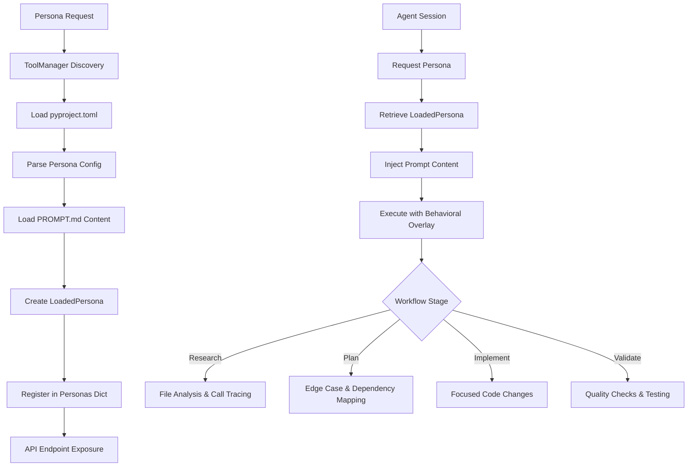

Now I have enough information to write the analysis. The eng component is a persona configuration that defines behavioral guidelines and workflow patterns for AI agents in the Centaur system. It's a declarative configuration rather than a traditional Python package with executable code.

# Engineering Persona Analysis

## Architecture

The `eng` component implements a **declarative persona pattern** within the Centaur AI agent system. Rather than containing executable code, it defines behavioral guidelines, workflow processes, and quality standards through configuration files. The persona acts as a behavioral overlay that modifies how AI agents approach software engineering tasks.

The architecture follows a **configuration-driven approach** where:
- **Persona Definition**: Stored as markdown prompts that specify behavior patterns
- **Metadata Configuration**: Defined in `pyproject.toml` with Centaur-specific extensions
- **Runtime Integration**: Loaded by the API service's `ToolManager` for agent execution
- **Dynamic Loading**: Personas are discovered and loaded at runtime through directory scanning

## Key Components

### 1. **Persona Configuration** (`pyproject.toml`)
Defines the persona's metadata and integration points with the Centaur system. Specifies the persona type, engine preference, and prompt file location.

### 2. **Behavioral Prompt** (`PROMPT.md`)
Contains comprehensive behavioral instructions covering:
- Engineering workflow processes (research, plan, implement, validate)
- Quality standards and maintainability requirements
- Debugging and investigation methodologies
- Communication style guidelines
- Budget-aware response patterns

### 3. **Workflow Patterns**
Embedded within the prompt are structured workflows:
- **Research-first approach**: File reading, call site tracing, assumption verification
- **Explicit planning**: Edge case identification, dependency mapping, test scoping
- **Precise implementation**: Focused changes, convention preservation
- **Thorough validation**: Language-specific checks, targeted testing

### 4. **Quality Gates**
Defines specific validation requirements:
- Python: `ruff check`, formatting validation, targeted tests
- TypeScript: `pnpm exec tsc --noEmit`, linting, relevant tests
- Architecture changes: Dead code removal, complete call path wiring

### 5. **Response Style Contract**
Establishes communication patterns:
- Outcome-first reporting with concrete evidence
- Technical fidelity preservation (exact numbers, commands, paths)
- Anti-pattern avoidance (hype language, generic framing, AI-slop)

## Data Flows



## External Dependencies

The `eng` persona has **no external dependencies** as it is purely a configuration artifact. However, it integrates with the broader Centaur ecosystem:

### Runtime Dependencies (Indirect)
- **Centaur API Service**: Loads and serves persona configurations through the ToolManager
- **Agent Execution Engine**: Applies persona behavioral overlays during agent sessions
- **Development Tools**: Referenced in validation workflows (ruff, tsc, pnpm)

### Integration Points
- **Slack Feedback System**: Uses "eng" as the default persona for improvement runs
- **Agent Control Plane**: Manages persona selection and application
- **Tool Discovery**: Exposed through `/personas` API endpoints

## API Surface

The persona exposes no direct API but is consumed through the Centaur API service:

### REST Endpoints (via API Service)
- `GET /personas` - Lists available personas including eng
- `GET /personas/eng` - Returns eng persona metadata
- `GET /personas/eng/prompt` - Returns the full behavioral prompt content

### Configuration Schema
```json
{
  "name": "eng",
  "description": "Engineering persona — code review, debugging, repo work",
  "engine": "codex",
  "prompt_file": "PROMPT.md",
  "has_custom_executor": false
}
```

## External Systems

The eng persona operates within the Centaur agent infrastructure:

### Agent Execution Runtime
- **Engine Selection**: Configured to use "codex" engine by default
- **Behavioral Overlay**: Prompt content injected into agent context
- **Workflow Guidance**: Provides structured approach to engineering tasks

### Development Environment Integration
- **Static Analysis**: References `ruff check` for Python validation
- **Type Checking**: Specifies `tsc --noEmit` for TypeScript validation
- **Package Management**: Integrates with `pnpm` for dependency management
- **Testing Frameworks**: Guides targeted test execution

## Component Interactions

```mermaid
graph LR
    A[Slack Feedback] --> |persona_id="eng"| B[Agent Spawn]
    B --> C[ToolManager]
    C --> |Load Persona| D[eng Configuration]
    D --> |Behavioral Overlay| E[Agent Runtime]
    E --> |Quality Validation| F[Development Tools]
    E --> |Code Analysis| G[Repository Files]
    E --> |Structured Output| H[Task Completion]
```

### Primary Consumers
- **Slack Integration**: Uses eng persona for automated improvement runs
- **Agent Control Plane**: Applies persona context to agent sessions
- **Development Workflows**: Provides engineering-specific behavioral patterns

### Data Dependencies
- **Repository Access**: Requires file system access for code analysis
- **Tool Chain Integration**: Depends on development tools for validation
- **Thread Context**: Maintains conversation state across engineering tasks
