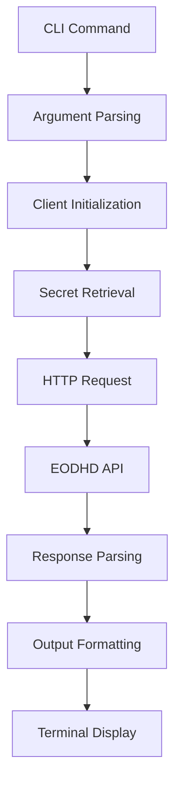

Now I have all the information needed to write a comprehensive analysis. Let me structure the analysis with proper citations.

# EODHD Financial API CLI Tool Analysis

## Architecture

The eodhd component follows a **layered architecture** pattern typical of CLI tools, with clear separation between the command-line interface, API client, and external service integration. The architecture consists of three main layers:

1. **CLI Layer** (`cli.py`) - Handles user interaction, command parsing, and output formatting
2. **Client Layer** (`client.py`) - Manages HTTP communication with the EODHD API
3. **External Service** - EODHD Financial API for market data

The component is designed as a simple, focused tool that provides command-line access to equity market data from the EODHD financial API service. It supports both human-readable formatted output and JSON output for programmatic consumption.

## Key Components

### 1. EodhdClient (`client.py`)
The core API client class that handles authentication and HTTP requests to the EODHD service. It manages API key authentication, request formatting, error handling, and response parsing. The client automatically appends `.US` suffix to symbols and provides a standardized interface for market data retrieval.

### 2. CLI Application (`cli.py`) 
A Typer-based command-line application that exposes two main commands: `quote` for real-time quotes and `eod` for historical daily prices. It handles argument parsing, output formatting with Rich for colored terminal output, and provides both human-readable and JSON output modes.

### 3. Quote Command Handler
Retrieves delayed real-time quotes including OHLCV data and percentage change. Formats output with color-coded changes (green for positive, red for negative) and provides clean tabular display of market data.

### 4. EOD Command Handler  
Fetches historical end-of-day pricing data with optional date range filtering. Displays the most recent 20 days of data in a formatted table, with full dataset available in JSON mode.

### 5. Authentication System
Integrates with the Centaur SDK's secret management system for secure API key handling. Falls back to environment variables and provides clear error messages when credentials are missing.

### 6. HTTP Client Infrastructure
Uses httpx for async-capable HTTP requests with 30-second timeouts, proper error handling, and JSON response parsing. Implements proper error propagation from API responses.

## Data Flows

The component implements two primary data flows for market data retrieval:

### Quote Data Flow
1. User executes `eodhd quote SYMBOL` command
2. CLI parses symbol argument and output format options
3. Client retrieves API key from secret management or environment
4. HTTP GET request to `/real-time/{SYMBOL}.US` endpoint
5. API returns real-time quote data (OHLCV + change metrics)
6. Response formatted for terminal display or JSON output
7. Data presented to user with color-coded change indicators

### Historical Data Flow
1. User executes `eodhd eod SYMBOL` with optional date range
2. CLI parses symbol, date range, and output format parameters
3. Client constructs request with date filtering parameters
4. HTTP GET request to `/eod/{SYMBOL}.US` endpoint with date params
5. API returns array of historical daily price records
6. Data limited to last 20 entries for display (full data in JSON mode)
7. Formatted output shows date, OHLCV data in tabular format

## External Dependencies

### Runtime Dependencies

- **httpx** (>=0.27.0) [networking]: Modern HTTP client library providing both synchronous and asynchronous request capabilities. Used in `client.py` for making authenticated requests to the EODHD API with timeout handling and error management. Integration point: `client.py` lines 5, 30-31.

- **typer** (>=0.12.0) [cli]: CLI framework built on top of Click that provides type hints and automatic help generation. Used throughout `cli.py` for command definition, argument parsing, and option handling. Integration points: `cli.py` lines 5, 13, 22-24, 46-50.

- **rich** (>=13.0.0) [cli]: Terminal formatting library for colored output, tables, and enhanced text display. Used in `cli.py` for console output formatting and colored text display based on market data values. Integration points: `cli.py` lines 7, 14, 33-42, 59-68.

- **python-dotenv** (>=1.0.0) [configuration]: Environment variable loader for development configuration. Used in `cli.py` to load environment variables from `.env` files. Integration point: `cli.py` lines 6, 11.

### Build Dependencies

- **hatchling** [build-tool]: Modern Python build backend for packaging and distribution. Required for building the Python package as specified in the `pyproject.toml` build system configuration.

## API Surface

The component exposes a command-line interface with two primary commands:

### CLI Commands

- **`eodhd quote <SYMBOL>`**: Retrieves delayed real-time quotes for US equities
  - Arguments: `symbol` (required) - ticker symbol (e.g., AAPL)
  - Options: `--json/-j` for JSON output format
  - Output: OHLCV data with formatted percentage change indicators

- **`eodhd eod <SYMBOL>`**: Retrieves historical end-of-day pricing data
  - Arguments: `symbol` (required) - ticker symbol
  - Options: `--from-date/-f`, `--to-date/-t` for date range, `--json/-j` for JSON output
  - Output: Historical daily OHLCV data (last 20 days in formatted mode, full dataset in JSON)

### Python API

- **`EodhdClient`**: Main API client class
  - `__init__(api_key: str | None = None)`: Initialize with optional API key
  - `get_quote(symbol: str) -> dict[str, Any]`: Get real-time quote data
  - `get_eod_prices(symbol: str, from_date: str | None = None, to_date: str | None = None) -> list[dict[str, Any]]`: Get historical pricing data

## External Systems

The component integrates with the following external systems:

- **EODHD Financial API** (eodhd.com): Third-party financial data provider offering real-time quotes and historical market data for US equities. The component makes authenticated HTTPS requests to `https://eodhd.com/api` endpoints for market data retrieval.

- **Centaur SDK Secret Management**: Runtime integration with the Centaur platform's secret management system for secure API key storage and retrieval through the `centaur_sdk.tool_sdk.secret` function.
