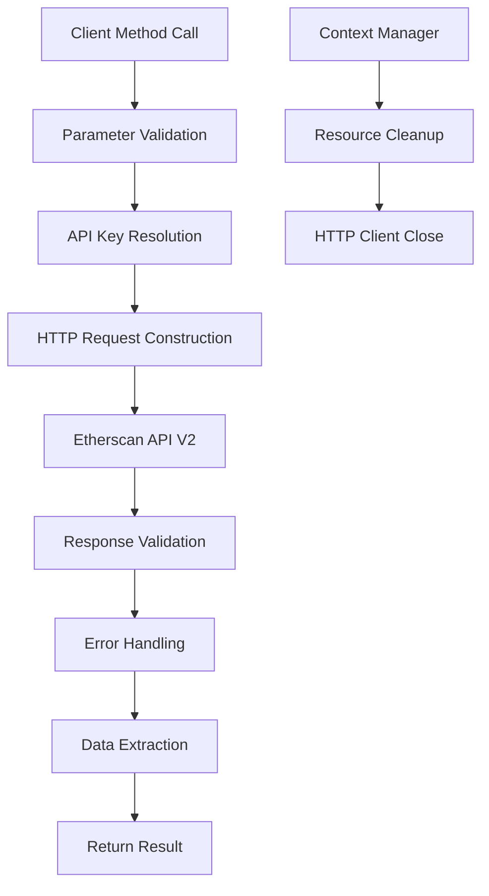

# Etherscan Component Analysis

## Architecture

The etherscan component implements a clean, single-responsibility architecture following the client adapter pattern. The `EtherscanClient` class serves as a comprehensive wrapper around the Etherscan API V2, providing type-safe methods for interacting with Ethereum blockchain data. The component uses a lazy-initialization pattern for HTTP connections and implements proper resource management through context manager protocol.

The architecture is designed for simplicity and reliability, with centralized error handling and consistent parameter validation across all API methods. The client abstracts away the complexity of the Etherscan API while preserving its full functionality through well-organized method categories.

## Key Components

### EtherscanClient Class
The primary interface class that encapsulates all Etherscan API functionality. It manages HTTP connections, API key authentication, and provides organized access to blockchain data across multiple Ethereum networks.

### API Key Management
A secure credential management system that retrieves API keys from either constructor parameters or environment variables using the centaur SDK's secret management facilities.

### HTTP Client Layer  
Lazy-initialized HTTP client using httpx for making API requests, with configurable timeouts and proper connection lifecycle management.

### Request Handler (_request method)
Centralized request handling that manages API authentication, chain ID routing, error processing, and response parsing for all API calls.

### Account Operations Module
Methods for retrieving account balances, transaction histories, and token transfer records with comprehensive filtering and pagination support.

### Contract Operations Module
Functionality for accessing verified contract ABIs and source code, enabling integration with smart contract analysis workflows.

### Statistics Module
Methods for retrieving real-time blockchain statistics including ETH prices, gas prices, and token supply information.

### Event Logs Module
Sophisticated log querying capabilities with topic filtering for analyzing smart contract events and interactions.

## Data Flows

The component follows a straightforward request-response pattern for all operations:

All API interactions follow this pattern, with specific parameter handling for different endpoint categories. The client maintains stateless operation except for the lazy-initialized HTTP connection.

## External Dependencies

### External Libraries

- **httpx** (>=0.27.0) [networking]: Modern HTTP client library providing async/sync capabilities with connection pooling. Used for all API requests to Etherscan endpoints. Primary integration in the `client` property and `_request` method for making HTTP calls with proper timeout handling.

- **typer** (>=0.12.0) [cli]: Modern CLI framework for building command-line interfaces. Though not directly used in the current client code, included for potential CLI tooling expansion.

- **rich** (>=13.0.0) [cli]: Rich text and formatting library for enhanced terminal output. Included for potential CLI output formatting in future iterations.

- **python-dotenv** (>=1.0.0) [configuration]: Environment variable loading from .env files. Supports local development workflows for managing API keys and configuration.

### Internal Dependencies

- **centaur_sdk.secret**: Internal SDK module for secure credential management. Used to retrieve the `ETHERSCAN_API_KEY` from environment variables or secure storage systems.

## API Surface

The component exposes a comprehensive public API through the `EtherscanClient` class:

### Account Operations
- `get_balance(address, chain_id=1)`: Retrieve ETH balance for an address
- `get_transactions(address, start_block=0, end_block=99999999, page=1, offset=20, sort="desc", chain_id=1)`: Get transaction history with pagination
- `get_token_transfers(address, contract_address=None, page=1, offset=20, sort="desc", chain_id=1)`: Retrieve ERC-20 token transfer events

### Contract Operations
- `get_contract_abi(address, chain_id=1)`: Fetch ABI for verified contracts
- `get_contract_source(address, chain_id=1)`: Retrieve source code for verified contracts

### Statistics Operations
- `get_eth_price(chain_id=1)`: Current ETH price in USD/BTC
- `get_token_supply(contract_address, chain_id=1)`: Total supply of ERC-20 tokens
- `get_gas_price(chain_id=1)`: Current network gas prices

### Event Log Operations
- `get_logs(address, from_block, to_block, topic0=None, chain_id=1)`: Query contract event logs with topic filtering

### Utility Functions
- `_client()`: Factory function for creating pre-configured client instances
- Context manager support for automatic resource cleanup

All methods support multi-chain operations through the `chain_id` parameter and return structured data as Python dictionaries or lists.
