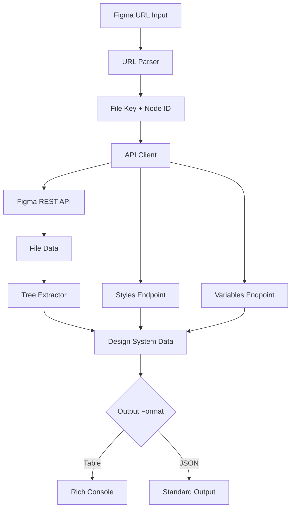

# Figma Design System Analysis Tool

## Architecture

The Figma component implements a **client-server pattern** with a clear separation between the API client layer and CLI interface layer. The architecture follows a simple linear data flow: URL parsing → API requests → data extraction → presentation. The design emphasizes extraction and analysis of design system information from Figma files through their REST API.

The component uses a **structured data extraction pattern** where raw Figma API responses are parsed and transformed into a standardized `FigmaDesignSystem` data structure that aggregates design tokens including colors, typography, components, variables, frames, effects, and grids.

## Key Components

### FigmaClient Class
The core API client class that handles authentication, HTTP requests, and URL parsing. It provides methods for accessing different Figma API endpoints including files, styles, components, and variables. Implements retry logic for rate limiting and supports both file-level and node-level data extraction.

### FigmaDesignSystem Dataclass  
A structured data container that holds extracted design system information. Contains typed collections for colors, text styles, components, variables, frames, effects, and grids. Serves as the standardized output format for all extraction operations.

### CLI Module
Provides the command-line interface with a single `crawl` command that takes a Figma URL and outputs design system information either as formatted tables or JSON. Integrates with the Centaur SDK's Table component for rich console output and handles error reporting.

### URL Parser
Static method that extracts file keys and optional node IDs from various Figma URL formats including file, design, and prototype URLs. Handles different node-id formats and URL structures.

### Tree Extraction Engine
Recursive algorithm that walks the Figma document tree to extract design elements. Identifies components, frames, colors from fills, and text styles. Implements deduplication logic to avoid duplicate entries.

### Color Extraction System
Converts Figma's normalized RGB color values (0-1 range) to standard hex format or RGBA strings with alpha transparency support. Only processes solid fills and ignores gradients or other complex fill types.

## Data Flows

The primary data flow starts with URL parsing to extract the Figma file key, followed by API requests to fetch file data, styles, and variables. The tree extraction process recursively walks the document structure to identify design elements, which are then aggregated into the standardized data structure and output in the requested format.

## External Dependencies

### External Libraries

- **typer** (>=0.12.0) [cli]: Modern Python CLI framework that provides type hints, automatic help generation, and command decoration. Used to define the `crawl` command with arguments and options. Imported in: `tools/productivity/figma/cli.py`.

- **rich** (>=13.0.0) [cli]: Rich text and beautiful formatting library for terminals. Provides the Console class for colored output and Table class for formatted data display. Used extensively in the CLI module for error messages and tabular output. Imported in: `tools/productivity/figma/cli.py`.

- **python-dotenv** (>=1.0.0) [build-tool]: Loads environment variables from .env files into the Python environment. Used to automatically load the FIGMA_ACCESS_TOKEN from local .env files. Imported in: `tools/productivity/figma/cli.py`.

## API Surface

### CLI Commands

- **crawl**: Primary command that accepts a Figma URL and extracts design system information. Supports `--json` flag for JSON output format instead of formatted tables.

### Python API

- **FigmaClient**: Main client class with methods for `get_file()`, `get_file_styles()`, `get_file_components()`, `get_file_variables()`, and `crawl()`.
- **FigmaDesignSystem**: Data structure containing extracted design information with fields for colors, text_styles, components, variables, frames, effects, and grids.
- **parse_url()**: Static utility method for extracting file keys and node IDs from Figma URLs.

### Authentication

The component requires a Figma personal access token provided via the `FIGMA_ACCESS_TOKEN` environment variable or the shorter `FIGMA` variable. Token management is handled through the Centaur SDK's secret management system.
