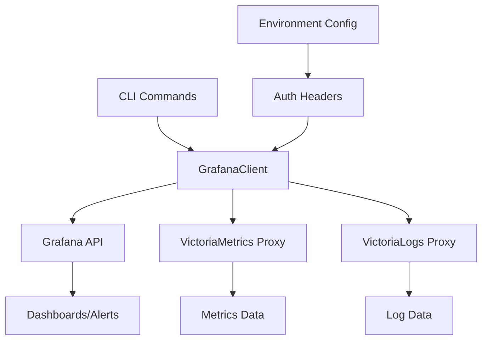
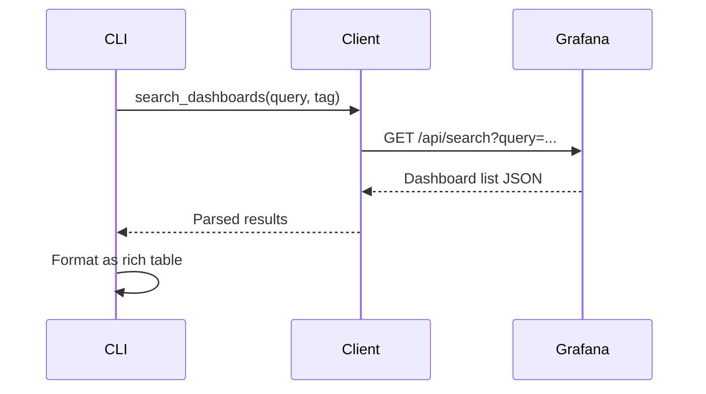
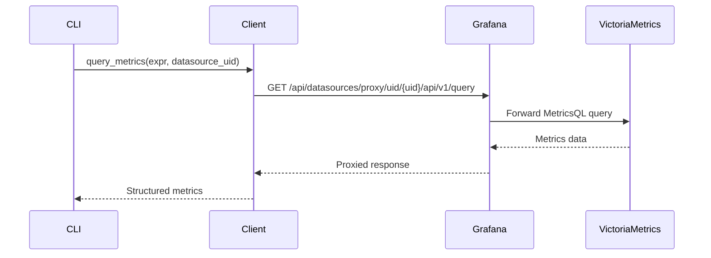
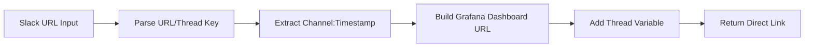

Now I have a comprehensive understanding of the grafana component. Let me create the analysis.

# Grafana Component Analysis

## Overview

The grafana component is a Python-based CLI tool and HTTP client library that provides comprehensive access to Grafana's observability platform. It serves as a command-line interface for interacting with Grafana dashboards, VictoriaMetrics/VictoriaLogs datasources, alerts, and annotations. The component bridges the gap between command-line operations and Grafana's web interface, offering both programmatic access through its client library and user-friendly CLI commands for common observability tasks.

## Architecture

The component follows a **client-server proxy architecture** with clear separation of concerns:

- **CLI Layer** (`cli.py`): Typer-based command interface providing user-friendly commands
- **Client Layer** (`client.py`): HTTP client abstraction over Grafana's REST API  
- **Authentication**: Flexible auth supporting both service account tokens and basic auth
- **Proxy Pattern**: Datasource queries are proxied through Grafana to VictoriaMetrics/VictoriaLogs



## Key Components

### GrafanaClient (client.py)
**Primary HTTP client handling all Grafana API interactions**
- Manages authentication via API keys or basic auth
- Provides methods for dashboard operations, datasource queries, alerts, and annotations
- Implements connection pooling and error handling
- Supports both JSON and raw response formats

### CLI Application (cli.py)  
**Typer-based command interface with rich table formatting**
- Exposes 9 main commands: search, get, datasources, query, vlogs, alerts, annotations, thread-debug-url, health
- Provides both JSON and formatted table outputs
- Integrates with centaur_sdk for consistent table rendering

### Thread Debug URL Builder
**Specialized functionality for Slack thread debugging**
- Parses various Slack URL formats to extract channel/timestamp pairs
- Generates direct Grafana dashboard URLs with thread context
- Supports multiple input formats: archive URLs, client URLs, direct thread keys

### Authentication System
**Flexible multi-method authentication**
- Primary: Service account API tokens via `GRAFANA_API_KEY`
- Fallback: Basic auth via `GRAFANA_USER`/`GRAFANA_PASSWORD` 
- Uses centaur_sdk secret management for secure credential handling

### Datasource Proxy Interface
**Direct access to VictoriaMetrics and VictoriaLogs through Grafana**
- MetricsQL queries with instant and range query support
- LogsQL queries with field introspection capabilities
- Label and field value enumeration for query building

## Data Flows

### Dashboard Query Flow


### Metrics Query Flow  


### Thread Debug URL Generation


## Dependencies

### External Libraries

- **httpx** (>=0.27.0) [networking]: Modern async-capable HTTP client library. Provides the core HTTP transport for all Grafana API calls with connection pooling and timeout handling. Used throughout `GrafanaClient` for REST API communication.

- **typer** (>=0.12.0) [cli]: Modern CLI framework built on Click. Provides the command structure, argument parsing, and help generation for all CLI commands. Used in `cli.py` to define the 9 main commands with rich type hints and validation.

- **rich** (>=13.0.0) [cli]: Terminal formatting library for beautiful CLI output. Provides table formatting, color coding, and console output management. Used extensively in CLI commands to render dashboard lists, metrics results, and alerts in formatted tables.

- **python-dotenv** (>=1.0.0) [config]: Environment variable loader for .env files. Handles loading configuration from .env files at startup. Used in `cli.py` via `load_dotenv()` to bootstrap environment configuration.

### Internal Dependencies

- **centaur_sdk** [internal]: Provides `Table` class for consistent table rendering and `secret()` function for secure credential management. Used for standardized output formatting and secure access to API keys and passwords.

## API Surface

### CLI Commands

The component exposes a rich CLI interface through the `grafana` command:

- **search**: Dashboard and folder search with tag filtering
- **get**: Retrieve specific dashboard by UID with panel information  
- **datasources**: List all configured datasources
- **query**: Execute MetricsQL queries against VictoriaMetrics
- **vlogs**: Execute LogsQL queries against VictoriaLogs
- **alerts**: List active alert instances
- **annotations**: List annotations with optional dashboard filtering
- **thread-debug-url**: Generate Grafana URLs from Slack thread inputs
- **health**: Check Grafana instance health and version

### Programmatic API

The `GrafanaClient` class provides a comprehensive Python interface:

```python
# Dashboard operations
search_dashboards(query=None, tag=None, limit=50)
get_dashboard(uid: str)

# Datasource management  
list_datasources()

# Metrics queries
query_metrics(expr, datasource_uid="victoriametrics", start=None, end=None, step="60s")
metric_labels(datasource_uid="victoriametrics")
metric_label_values(label, datasource_uid="victoriametrics")

# Logs queries
query_victorialogs(query, datasource_uid="victorialogs", start=None, end=None, limit=100)
victorialogs_field_names(datasource_uid="victorialogs")
victorialogs_field_values(field, datasource_uid="victorialogs")

# Alerts and annotations
get_alerts()
get_alert_rules()
list_annotations(dashboard_uid=None, from_ts=None, to_ts=None, limit=100)

# Utilities
thread_debug_url(thread, dashboard_uid="thread-debugger", from_range="now-24h", to_range="now")
health()
```

## External Systems

### Grafana Instance
**Primary observability platform**
- REST API endpoint for all dashboard, datasource, and alert operations
- Serves as proxy for VictoriaMetrics and VictoriaLogs queries
- Provides authentication and authorization layer

### VictoriaMetrics
**Metrics storage and query engine**  
- Accessed through Grafana's datasource proxy at `/api/datasources/proxy/uid/{uid}/api/v1/*`
- Supports MetricsQL for advanced metrics queries
- Provides Prometheus-compatible API endpoints

### VictoriaLogs  
**Log storage and analysis system**
- Accessed through Grafana's datasource proxy for LogsQL queries
- Uses POST requests with form data for log queries and field introspection
- Returns NDJSON format for log entries

### Slack Integration
**Thread debugging workflow**
- Parses Slack URLs to extract channel and timestamp information
- Supports multiple URL formats: archive links, client thread URLs, query parameters
- Generates contextualized Grafana dashboard links for incident investigation

## Component Interactions

This component operates as a **frontend client** with no direct internal component dependencies. It serves as:

- **Dashboard Interface**: Provides CLI and programmatic access to Grafana dashboards for other tools and workflows
- **Metrics Gateway**: Enables command-line querying of VictoriaMetrics data for scripts and automation
- **Incident Response Tool**: Facilitates quick navigation from Slack threads to relevant Grafana dashboards
- **Observability Automation**: Supports automated alert checking and annotation management for CI/CD pipelines

The component is designed to be consumed by:
- DevOps engineers for dashboard management and metrics investigation
- Incident response workflows requiring quick Grafana access
- Automation scripts needing programmatic observability data access
- Integration pipelines that need to query metrics or create annotations
