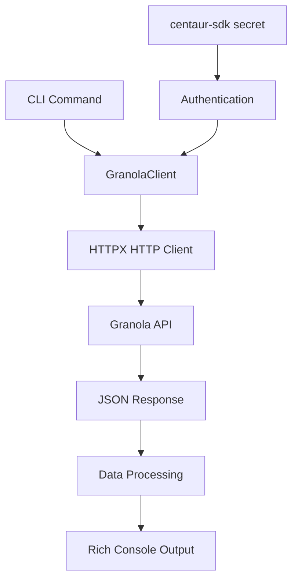

Now I have sufficient information to write a comprehensive analysis. Let me create the analysis document.

# Granola Meeting Notes CLI Analysis

## Architecture

The granola component implements a command-line interface for accessing Granola meeting notes and transcripts via their Enterprise API. It follows a clean separation between the API client layer and the CLI presentation layer, utilizing a simple but effective client-server architecture pattern.

The component is structured as a Python package with two main modules:
- `client.py`: Handles HTTP communication with the Granola Enterprise API
- `cli.py`: Provides the user-facing Typer-based command-line interface

The architecture follows the principles of separation of concerns, with the client module handling all API interactions and data fetching, while the CLI module focuses exclusively on command parsing, user interaction, and output formatting.

## Key Components

### GranolaClient Class
The core API client class that manages authentication and HTTP requests to the Granola Enterprise API. It provides methods for listing notes, retrieving individual notes with optional transcripts, and performing basic search functionality. The client uses HTTPX for HTTP operations and implements proper error handling with automatic status code checking.

### CLI Command Structure
The CLI is built using Typer and provides four main commands:
- `list`: Display recent meeting notes with pagination support
- `get`: Retrieve and display a specific note by ID
- `search`: Search meeting notes by title substring matching  
- `transcript`: Fetch and display the transcript for a specific note

### Date Formatting Utility
A helper function `_format_date` that converts ISO 8601 date strings from the API into human-readable format, handling timezone information and parsing errors gracefully.

### Rich Console Output
The CLI leverages the Rich library for enhanced terminal output, including formatted tables, markdown rendering, and colored panels for better user experience.

### Authentication Layer
Authentication is handled through the centaur-sdk's secret management system, with the component expecting a `GRANOLA_API_KEY` environment variable or secret store entry.

## Data Flows



The primary data flow follows this pattern:
1. User invokes CLI command with arguments
2. CLI module creates GranolaClient instance
3. Client authenticates using API key from secret store
4. HTTP request sent to Granola Enterprise API
5. JSON response processed and formatted
6. Rich console renders formatted output to terminal

For the search functionality, an additional client-side filtering step occurs after fetching a larger set of notes from the API.

## External Dependencies

### External Libraries

- **httpx** (>=0.27.0) [networking]: Modern async-capable HTTP client library used for making requests to the Granola Enterprise API. Provides better performance and features compared to requests. Used in: `tools/productivity/granola/client.py` for all API communication.

- **typer** (>=0.12.0) [cli]: Modern CLI framework built on top of Click, providing automatic help generation, type hints support, and clean command definition syntax. Used in: `tools/productivity/granola/cli.py` for all command-line interface functionality.

- **rich** (>=13.0.0) [cli]: Terminal formatting and rendering library that provides rich text, tables, markdown rendering, and colored output. Used in: `tools/productivity/granola/cli.py` for formatting console output, tables, and markdown content.

- **python-dotenv** (implicit dependency) [configuration]: Environment variable management for loading .env files. Used in: `tools/productivity/granola/cli.py` for loading environment configuration.

- **centaur-sdk** (internal dependency) [framework]: Internal SDK providing secret management and table utilities. Used in: `tools/productivity/granola/client.py` for secret retrieval and `tools/productivity/granola/cli.py` for table display.

## API Surface

The granola component exposes a library API through the GranolaClient class and a CLI interface through the typer application.

### Library API (GranolaClient)

```python
class GranolaClient:
    def __init__(self, api_key: str | None = None)
    def list_notes(page_size: int, cursor: str | None, ...) -> dict
    def get_note(note_id: str, include_transcript: bool) -> dict  
    def list_all_notes(limit: int, created_after: str | None) -> list
    def get_transcript(note_id: str) -> list
    def search_notes(query: str, limit: int) -> list
```

### CLI Commands

- `granola list [--limit N] [--full] [--after DATE]`: List recent meeting notes
- `granola get NOTE_ID [--raw] [--transcript]`: Get specific note by ID
- `granola search QUERY [--limit N]`: Search notes by title
- `granola transcript NOTE_ID`: Get transcript for a note

The CLI provides both machine-readable (--raw) and human-readable output formats, with rich formatting for interactive use.

## External Systems

### Granola Enterprise API
The component integrates with the Granola Enterprise API hosted at `public-api.granola.ai`. This is a REST API that requires Bearer token authentication and provides workspace-wide access to meeting notes and transcripts. The API supports pagination, filtering by creation/update dates, and optional transcript inclusion.

### Authentication System
Authentication relies on API keys generated through the Granola Enterprise workspace settings. The component uses the centaur-sdk secret management system to securely retrieve and manage these credentials.
