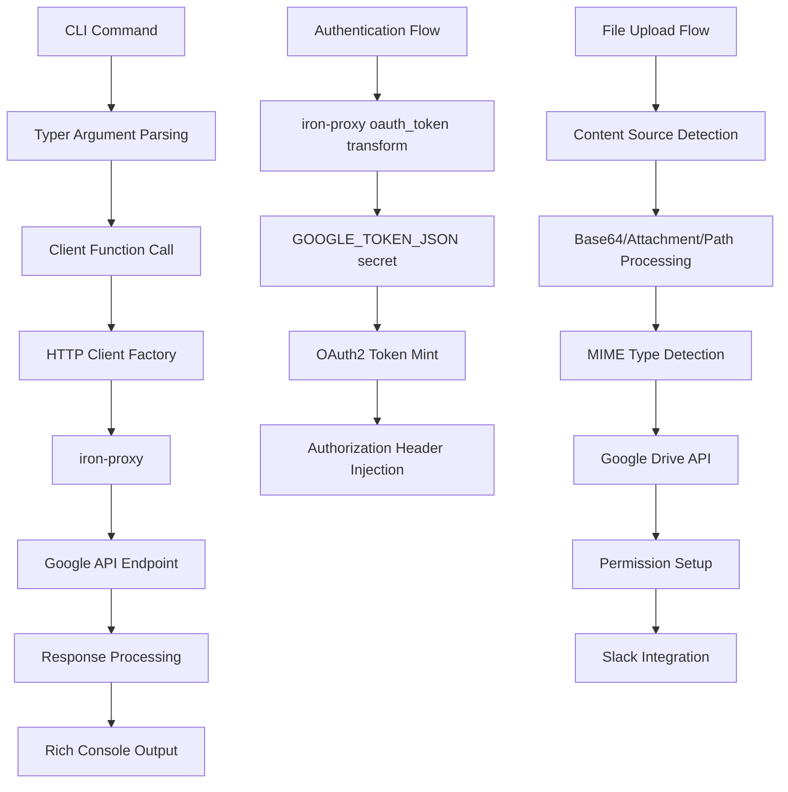

# GSuite Component Analysis

## Architecture

The gsuite component implements a comprehensive CLI tool for interacting with Google Workspace services. It follows a layered architecture pattern where the `cli.py` module provides the command-line interface using Typer, while `client.py` contains all the backend service integration logic. The component uses the Google API Python client libraries to communicate with various Google services, with authentication handled transparently through iron-proxy's OAuth token transformation.

The architecture is organized around seven main service areas: Gmail, Calendar, Drive, Docs, Sheets, Slides, and Analytics. Each service has its own sub-application within the CLI and corresponding functions in the client module. The design emphasizes separation of concerns, with the CLI layer focusing on user interaction and argument parsing, while the client layer handles all API communication and data transformation.

## Key Components

### CLI Module (`cli.py`)
The main command-line interface built with Typer, providing 7 sub-applications (gmail, calendar, drive, docs, sheets, slides, analytics) with 70+ total commands. Each sub-app has extensive argument parsing, help text, and rich console output formatting using the Rich library.

### Client Module (`client.py`)
Core API client with 132 functions implementing Google Workspace service integrations. Handles authentication via iron-proxy, HTTP client configuration with proxy support, and provides comprehensive CRUD operations for all supported services.

### Analytics Properties (`analytics_properties.py`)
Manages GA4 property ID mappings for known websites with both static mappings and dynamic discovery capabilities. Includes caching and fallback mechanisms for resolving site names to Google Analytics property IDs.

### HTTP Transport Layer
Custom httplib2 configuration that routes requests through iron-proxy for authentication. Handles SOCKS proxy setup, SSL certificate configuration, and falls back to direct connections in non-proxied environments.

### Authentication System
Uses Google's AnonymousCredentials pattern where iron-proxy's `oauth_token` transform injects OAuth access tokens into outbound requests. The refresh token grant exchanges stored credentials for short-lived access tokens at the network boundary.

### Service Factory Pattern
Centralized service creation functions (`get_gmail_service()`, `get_calendar_service()`, etc.) that configure Google API clients with proper HTTP transport and authentication settings.

### Error Handling and Rich Output
Comprehensive error handling with user-friendly console output using Rich formatting. Commands provide colored output, tables, progress indicators, and structured error messages with appropriate exit codes.

### File Operations Framework
Sophisticated file handling supporting multiple input sources (base64 content, Centaur attachments, local paths) with automatic MIME type detection, format conversion (e.g., CSV to Google Sheets), and thread-scoped attachment management.

### Permission Management System
Advanced Google Drive permission handling including bulk sharing, ownership transfer, and integration with Slack channel membership for automated workspace collaboration setup.

### Batch Operations Support
Optimized batch processing for operations like bulk labeling, multi-file sharing, and batch document updates with progress tracking and error reporting.

### Analytics Query Engine
Flexible Google Analytics 4 reporting system with custom query support, predefined report types, and multiple output formats including JSON and formatted tables.

### Document Processing Pipeline
Google Docs manipulation including text extraction, find/replace operations, bullet point formatting, and content insertion with revision tracking and conflict detection.

## Data Flows

The main data flow starts with CLI commands being parsed by Typer, then routed to appropriate client functions. These functions create authenticated HTTP clients that route through iron-proxy for OAuth token injection before reaching Google APIs. Responses are processed and formatted using Rich for console output.

Authentication follows a separate flow where iron-proxy's oauth_token transform uses stored refresh tokens to mint access tokens and inject them as Authorization headers on outbound requests to Google services.

File operations have a specialized flow that handles multiple input sources (base64 content, Centaur attachments, local paths), performs MIME type detection and format conversion, then integrates with Slack for automated permission management.

## External Dependencies

### Google API Libraries
- **google-api-python-client** (>=2.100.0) [google-api]: Core Google API client library providing service discovery and HTTP transport. Used throughout `client.py` for Gmail, Calendar, Drive, Docs, Sheets, and Slides operations. Imported in: `client.py` lines 17-18.

- **google-analytics-data** (>=0.18.0) [analytics]: Google Analytics Data API client for GA4 reporting and real-time data queries. Used for all Analytics commands and custom query operations. Imported in: `client.py` for analytics functions.

- **google-analytics-admin** (>=0.22.0) [analytics]: Google Analytics Admin API client for property discovery and configuration. Used in `analytics_properties.py` for dynamic property ID resolution. Imported in: `analytics_properties.py` lines 74-75.

### Authentication & HTTP
- **google-auth-httplib2** (>=0.2.0) [auth]: Google authentication library integration with httplib2 transport. Provides authentication flow support and credential management. Used in conjunction with httplib2 for authenticated requests.

- **google-auth-oauthlib** (>=1.2.0) [auth]: OAuth 2.0 client library for Google authentication flows. Supports refresh token grants and credential management. Used for authentication setup and token refresh operations.

- **httplib2** (>=0.20.0) [networking]: HTTP client library with proxy support used by google-api-python-client. Configured with SOCKS proxy support for iron-proxy routing. Imported in: `client.py` line 13.

- **pysocks** (>=1.7.1) [networking]: SOCKS proxy support library required by httplib2 for proxy functionality. Critical for routing requests through iron-proxy. Without this, httplib2 silently ignores proxy settings. Imported in: `client.py` line 14.

### CLI & UI Framework
- **typer** (>=0.12.0) [cli]: Modern CLI framework building on Click with automatic help generation and type hints. Provides the entire command-line interface structure with sub-commands and argument parsing. Imported in: `cli.py` line 5.

- **rich** (>=13.0.0) [cli]: Terminal output formatting library providing colors, tables, progress bars, and styled console output. Used extensively throughout `cli.py` for user interface formatting. Imported in: `cli.py` line 7.

### Configuration
- **python-dotenv** (>=1.0.0) [configuration]: Environment variable loading from .env files. Used for local development configuration and secret management. Provides fallback configuration when iron-proxy secrets are unavailable.

## External Systems

### Google Workspace Services
The component integrates with multiple Google Workspace APIs at runtime:
- **Gmail API** for email search, reading, sending, and management operations
- **Google Calendar API** for event creation, scheduling, and RSVP functionality  
- **Google Drive API** for file storage, sharing, and permission management
- **Google Docs API** for document creation, editing, and formatting
- **Google Sheets API** for spreadsheet operations and data manipulation
- **Google Slides API** for presentation creation and management
- **Google Analytics API** for website traffic analysis and reporting

### Iron-Proxy Integration
All HTTP requests are routed through iron-proxy which provides:
- OAuth token injection via the `oauth_token` transform
- MITM SSL certificate handling for API requests
- Request/response logging and monitoring
- Authentication credential management

### Slack Integration
The component integrates with Slack via CLI subprocess calls for:
- Channel member email resolution for file sharing
- User email lookup for ownership transfers
- Automated workspace permission setup

## Component Interactions

The gsuite component is designed as a standalone CLI tool with minimal direct dependencies on other components in the codebase. However, it does interact with the broader ecosystem:

### Centaur SDK Integration
- Uses `centaur_sdk.save_attachment()` for thread-scoped file management
- Leverages `centaur_sdk.current_thread_key()` for attachment API access
- Utilizes `centaur_sdk.secret()` for configuration and API key retrieval
- Imports `centaur_sdk.Table` for structured data presentation

### Slack CLI Integration  
- Makes subprocess calls to the `slack` CLI tool for user and channel information
- Uses `slack channel-emails` command to resolve channel membership
- Uses `slack user-info` command to get user email addresses
- This enables automated permission setup for shared Google Drive files

### Optional API Integration
- Attempts to import `api.integrations.gsuite.http.build_http` for shared HTTP client configuration
- Falls back to local HTTP client configuration if the API integration is unavailable
- This allows for consistent HTTP handling across different deployment scenarios

The component is designed to be self-contained while still integrating seamlessly with the broader Centaur platform for file management, authentication, and workspace collaboration.
