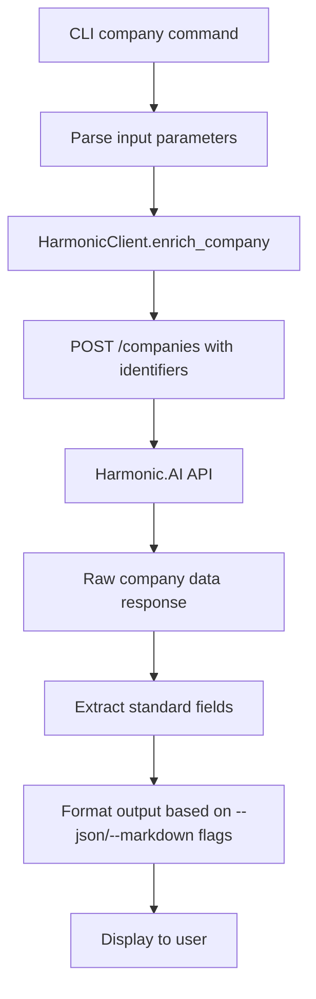
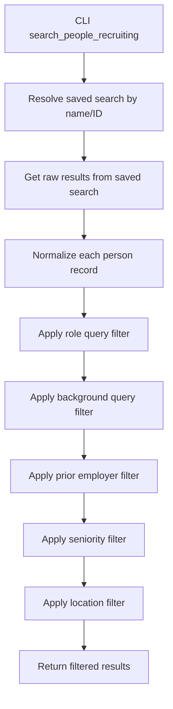
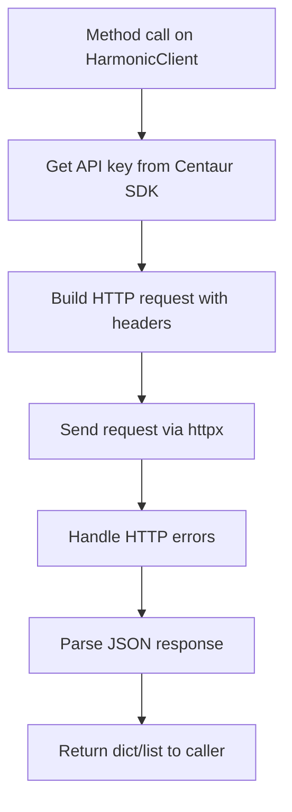

# Harmonic Research Library

## Architecture

The harmonic component implements a **client-server library pattern** with a clear separation between API client logic and CLI presentation layer. The architecture follows the **facade pattern** where the `HarmonicClient` class provides a unified interface to the Harmonic.AI API, while the CLI module handles user interaction and output formatting.

The component is structured as a Python package with three core modules:
- `client.py` - HTTP API client with comprehensive data normalization
- `cli.py` - Typer-based command-line interface with rich output formatting
- `__init__.py` - Package initialization (minimal)

The design emphasizes **data transformation and normalization**, with extensive helper functions to clean and standardize API responses from Harmonic.AI's varying data formats.

## Key Components

### HarmonicClient Class
The main API client class provides authenticated HTTP requests to the Harmonic.AI REST API. It handles authentication via API key, manages HTTP sessions with configurable timeouts, and provides methods for all major API endpoints including company enrichment, person enrichment, search operations, and saved search management.

### CLI Command Structure
The CLI implements 8 primary commands using Typer: `company`, `person`, `search`, `similar`, `typeahead`, `saved-searches`, `saved-search-results`, and `status`. Each command supports multiple output formats (JSON, markdown tables, rich console output) with consistent error handling and user feedback.

### Data Normalization Pipeline
A comprehensive set of helper functions handles data cleaning and standardization: `_clean_text()`, `_dedupe_strings()`, `_normalize_seniority()`, `_location_text()`, and `_normalize_person_result()`. These functions address inconsistencies in Harmonic.AI's API responses and provide recruiting-friendly data structures.

### Authentication System
Integrates with the Centaur SDK's secret management system to retrieve API keys, with fallback support for direct key injection. The `_clean_secret()` function handles multi-line 1Password field formats.

### Output Formatting System
Provides three distinct output modes: JSON for machine consumption, rich console tables with color coding and truncation, and markdown tables for documentation. The `format_money()` and `truncate()` functions ensure consistent data presentation.

### Search and Filter Engine
Implements sophisticated filtering capabilities for people recruiting searches, including role queries, background matching, prior employer filtering, seniority levels, and location constraints. Uses fuzzy text matching via `_match_query()`.

### Error Handling Framework
Centralized error handling converts HTTP exceptions into user-friendly RuntimeError messages, with proper status code and response text propagation for debugging.

### Pagination Support
Handles cursor-based pagination across multiple endpoints with consistent parameter passing and next-page cursor extraction from API responses.

## Data Flows

### Company Enrichment Flow

### Person Search and Filter Flow

### API Request Flow

## Dependencies

### External Libraries

- **httpx** (>=0.27.0) [networking]: Modern async-capable HTTP client for making requests to the Harmonic.AI REST API. Provides better performance and developer experience than requests library. Used throughout `client.py` for all API communications with timeout handling and proper session management.

- **typer** (>=0.12.0) [cli]: Modern CLI framework built on Click that provides type hints, automatic help generation, and rich integration. Powers the entire CLI interface in `cli.py` with decorators for commands, options, and arguments. Handles command parsing, validation, and help text generation.

- **rich** (>=13.0.0) [cli]: Advanced terminal formatting library for creating beautiful console output with colors, tables, and progress bars. Used in `cli.py` for console output, table formatting, and colored text display. Imported via `Console` class and `Table` component from centaur_sdk.

### Internal Dependencies

- **centaur_sdk.secret**: Provides secure secret retrieval functionality for accessing the `HARMONIC_API_KEY` environment variable. Used in `client.py` for authentication token management with proper secret cleaning and fallback handling.

- **centaur_sdk.Table**: Rich table component wrapper from the Centaur SDK used for formatted console output in CLI commands. Imported in `cli.py` for displaying search results and company data in tabular format.

## API Surface

### HarmonicClient Public Methods

- **enrich_company()**: Enriches company data by website domain, URL, LinkedIn, Twitter, Crunchbase, or PitchBook identifiers. Returns comprehensive company profile with funding, headcount, tags, and highlights.

- **enrich_person()**: Enriches person data using LinkedIn profile URL. Returns normalized person profile with current title, company, location, experience history, and social profiles.

- **search_companies_natural_language()**: Performs Scout Search using natural language queries with similarity thresholds and pagination support. Returns ranked company results based on semantic matching.

- **get_similar_companies()**: Finds companies similar to a given company ID or URN. Returns list of companies with similar profiles, funding stages, or business models.

- **search_typeahead()**: Provides autocomplete search for companies, people, or investors. Supports partial name matching and returns structured suggestions with IDs.

- **get_saved_searches()**: Lists all saved searches accessible to the authenticated account. Returns search metadata including names, types, and result counts.

- **get_saved_search_results()**: Retrieves paginated results from a specific saved search by ID or URN. Supports cursor-based pagination for large result sets.

- **search_people_recruiting()**: Advanced people search with recruiting-focused filters including role queries, background matching, prior employers, seniority levels, and locations. Returns normalized candidate profiles.

- **get_enrichment_status()**: Checks status of pending enrichment requests using IDs or URNs. Returns completion status and enriched entity URNs when available.

- **raw()**: Direct API access method for making arbitrary HTTP requests to any Harmonic.AI endpoint with custom parameters and JSON bodies.

### CLI Commands

- **company**: Enriches company by domain/URL/LinkedIn with JSON, markdown, or rich console output
- **person**: Enriches person by LinkedIn URL with multiple output formats
- **search**: Natural language company search with pagination and similarity thresholds
- **similar**: Finds companies similar to a given company ID
- **typeahead**: Autocomplete search for companies/people/investors
- **saved-searches**: Lists accessible saved searches
- **saved-search-results**: Retrieves paginated results from saved searches
- **status**: Checks enrichment request completion status
- **raw**: Direct API endpoint access for debugging and advanced usage
