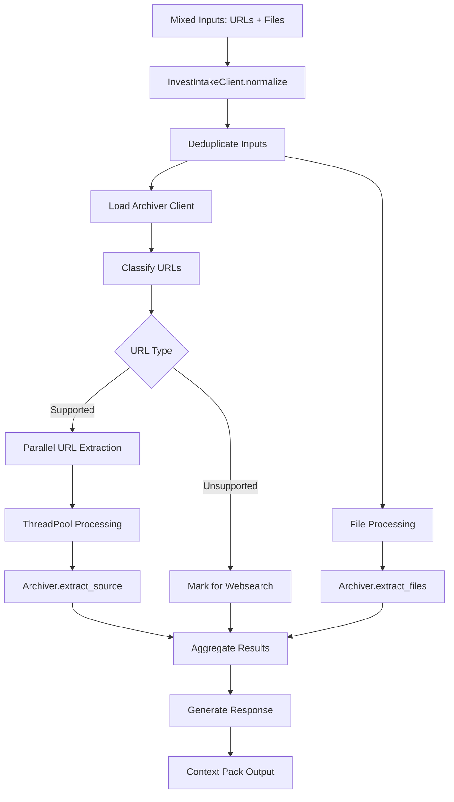

# invest-intake Component Analysis

## Architecture

The invest-intake component implements a normalization layer that standardizes mixed investment research inputs (URLs and files) into a unified context pack. It follows a client-based architecture where the main `InvestIntakeClient` class orchestrates the processing of diverse input sources through a combination of classification, delegation, and parallel processing patterns.

The component uses dynamic module loading to integrate with the archiver component for URL extraction and implements a concurrent processing model with ThreadPoolExecutor for parallel URL handling. The design emphasizes resilience with comprehensive error handling and graceful degradation for unsupported URL types.

## Key Components

### InvestIntakeClient Class
The central orchestrator that provides the main `normalize` method for processing mixed inputs. It manages temporary directories, coordinates parallel processing, and aggregates results from multiple sources.

### URL Classification System
Static methods `_classify_url` and `_classify_file` that categorize inputs based on domain patterns and file extensions. URL classification identifies docsend.com, docs.google.com, drive.google.com as archiver-supported, while other HTTP(S) URLs are marked for websearch delegation.

### Dynamic Archiver Integration
The `_load_archiver_client` method implements runtime dependency resolution, searching for the archiver component in multiple locations and dynamically importing it. This allows loose coupling between components while maintaining functionality.

### Parallel URL Processing
Uses ThreadPoolExecutor with configurable parallelism (max 6 workers) to process multiple URLs concurrently. Each URL is processed through the `_extract_url` method which delegates to the archiver client for supported domains.

### Error Handling and Status Management
Comprehensive error tracking with structured status reporting. Errors are collected and categorized, with partial success scenarios handled gracefully. Status codes include "ok", "error", "partial", and "needs_websearch".

### Deduplication Utility
The `_dedupe` static method removes duplicate entries from input lists while preserving order, handling null/empty values gracefully.

## Data Flows

The flow starts with mixed input normalization, proceeds through classification and parallel processing, and culminates in a structured response containing artifacts, errors, and next-action recommendations.

## External Dependencies

### External Libraries

- **typer** (>=0.12.0) [cli]: Command-line interface framework providing type-safe argument parsing and CLI building capabilities. Used for CLI command registration and argument handling.

The component has minimal external dependencies, relying primarily on Python's standard library for core functionality including concurrent.futures for parallel processing, pathlib for file system operations, and urllib.parse for URL parsing.

## API Surface

### Public Methods

**InvestIntakeClient.normalize()**
- **Parameters**: `urls`, `file_paths`, `company`, `max_depth`, `parallelism`, `include_raw_payload`
- **Returns**: Structured dictionary with status, summary, artifacts, errors, and next actions
- **Purpose**: Main entry point for normalizing mixed investment research inputs

**Module-level Factory Function**
- **_client()**: Returns configured InvestIntakeClient instance for external consumption

### Response Structure

The normalize method returns a comprehensive response dictionary containing:
- `status`: Overall processing status ("ok", "error", "partial")
- `summary`: Counts of processed items and outcomes
- `artifacts`: List of processed items with classification and status
- `output_root`: Temporary directory containing extracted content
- `errors`: List of processing errors with source identification
- `deferred_to_websearch`: Items requiring websearch component handling
- `next_actions`: Suggested follow-up steps for research workflow
