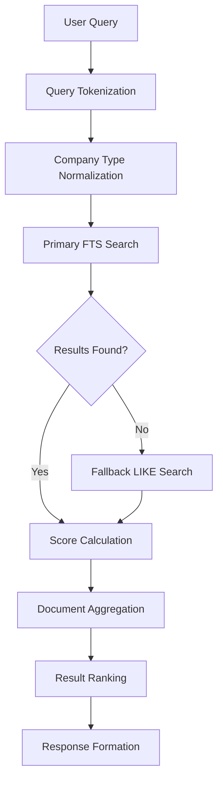
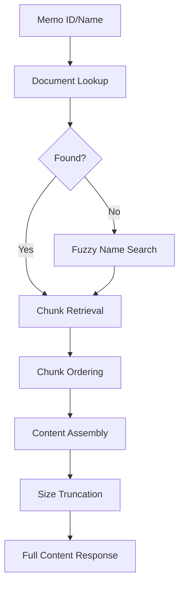
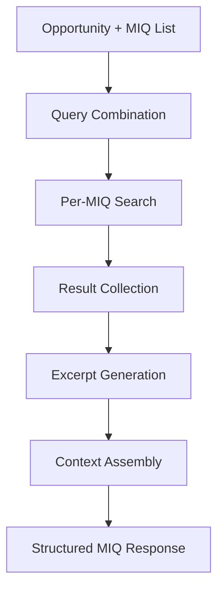

# InvestMemos Component Analysis

## Overview

The `investmemos` component is a Python library that provides a Postgres-backed investment memo search and retrieval system. It offers full-text search capabilities with vector embeddings for finding relevant investment memos, company information, and analysis content stored in a structured corpus.

## Architecture

The component follows a **client-server pattern** with an asynchronous database client architecture. It implements a single-purpose library design focused on search and retrieval operations, using asyncpg for high-performance Postgres connectivity and full-text search with text embeddings for semantic retrieval.

The architecture centers around the `InvestmemosClient` class which provides both synchronous public APIs (using asyncio.run internally) and asynchronous private implementations for database operations. The design supports multiple search strategies including full-text search (FTS), token matching, and hybrid scoring approaches.

## Key Components

### InvestmemosClient
**Location**: `tools/research/investmemos/client.py:75-481`
The main client class providing investment memo search and retrieval functionality. Manages database connections, implements multiple search strategies, and provides both document-level and chunk-level operations.

### Query Processing Pipeline
**Location**: `tools/research/investmemos/client.py:54-61, 142-246`
Implements query tokenization, normalization, and multi-strategy search including FTS ranking, lexical matching, and hybrid scoring. Handles fallback search mechanisms when primary searches return no results.

### Document Aggregation System
**Location**: `tools/research/investmemos/client.py:280-314`
Groups search results by document ID, consolidates chunk hits, and provides document-level ranking with excerpt aggregation for improved search result presentation.

### Company Type Normalization
**Location**: `tools/research/investmemos/client.py:19-32`
Standardizes company type classifications with aliases mapping (e.g., "protocol" → "crypto_protocol", "saas" → "software_business") for consistent filtering.

### MIQ Context Builder
**Location**: `tools/research/investmemos/client.py:424-477`
Builds context for "Most Important Questions" (MIQs) by combining opportunity descriptions with question lists to find relevant memo excerpts for investment analysis.

### Content Reading System
**Location**: `tools/research/investmemos/client.py:316-422`
Retrieves full memo content by document ID or name, assembles chunks in proper order, and provides content truncation for size management.

## Data Flows

### Investment Memo Search Flow



### Memo Reading Flow



### MIQ Context Building Flow



## Dependencies

### External Libraries

- **asyncpg** (>=0.30.0) [database]: High-performance asynchronous PostgreSQL client library. Used for all database connectivity, connection pooling, and query execution. The client leverages asyncpg's prepared statement support and connection management for efficient database operations. Imported in: `tools/research/investmemos/client.py:12`, used throughout async methods for database connectivity.

## API Surface

The component exposes a public API through the `InvestmemosClient` class with four primary methods:

### Public Methods

- **`list_memos(query, limit, source)`**: Lists memo documents with optional name-based filtering, returning document metadata and basic information
- **`search_memos(query, limit, stage, company_type, source, kind)`**: Performs full-text search across memo chunks with filtering capabilities, returns ranked documents with excerpts
- **`read_memo(memo, max_chars, source, kind)`**: Retrieves full memo content by document ID or name, with content size management
- **`build_miq_context(opportunity, miqs, memos_per_miq, excerpt_chars, stage, company_type, source, kind)`**: Builds contextual memo excerpts for investment analysis questions

### Configuration

The client supports environment-based configuration:
- `DATABASE_URL`: PostgreSQL connection string
- `INVEST_MEMO_SOURCE`: Default source identifier (defaults to "invest_memo_corpus")  
- `INVEST_MEMO_KIND`: Default content kind (defaults to "invest_memo_chunk")

### Response Format

All public methods return structured dictionaries with consistent error handling:
```python
{
    "status": "ok" | "error",
    "error": "error message if status=error",
    # method-specific data fields
}
```

## Database Schema Integration

The component integrates with two primary Postgres tables:

- **`raw_records`**: Stores document-level metadata with fields `external_id`, `data` (JSON), `fetched_at`, `source`, and `kind`
- **`embeddings`**: Stores searchable content chunks with full-text search vectors, including `source_id`, `content`, `metadata` (JSON), `content_tsv` (tsvector), `source`, and `kind`

The schema supports multi-tenant operation through source/kind partitioning and provides full-text search capabilities using PostgreSQL's built-in text search features.
