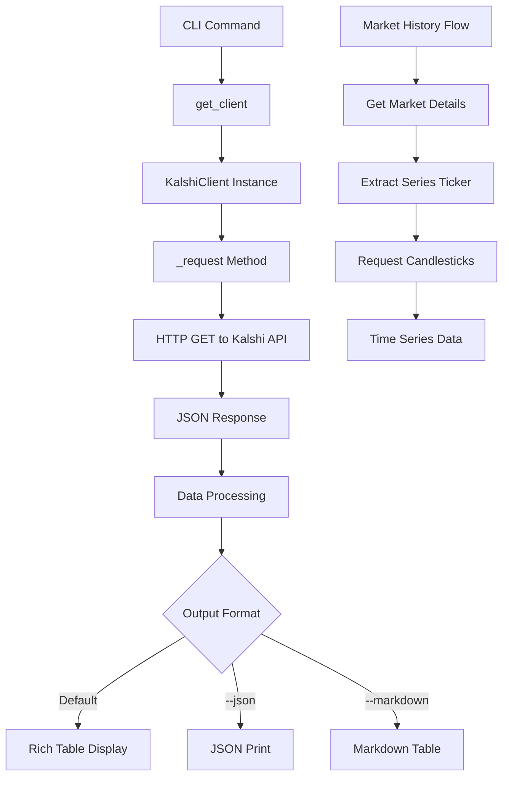

# Kalshi Prediction Market CLI

## Architecture

The Kalshi component follows a **layered architecture** pattern, separating API client functionality from command-line interface presentation. The architecture consists of two main layers:

1. **Client Layer** (`client.py`) - Handles HTTP communication with the Kalshi API
2. **Presentation Layer** (`cli.py`) - Provides user-facing CLI commands with rich formatting

The component is designed around **read-only market data access**, focusing on public prediction market information without requiring authentication. It implements a **functional programming style** with command functions that orchestrate client operations and format output for different consumption patterns.

## Key Components

### KalshiClient Class
The core HTTP client that manages all API interactions with the Kalshi prediction market platform. It provides methods for fetching markets, events, trades, and historical data with configurable timeouts and error handling.

### CLI Command Functions
Eight primary command functions that expose market data functionality:
- `markets()` - Lists active prediction markets with filtering options
- `market()` - Shows detailed information for a specific market
- `trades()` - Displays recent trading activity for a market
- `history()` - Provides candlestick price history data
- `events()` - Lists event categories and series
- `search()` - Searches markets by title or ticker
- `raw()` - Makes direct API calls for debugging

### Formatting Utilities
Helper functions for data presentation:
- `format_price()` - Converts cent values to readable price format
- `format_volume()` - Formats trading volumes with K/M suffixes
- `print_markdown_table()` - Outputs data in markdown table format

### Output Modes
The CLI supports three output formats for all commands:
- **Rich Console Tables** - Default colorized terminal output using Rich library
- **JSON Output** - Machine-readable format for programmatic consumption
- **Markdown Tables** - Human-readable format for documentation

## Data Flows



### Market Data Retrieval Flow
1. User executes CLI command with parameters
2. Command function calls `get_client()` to obtain KalshiClient instance
3. Client makes HTTP request to Kalshi API endpoint
4. JSON response is processed and filtered based on command parameters
5. Data is formatted according to specified output mode (rich, JSON, or markdown)
6. Results are displayed to user

### Historical Data Processing
The history command follows a special flow requiring two API calls:
1. First retrieves market details to extract series ticker
2. Uses series ticker to fetch candlestick data for the specified time period
3. Converts timestamps to human-readable dates for display

## External Dependencies

### Runtime Dependencies

- **httpx** (>=0.27.0) [networking]: Modern async-capable HTTP client for making requests to the Kalshi API. Provides timeout handling, connection pooling, and status code validation. Used in `client.py` for all API communication.

- **typer** (>=0.12.0) [cli]: Command-line interface framework built on Click, providing type annotations and automatic help generation. Used throughout `cli.py` for command definitions, argument parsing, and option handling.

- **rich** (>=13.0.0) [cli]: Terminal formatting library providing colorized tables, progress bars, and styled output. Used in `cli.py` for creating formatted market data tables and console output with colors and styling.

- **python-dotenv** (>=1.0.0) [configuration]: Environment variable loading from .env files. Listed as dependency but not actively used in current implementation - likely reserved for future authentication features.

### Internal Dependencies

- **centaur_sdk** [framework]: Internal framework providing the `Table` class used for rich console output formatting. Imported in `cli.py` line 9 for creating data tables.

## API Surface

### CLI Commands

The component exposes the following command-line interface:

```bash
kalshi markets [--status STATUS] [--event EVENT] [--limit N] [--json] [--markdown]
kalshi market TICKER [--json]
kalshi trades TICKER [--limit N] [--json] [--markdown]
kalshi history TICKER [--days N] [--interval MINUTES] [--json] [--markdown]
kalshi events [--status STATUS] [--series SERIES] [--limit N] [--json] [--markdown]
kalshi search QUERY [--limit N] [--json] [--markdown]
kalshi raw ENDPOINT [--params KEY=VALUE,KEY=VALUE]
```

### Public Client Methods

- `list_markets()` - Retrieve markets with optional filtering by status, event, or series
- `get_market()` - Get detailed information for a specific market ticker
- `get_trades()` - Fetch recent trades with time and ticker filtering
- `get_candlesticks()` - Historical OHLC price data for technical analysis
- `list_events()` - Browse event categories and series
- `get_event()` - Get specific event details
- `list_series()` - List available market series/categories

## External Systems

### Kalshi Elections API
- **Endpoint**: `https://api.elections.kalshi.com/trade-api/v2`
- **Purpose**: Primary data source for prediction market information
- **Integration**: Read-only access through public endpoints, no authentication required
- **Data Types**: Markets, events, trades, candlestick price history, series information

The component exclusively consumes public market data from Kalshi's prediction market platform, focusing on informational use cases rather than trading operations.
