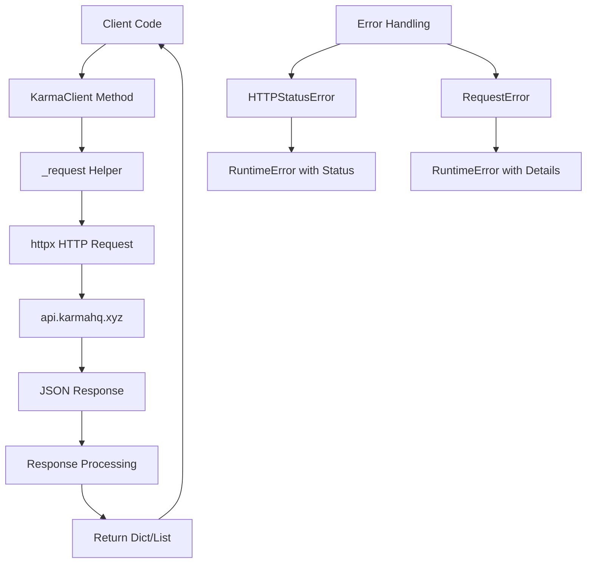

# Karma Component Analysis

The karma component is a Python library that provides a client interface to the Karma DAO governance analytics API. It enables developers to access delegate reputation scores, contributor data, and governance participation metrics from various decentralized autonomous organizations (DAOs).

## Architecture

The component follows a simple client library pattern with a single primary class `KarmaClient` that encapsulates HTTP communication with the Karma API. The architecture is straightforward and focused:

- **Client-Server Pattern**: Thin HTTP client wrapper around the Karma API
- **Resource-Based API**: Methods organized around DAO entities (DAOs, delegates, activities)
- **Context Manager Support**: Proper resource management with `__enter__`/`__exit__` methods
- **Synchronous Design**: Uses synchronous HTTP client (httpx) for simplicity

## Key Components

### KarmaClient Class
The main client class provides a Python interface to the Karma API at `https://api.karmahq.xyz/api`. It implements connection pooling through a lazy-loaded httpx client and provides methods for all major API operations.

### Core API Methods
- **list_daos()**: Retrieves all supported DAOs with pagination support (up to 100 results)
- **get_delegates()**: Fetches delegate listings for a specific DAO with sorting and pagination
- **get_delegate()**: Gets detailed profile information for a specific delegate by address
- **get_delegate_activity()**: Returns voting and proposal activity history for delegates
- **get_dao_stats()**: Provides governance statistics and metrics for DAOs

### HTTP Layer
The `_request()` method handles all HTTP communication, including error handling for both HTTP status errors and network request failures. It automatically extracts data from API responses and provides meaningful error messages.

### Resource Management
Context manager implementation ensures proper cleanup of HTTP connections through the `close()`, `__enter__()`, and `__exit__()` methods.

## Data Flows

The component implements a straightforward request-response flow for accessing DAO governance data:

## External Dependencies

### External Libraries

- **httpx** (>=0.27.0) [networking]: Modern HTTP client library for Python. Provides the core HTTP transport functionality for API communication. Used for all HTTP requests to the Karma API with automatic JSON parsing and error handling. Imported in: `tools/crypto/karma/client.py`.

- **typer** (>=0.12.0) [cli]: CLI framework for building command-line interfaces. Although not directly used in the current client code, it's included as a dependency likely for future CLI functionality around DAO analytics. Listed in dependencies but not currently imported.

- **rich** (>=13.0.0) [cli]: Library for rich text and beautiful formatting in terminals. Similar to typer, this appears to be prepared for future CLI features that would display DAO metrics in formatted output. Listed in dependencies but not currently imported.

- **python-dotenv** (>=1.0.0) [configuration]: Loads environment variables from .env files. While the current implementation doesn't require API keys (as noted in the .env.example), this dependency suggests future support for authenticated endpoints. Listed in dependencies but not currently imported.

## API Surface

The karma component exposes a clean Python API for DAO governance analytics:

### Public Classes
- **KarmaClient**: Main client class with configurable timeout and context manager support

### Public Methods
- **list_daos()** → `list[dict]`: Get all supported DAOs
- **get_delegates(dao_name, limit, offset, order_by)** → `list[dict]`: Paginated delegate listings
- **get_delegate(dao_name, address)** → `dict`: Individual delegate profiles
- **get_delegate_activity(dao_name, address)** → `list[dict]`: Delegate voting history
- **get_dao_stats(dao_name)** → `dict`: DAO governance statistics

### Configuration Options
- **timeout**: HTTP request timeout configuration (default: 30 seconds)
- **base_url**: Fixed to `https://api.karmahq.xyz/api`

### Error Handling
All API methods can raise `RuntimeError` exceptions with descriptive messages for both HTTP errors and network failures.
