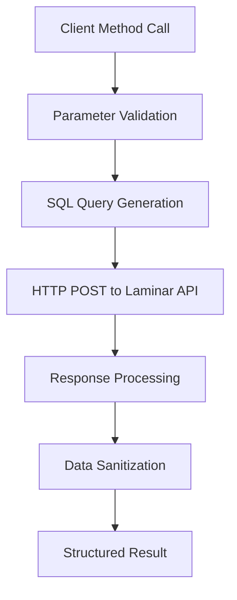
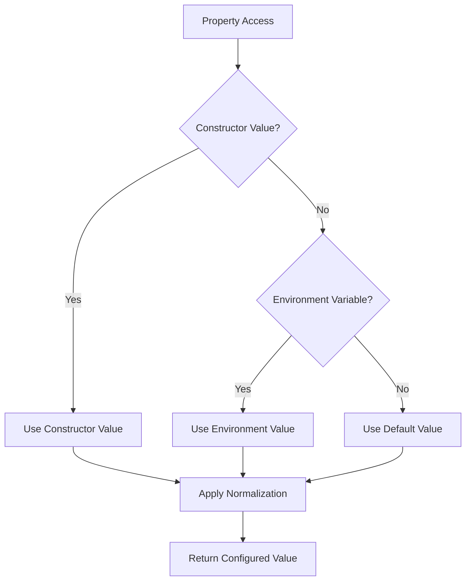
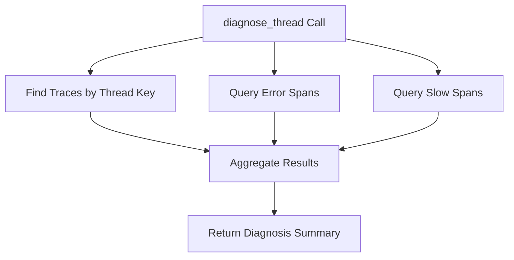

Now I have enough information to write the analysis. Let me create a comprehensive analysis of the laminar component.

# Laminar Component Analysis

## Overview

The Laminar component is a Python client library designed to enable Centaur agent executions to investigate their own traces through the Laminar observability platform. It provides a programmatic interface to query trace data stored in a Laminar app-server SQL database, allowing agents to introspect their execution patterns, diagnose performance issues, and identify errors.

## Architecture

The component follows a **client-facade pattern** with a single main class (`LaminarClient`) that abstracts the complexity of interacting with the Laminar SQL API. The architecture emphasizes:

- **Simplicity**: Single-file implementation focusing on essential querying capabilities
- **Configuration flexibility**: Multiple configuration sources (constructor parameters, environment variables, defaults)
- **SQL abstraction**: Higher-level methods that generate appropriate ClickHouse SQL queries for common use cases
- **Data sanitization**: Automatic filtering and truncation of trace data for practical consumption

## Key Components

### LaminarClient Class
The primary interface providing configuration management, HTTP client lifecycle, and high-level query methods. Handles authentication via API keys and project scoping, with automatic URL normalization and timeout management.

### Configuration Properties
A set of property methods (`base_url`, `external_url`, `api_key`, `project_id`) that implement a cascading configuration strategy: constructor parameters override environment variables, which override hardcoded defaults.

### Query Infrastructure
The `_query()` method centralizes SQL execution against the Laminar app-server's `/api/v1/projects/{project_id}/sql/query` endpoint, handling authentication headers, error responses, and response payload normalization.

### Data Processing Utilities
Helper functions for data sanitization including `_interesting_attributes()` for filtering relevant trace attributes, `_truncate()` for limiting string lengths, `_safe_json()` for robust JSON parsing, and `_clamp_int()` for parameter validation.

### Trace Query Methods
Specialized methods for common trace investigation patterns:
- `recent_traces()`: Lists recent traces with basic metadata
- `find_traces()`: Searches by Centaur-specific identifiers (thread_key, execution_id, session_id)
- `get_trace()`: Retrieves detailed span information for a specific trace
- `diagnose_thread()`: Comprehensive thread analysis including errors and performance metrics
- `errors()`: Lists recent error spans across the entire project

### Health Monitoring
The `health()` method provides connectivity verification and configuration validation for troubleshooting client setup issues.

## Data Flows

### Trace Query Flow

### Configuration Resolution Flow

### Thread Diagnosis Flow

## External Dependencies

### External Libraries

- **httpx** (>=0.27.0) [networking]: Modern HTTP client library providing async/sync capabilities with robust connection management. Used for all communication with the Laminar app-server SQL API. The `LaminarClient` uses the synchronous client interface via `httpx.Client` for simplicity. Imported in: `client.py` line 9.

### Standard Library Dependencies

- **json** [serialization]: Used for parsing Laminar trace attributes and handling API request/response payloads. Primary usage in `_safe_json()` for robust parsing of trace attribute JSON strings and in `_query()` for request serialization.

- **os** [system]: Used for environment variable access in configuration property methods. Enables flexible deployment configuration through `LAMINAR_BASE_URL`, `LAMINAR_API_KEY`, `LAMINAR_PROJECT_ID`, and `LAMINAR_EXTERNAL_URL` environment variables.

- **typing** [type-hints]: Provides type annotation support for method signatures and return types. Used extensively throughout for `dict[str, Any]`, `str | None`, and other union types to ensure type safety.

## API Surface

### Primary Interface
- **LaminarClient**: Main client class with context manager support
- **Configuration**: Environment-based configuration with sensible defaults
- **Query Methods**: High-level methods for common trace investigation patterns
- **Health Check**: Connectivity and configuration validation

### Configuration Parameters
- `base_url`: Internal Laminar app-server endpoint (default: cluster-local service)
- `external_url`: External Laminar UI endpoint for generating trace URLs
- `api_key`: Authentication credential for API access
- `project_id`: Laminar project scope for query filtering
- `timeout`: HTTP request timeout configuration

### Method Categories
- **Discovery**: `recent_traces()`, `find_traces()` for locating relevant traces
- **Detail**: `get_trace()` for comprehensive span-level information
- **Analysis**: `diagnose_thread()`, `errors()` for pattern identification and troubleshooting
- **Utility**: `health()`, `query()` for infrastructure verification and custom SQL execution

### Response Formats
All methods return structured dictionaries with consistent field naming. Trace data includes Centaur-specific attributes (thread_key, execution_id, service names) and performance metrics (duration, token counts, costs).
