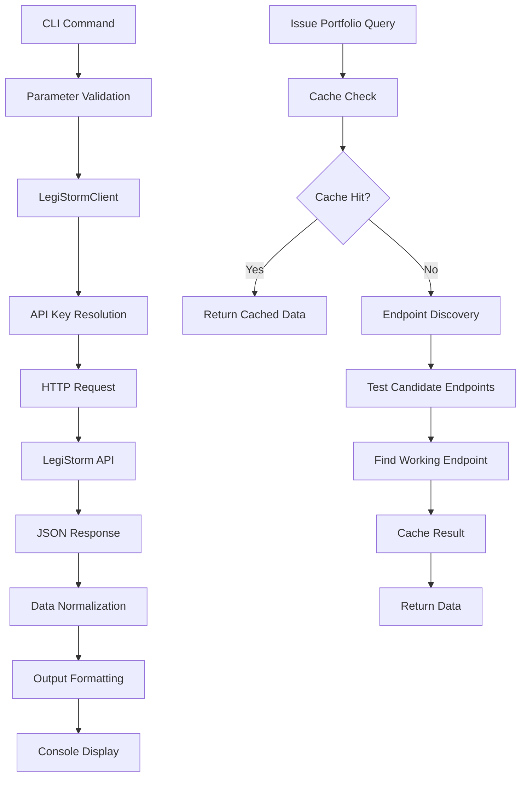

# LegiStorm Congressional Data Library

## Architecture

The legistorm component is a Python library that provides a comprehensive API client and CLI interface for accessing the LegiStorm Congressional database. The component follows a layered architecture with clear separation between the API client logic, CLI interface, and data transformation utilities.

The core architecture consists of:

1. **Client Layer**: The `LegiStormClient` class provides a robust HTTP client with authentication, caching, and error handling
2. **CLI Layer**: A Typer-based command-line interface that exposes all client functionality with formatted output options
3. **Data Processing Layer**: Extensive data normalization and extraction utilities for handling LegiStorm's complex API responses

The component implements intelligent endpoint discovery for issue portfolio data, automatically testing multiple candidate endpoints to find working routes based on API key permissions. It also includes a sophisticated caching system for expensive issue portfolio queries.

## Key Components

### LegiStormClient Class
The main API client class that handles all interactions with the LegiStorm API. It manages authentication via API keys, implements HTTP request/response handling, and provides methods for accessing different types of congressional data including members, staff, offices, caucuses, town halls, trips, and hearings.

### Issue Portfolio Intelligence System
A complex system for discovering and caching issue portfolio data across different API endpoints. Since LegiStorm's issue portfolio endpoints vary by subscription level, the client automatically tests multiple candidate endpoints (`/issue_staff/list`, `/member/issue/list`, `/office/issue/list`, etc.) to find working routes.

### CLI Commands Module
Comprehensive command-line interface built with Typer that provides 13 different commands for querying congressional data. Each command supports multiple output formats (table, markdown, JSON) and includes consistent parameter handling for date ranges, pagination, and filtering.

### Data Extraction Utilities
Static methods for extracting and normalizing data from LegiStorm's nested JSON responses. These utilities handle the complexity of LegiStorm's data structure, extracting staff IDs, member IDs, office IDs, and issue names from various nested object patterns.

### Caching System
Time-based caching for issue portfolio queries with configurable TTL (default 3600 seconds). The cache key includes all relevant query parameters to ensure accurate cache hits while reducing expensive API calls.

### Authentication Management
Flexible authentication system that accepts API keys via constructor parameter or environment variables (`LEGISTORM_API_KEY`). The client uses the centaur SDK's secret management for secure credential handling.

## Data Flows



The primary data flow starts with CLI commands that validate parameters and delegate to the `LegiStormClient`. The client resolves API credentials, makes authenticated HTTP requests to the LegiStorm API, and processes the JSON responses through normalization utilities before returning formatted data.

For issue portfolio queries, there's a secondary flow involving cache checks and intelligent endpoint discovery. The system first checks for cached results, and if none exist, it tests multiple candidate endpoints to find one that works with the current API key's permissions.

## External Dependencies

### External Libraries

- **httpx** (>=0.27.0) [networking]: Modern async-capable HTTP client library used for making requests to the LegiStorm API. Provides robust error handling, timeout management, and connection pooling. Used throughout the `LegiStormClient._request()` method and initialized in the `client` property.

- **typer** (>=0.12.0) [cli]: Modern CLI framework for building command-line applications with type hints and automatic help generation. Powers the entire CLI interface in `cli.py` with 13 different commands for querying congressional data. Creates the main `app` instance and handles all command parsing and validation.

- **rich** (>=13.0) [cli]: Advanced terminal formatting library that provides styled tables, colors, and text rendering. Used for creating formatted output tables via the `Console` class and imported `Table` from centaur SDK. Handles all visual formatting in CLI commands when not using JSON or markdown output.

- **centaur_sdk** (internal) [framework]: Internal Centaur SDK providing shared utilities including `secret()` for credential management, `cli_tables.Table` for consistent table formatting across tools, and `tool_sdk` integration. Used for API key resolution and standardized CLI table rendering.

## API Surface

The library exposes its functionality through two primary interfaces:

### LegiStormClient Public Methods

```python
# Core data access methods
get_members(updated_from, updated_to, limit=20, page=1, member_id=None, state_id=None, status="a") -> dict
get_staff(updated_from, updated_to, limit=20, page=1, staff_id=None, member_id=None, office_id=None) -> dict  
get_staff_with_issue_portfolios(updated_from, updated_to, limit=20, page=1, staff_id=None, member_id=None, office_id=None, issue_endpoint=None) -> dict
get_offices(updated_from, updated_to, limit=20, page=1, office_id=None) -> dict
get_caucuses(updated_from, updated_to, limit=20, page=1, caucus_id=None) -> dict
get_townhalls(updated_from, updated_to, limit=20, page=1, townhall_id=None) -> dict  
get_trips(updated_from, updated_to, limit=20, page=1, trip_id=None) -> dict
get_hearings(updated_from, updated_to, chamber="H", limit=20, page=1, hearing_id=None, office_id=None, hearing_date_from=None, hearing_date_to=None) -> dict

# Utility methods
get_staff_retired_ids() -> dict
get_offices_retired_ids() -> dict  
get_caucuses_retired_ids() -> dict
raw_request(endpoint, params=None) -> dict | list

# Context manager support
__enter__() / __exit__() / close()
```

### CLI Commands

The CLI provides 13 commands accessible via the `legistorm` command:
- `members` - Query congressional members with filtering by state, status, ID
- `staff` - Query congressional staff with filtering by member, office, ID  
- `staff-portfolios` - Get staff with enriched issue portfolio data
- `staff-retired` - Get retired staff IDs
- `offices` - Query congressional offices (committees, subcommittees, etc.)
- `offices-retired` - Get retired office IDs
- `caucuses` - Query congressional caucuses (requires subscription)
- `caucuses-retired` - Get retired caucus IDs
- `townhalls` - Query town hall events
- `trips` - Query privately funded travel records
- `hearings` - Query congressional hearings with chamber and date filtering

All commands support multiple output formats (`--json`, `--markdown`) and consistent parameter patterns for date ranges (`--from`, `--to`), pagination (`--limit`, `--page`), and entity-specific filtering.
