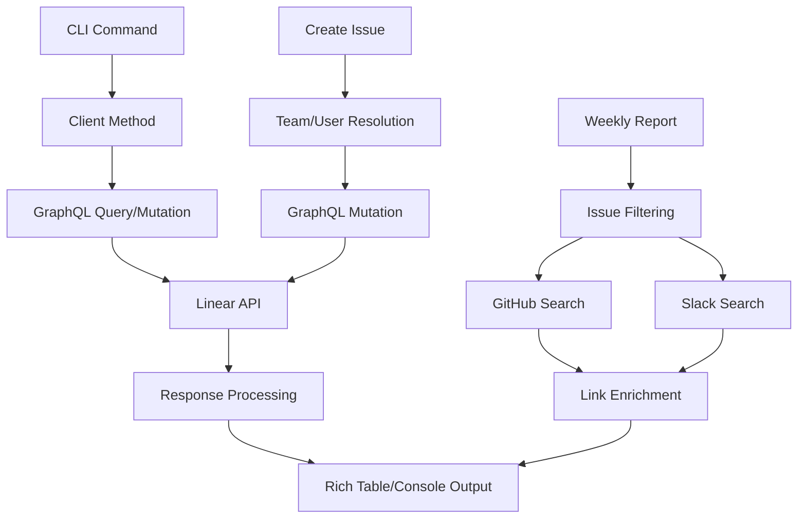

Based on my analysis, I can see that the LinearClient inherits from LinearReadonlyClient but that class isn't found in the current codebase. This suggests it's defined elsewhere in the centaur codebase. Now I have enough information to write the comprehensive analysis.

# Linear CLI Component Analysis

## Overview

The Linear component is a comprehensive command-line interface for interacting with Linear issue tracking, providing AI agents and users with full access to Linear's GraphQL API. The tool offers both read-only operations (listing issues, teams, projects) and write operations (creating, updating, commenting on issues) while integrating with external services like GitHub and Slack for enriched reporting.

## Architecture

The component follows a **layered architecture** pattern with clear separation between CLI commands, client abstraction, and external integrations:

1. **CLI Layer** (`cli.py`) - Command definitions using Typer for argument parsing and Rich for formatted output
2. **Client Layer** (`client.py`) - API abstraction inheriting from a shared LinearReadonlyClient 
3. **Integration Layer** (`integrations.py`) - Cross-platform enrichment with GitHub and Slack APIs
4. **Configuration Layer** - Environment-based authentication and settings

The design promotes reusability by separating read-only operations (shared with other components) from CLI-specific mutations and integrations.

## Key Components

### CLI Application (`cli.py`)
- **Entry Point**: Typer-based CLI app with 20+ commands covering the full Linear workflow
- **Rich Output**: Formatted tables and console output using the Rich library
- **Authentication**: Dynamic environment loading from multiple locations
- **Command Categories**: User info, teams, issues (CRUD), projects, cycles, labels, search, integrations
- **Error Handling**: Graceful exit codes and user-friendly error messages

### Linear Client (`client.py`) 
- **API Abstraction**: Wraps Linear's GraphQL API with typed Python methods
- **Inheritance Model**: Extends LinearReadonlyClient for shared query operations
- **Mutation Support**: Create/update issues, comments, labels, and relations
- **Label Resolution**: Smart label name-to-ID mapping with team scoping
- **GraphQL Queries**: Hand-crafted mutations for precise data fetching

### Cross-Platform Integrations (`integrations.py`)
- **GitHub Integration**: PR and commit search via GitHub API
- **Slack Integration**: Message search using Slack SDK
- **Issue Enrichment**: Automatic linking of Linear issues to related GitHub/Slack content
- **Weekly Reporting**: Time-filtered issue reporting with external link discovery
- **Search Term Extraction**: Intelligent keyword extraction from issue titles

### Configuration Management
- **Environment Loading**: Multi-location .env file discovery
- **Secret Management**: Integration with centaur_sdk for secure API key handling
- **Authentication**: Support for Linear API keys, GitHub tokens, and Slack bot tokens

## Data Flows



### Primary Data Flow
1. **Command Parsing**: Typer processes CLI arguments and options
2. **Client Initialization**: LinearClient loads environment and authenticates
3. **API Interaction**: GraphQL queries/mutations sent to Linear API
4. **Data Processing**: Response transformation and filtering
5. **Output Rendering**: Rich library formats tables and console output

### Integration Data Flow
1. **Issue Collection**: Fetch Linear issues based on filters
2. **Search Term Extraction**: Parse issue titles/identifiers for keywords
3. **External API Calls**: Parallel searches to GitHub and Slack APIs
4. **Link Enrichment**: Attach found links to issue metadata
5. **Unified Reporting**: Present enriched data in structured format

## External Dependencies

### Core Dependencies

- **httpx** (>=0.27.0) [networking]: Modern async HTTP client for API requests. Used in integrations.py for GitHub API calls and as the underlying transport for Linear GraphQL requests. Provides connection pooling and timeout handling.

- **typer** (>=0.12.0) [cli]: Modern CLI framework built on Click. Powers all command definitions in cli.py including argument parsing, option handling, help generation, and command organization. Provides type hints for better developer experience.

- **rich** (>=13.0.0) [cli]: Advanced terminal formatting library. Used extensively in cli.py for creating formatted tables, progress indicators, colored output, and structured console display. Enhances user experience with professional CLI output.

- **python-dotenv** (>=1.0.0) [config]: Environment variable management from .env files. Used in cli.py get_client() function to load Linear API keys and other configuration from multiple possible .env locations in the project hierarchy.

### Integration Dependencies

- **centaur_sdk** [internal]: Centaur's internal SDK providing Table class for formatted output and secret() function for secure credential management. Used in cli.py for table creation and in integrations.py for GitHub/Slack token access.

- **slack_sdk** [optional]: Official Slack Python SDK for workspace API access. Dynamically imported in integrations.py SlackSearchClient class for message search functionality. Gracefully handled if not installed.

### Runtime Dependencies

The component also depends on external command-line tools:

- **gh CLI**: GitHub's official command-line tool used as fallback for GitHub authentication token retrieval when GITHUB_TOKEN environment variable is not set.

## API Surface

### CLI Commands

The component exposes a rich CLI interface through 20+ commands:

#### Core Issue Management
- `linear me` - Show authenticated user info
- `linear issues [--team] [--assignee] [--state] [--limit] [--full] [--json]` - List issues with filters
- `linear issue <id> [--json]` - Get detailed issue information
- `linear create <title> --team <key> [options]` - Create new issues
- `linear update <id> [options]` - Update existing issues  
- `linear comment <id> <body>` - Add comments to issues

#### Resource Management  
- `linear teams` - List all teams
- `linear projects [--limit] [--json]` - List projects
- `linear project <name>` - Get project details
- `linear cycles [--team] [--limit]` - List development cycles
- `linear states [--team]` - List workflow states

#### Labels and Relations
- `linear labels [--team]` - List available labels
- `linear add-label <issue-id> <label> [--team]` - Add labels to issues
- `linear remove-label <issue-id> <label> [--team]` - Remove labels from issues  
- `linear link <issue-id> <related-id> [--type]` - Create issue relations

#### Search and Reporting
- `linear search <query> [--limit] [--json]` - Full-text issue search
- `linear weekly [--team] [--org]` - Generate weekly reports with external links
- `linear users [--limit] [--query]` - List workspace users

#### Asset Management
- `linear fetch-asset <url> [--output]` - Download Linear-hosted files

### Programmatic Interface

When imported as a module, the component provides:

```python
from linear.client import LinearClient

client = LinearClient()
# Full access to all Linear GraphQL operations
issues = client.issues(team_key="ENG", limit=25)
client.create_issue(title="Bug fix", team_id="team_123")
```

## External Systems

### Linear API Integration
- **Service**: Linear GraphQL API (api.linear.app)
- **Protocol**: HTTPS/GraphQL
- **Authentication**: Bearer token via LINEAR_API_KEY
- **Usage**: Primary data source for all issue tracking operations
- **Rate Limits**: Respects Linear's API rate limiting

### GitHub API Integration  
- **Service**: GitHub REST API (api.github.com)
- **Protocol**: HTTPS/REST
- **Authentication**: Bearer token via GITHUB_TOKEN or gh CLI
- **Usage**: Search PRs and commits for issue enrichment
- **Scope**: Read access to public and private repositories

### Slack API Integration
- **Service**: Slack Web API (slack.com/api)
- **Protocol**: HTTPS/REST  
- **Authentication**: Bot token via SLACK_BOT_TOKEN
- **Usage**: Search workspace messages for issue context
- **Permissions**: Requires search:read scope

### File Upload Integration
- **Service**: Linear Asset CDN (uploads.linear.app)
- **Protocol**: HTTPS
- **Authentication**: Linear API key
- **Usage**: Download issue attachments and embedded media

## Component Interactions

The Linear component integrates with the broader Centaur ecosystem through several mechanisms:

### Internal Service Dependencies
- **LinearReadonlyClient**: Inherits from a shared client in `api.integrations.linear` for read operations, enabling code reuse across multiple Centaur components
- **centaur_sdk**: Uses internal SDK for secure credential management and standardized table formatting

### External Tool Dependencies  
- **GitHub CLI**: Leverages `gh auth token` for GitHub authentication as fallback
- **Environment Configuration**: Shares .env files with other Centaur components for unified configuration management

### Data Exchange Patterns
- **JSON Output**: All commands support `--json` flag for programmatic consumption by other tools
- **Exit Codes**: Proper exit code handling for shell script integration
- **Environment Variables**: Standard environment variable patterns for service configuration
