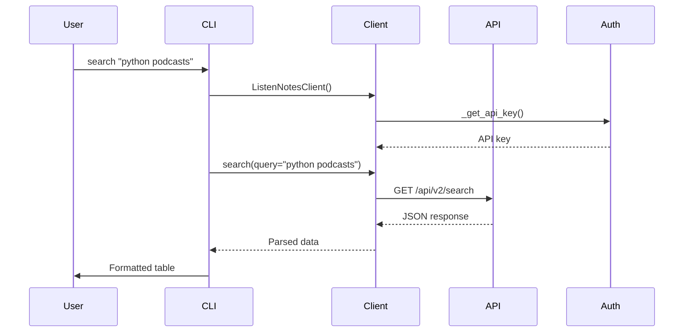

# Listen Notes Component Analysis

## Architecture

The `listennotes` component implements a layered architecture with clear separation between the API client layer and CLI presentation layer. The design follows a simple client-service pattern where:

- The `ListenNotesClient` class provides a clean Python interface to the Listen Notes REST API
- The CLI module (`cli.py`) wraps the client with Typer-based commands for terminal interaction
- Secret management is integrated through the Centaur SDK with fallback to 1Password CLI

The component uses composition over inheritance, with the CLI importing and instantiating the client as needed rather than extending it. This promotes loose coupling and makes the client reusable as a library.

## Key Components

### 1. ListenNotesClient (`client.py`)
The core API client class that handles all HTTP communication with the Listen Notes API. It implements connection pooling, error handling, and multiple authentication methods.

### 2. CLI Commands (`cli.py`)
Three main CLI commands (`search`, `podcast`, `episode`) that provide user-friendly interfaces to the API functionality with rich formatting options including tables, markdown, and JSON output.

### 3. Authentication System
Multi-layered authentication that checks for API keys in order of precedence: constructor parameter, Centaur SDK secrets, and 1Password CLI integration.

### 4. Output Formatters
Flexible output formatting supporting Rich tables, markdown tables, and raw JSON to accommodate different use cases from human-readable reports to machine processing.

### 5. HTTP Client Management
Context manager pattern implementation for proper resource cleanup and connection management using httpx as the underlying HTTP library.

## Data Flows

```mermaid
graph TD
    A[CLI Command] --> B[get_client()]
    B --> C[ListenNotesClient.__init__]
    C --> D[_get_api_key()]
    D --> E{API Key Source}
    E -->|Instance| F[Use provided key]
    E -->|Centaur SDK| G[secret() function]
    E -->|1Password| H[op CLI command]
    F --> I[_request()]
    G --> I
    H --> I
    I --> J[httpx.Client.get()]
    J --> K[Listen Notes API]
    K --> L[JSON Response]
    L --> M{Output Format}
    M -->|Rich| N[Formatted Table]
    M -->|Markdown| O[Markdown Table]
    M -->|JSON| P[Raw JSON]
```



## External Dependencies

### External Libraries

- **httpx** (>=0.27.0) [networking]: Modern async-capable HTTP client library. Used as the primary HTTP client for making requests to the Listen Notes API. Provides connection pooling, timeout handling, and robust error management. Imported in: `tools/research/listennotes/client.py`.

- **typer** (>=0.12.0) [cli]: Modern CLI framework built on top of Click. Provides automatic help generation, type validation, and clean command definition syntax. Used to create the main CLI application with subcommands for search, podcast, and episode operations. Imported in: `tools/research/listennotes/cli.py`.

- **rich** (>=13.0.0) [cli]: Terminal formatting library for creating beautiful console output. Used to generate formatted tables with colors and styling for displaying podcast search results and details. Provides the Console and Table classes. Imported in: `tools/research/listennotes/cli.py`.

- **python-dotenv** (implied) [configuration]: Environment variable management from .env files. Used to load environment variables at CLI startup for configuration management. Imported in: `tools/research/listennotes/cli.py`.

All dependencies are runtime requirements focused on HTTP communication, CLI interaction, and output formatting. No development-only dependencies are specified.

## API Surface

The component exposes both a programmatic Python API and a command-line interface:

### Python API (`ListenNotesClient`)
```python
# Core client methods
def search(query: str, type: str = "episode", offset: int = 0, len_min: int = None, len_max: int = None) -> dict
def get_podcast(podcast_id: str) -> dict  
def get_episode(episode_id: str) -> dict
def close()  # Resource cleanup
```

### CLI Interface
```bash
listennotes search "query" --type episode|podcast --limit N --json --markdown
listennotes podcast <podcast_id> --json --markdown  
listennotes episode <episode_id> --json --markdown
```

All CLI commands support multiple output formats (rich tables, markdown tables, raw JSON) to accommodate different consumption patterns from interactive use to scripted integration.

The client implements the context manager protocol (`__enter__`/`__exit__`) for proper resource management, and provides both direct instantiation and factory function patterns.

## External Systems

### Listen Notes API
The component integrates with the Listen Notes REST API (https://listen-api.listennotes.com/api/v2) for podcast data retrieval. Authentication uses API key headers (`X-ListenAPI-Key`), and the integration supports:
- Episode and podcast search with filtering parameters
- Individual podcast metadata retrieval  
- Individual episode metadata retrieval

### 1Password CLI Integration
Fallback authentication mechanism that attempts to retrieve the API key from 1Password using the `op` command-line tool when other methods fail. This provides secure credential storage for production deployments.

## Component Interactions

This component has no dependencies on other components within the centaur-src codebase. It only imports from:
- Standard library modules (`subprocess`, `json`)  
- External packages (`httpx`, `typer`, `rich`, `dotenv`)
- The `centaur_sdk` for secret management and table formatting

The component is designed as a standalone library that could be used independently or integrated into larger applications.
