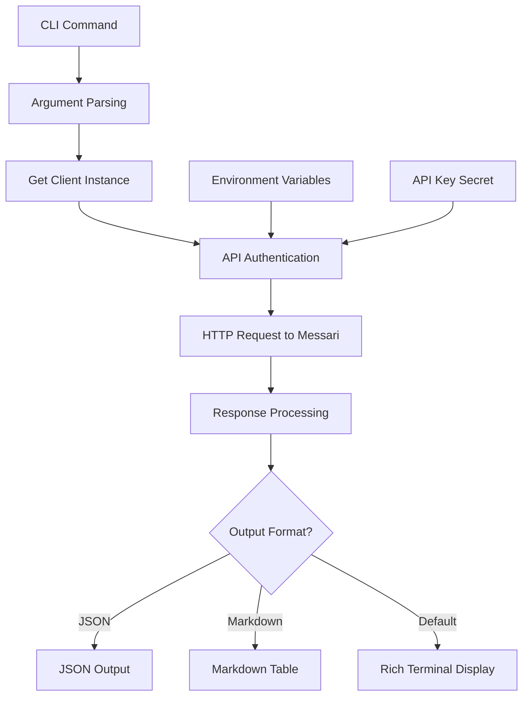

Now I have all the necessary information to write a comprehensive analysis of the messari component.

# Messari Component Analysis

The messari component is a Python CLI tool that provides access to cryptocurrency asset data through the Messari API. It offers a command-line interface for retrieving prices, metrics, profiles, market data, and news about digital assets, with multiple output formats including rich terminal displays, JSON, and markdown tables.

## Architecture

The component follows a **layered architecture** pattern with clear separation of concerns:

- **CLI Layer** (`cli.py`): Command definitions, argument parsing, and output formatting
- **Client Layer** (`client.py`): HTTP API client with request handling and authentication  
- **Configuration**: Environment variable management for API key authentication

The architecture enables clean separation between user interface concerns and API communication, making the component easy to extend with new commands or modify output formats.

## Key Components

### MessariClient Class
The core API client that handles all communication with the Messari data API. It manages authentication via API keys, constructs HTTP requests, and handles error responses. The client supports both v1 and v2 API endpoints and provides context manager functionality for resource cleanup.

### CLI Command Structure
Eight distinct commands provide comprehensive crypto data access:
- `assets`: Lists cryptocurrency assets with basic information
- `asset`: Retrieves detailed information for a specific asset
- `metrics`: Displays price, volume, and market capitalization data
- `profile`: Shows asset descriptions and project details
- `markets`: Lists trading markets and exchanges for an asset
- `news`: Retrieves latest cryptocurrency news (fallback implementation)
- `timeseries`: Fetches historical data for specific metrics
- `raw`: Enables direct API endpoint access for power users

### Output Formatting System
Three distinct output formats accommodate different use cases:
- **Rich Terminal**: Colored, formatted tables using the rich library for interactive use
- **JSON**: Machine-readable output for programmatic consumption
- **Markdown**: Documentation-friendly tables for reports and sharing

### Utility Functions
Helper functions provide consistent data presentation:
- `format_number()`: Formats large numbers with B/M/K suffixes for readability
- `print_markdown_table()`: Generates markdown table output
- `get_client()`: Factory function for creating authenticated client instances

## Data Flows



### Request Flow
1. User executes CLI command with arguments
2. Typer parses arguments and validates options
3. Client factory creates authenticated MessariClient instance
4. Client constructs HTTP request with proper headers and parameters
5. HTTPX sends request to Messari API endpoints
6. Response data is parsed and returned to command handler
7. Output formatter renders data according to selected format
8. Results are displayed to user via console or stdout

### Error Handling Flow
- Invalid API responses trigger RuntimeError exceptions with detailed messages
- Missing API keys cause initialization failures with clear error messages
- HTTP errors are captured and presented with status codes and API error details

## External Dependencies

### External Libraries

- **httpx** (>=0.27.0) [networking]: Modern HTTP client library for making API requests to Messari endpoints. Provides async/sync support, timeout handling, and connection pooling. Used in `client.py` for all API communication with automatic request/response handling.

- **typer** (>=0.12.0) [cli]: Modern CLI framework built on Click that provides type hints, automatic help generation, and command parsing. Used throughout `cli.py` to define all eight commands with their arguments, options, and help text. Handles argument validation and command routing.

- **rich** (>=13.0.0) [cli]: Terminal formatting library that provides colored output, progress bars, and formatted tables. Used in `cli.py` for the default output format, creating styled tables with colored columns and console output for better user experience.

- **python-dotenv** (>=1.0.0) [configuration]: Environment variable loading from .env files. Used in `cli.py` via `load_dotenv()` to automatically load API keys and other configuration from environment files during CLI initialization.

- **centaur_sdk** [internal]: Internal SDK providing shared utilities including the `Table` class for rich terminal output and the `secret()` function for secure credential management. Used in both `cli.py` and `client.py` for consistent formatting and authentication patterns.

## API Surface

### CLI Commands

The component exposes eight public commands through the `messari` CLI executable:

- **messari assets** `[--limit N] [--fields FIELDS] [--json] [--markdown]`: Lists crypto assets with optional filtering and output format selection
- **messari asset** `ASSET_KEY [--json] [--markdown]`: Retrieves detailed information for a specific cryptocurrency 
- **messari metrics** `ASSET_KEY [--json] [--markdown]`: Displays price, volume, and market cap metrics
- **messari profile** `ASSET_KEY [--json] [--markdown]`: Shows asset description and project details
- **messari markets** `ASSET_KEY [--limit N] [--json] [--markdown]`: Lists trading markets and exchanges
- **messari news** `[--limit N] [--json] [--markdown]`: Retrieves cryptocurrency news (limited functionality)
- **messari timeseries** `ASSET_KEY METRIC [--start DATE] [--end DATE] [--json] [--markdown]`: Fetches historical metric data
- **messari raw** `ENDPOINT [--version V] [--params PARAMS]`: Direct API access for advanced users

### Python API

The MessariClient class provides programmatic access:

```python
from messari.client import MessariClient

client = MessariClient(api_key="your_key")
data = client.get_asset_metrics("bitcoin")
timeseries = client.get_timeseries("ethereum", "price", start="2024-01-01")
```

## External Systems

### Messari API Integration
The component integrates with the Messari data API at `data.messari.io` using REST endpoints. It requires API key authentication passed via the `x-messari-api-key` header. The client supports both v1 and v2 API versions, with v1 being the primary version used for most operations.

**API Limitations**: Several endpoints mentioned in the CLI commands have been deprecated or disabled by Messari, including the assets list endpoint, profile endpoint, markets endpoint, and news endpoint. The client implements fallback behavior by using the metrics endpoint as a substitute, which limits the full functionality described in the command help text.

### Configuration Management
The component relies on environment variable configuration for the `MESSARI_API_KEY`, which can be loaded from `.env` files via python-dotenv or set directly in the environment. The centaur_sdk secret management system provides secure credential handling.

## Component Interactions

This component operates independently with no direct dependencies on other components in the centaur-src codebase. It integrates with:

- **centaur_sdk**: Uses shared utilities for table formatting and secret management
- **Environment**: Loads configuration from environment variables and .env files
- **External API**: Communicates with Messari's REST API over HTTPS

The component is designed as a standalone tool that can be used independently or as part of larger cryptocurrency analysis workflows.
