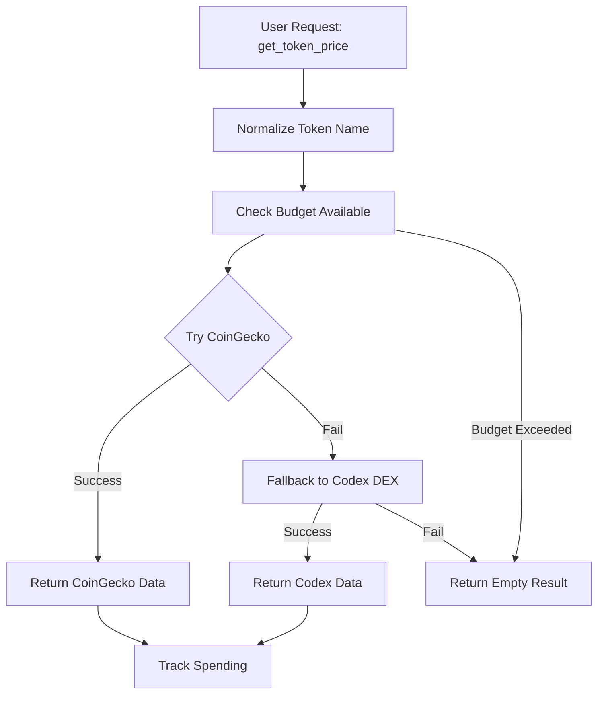
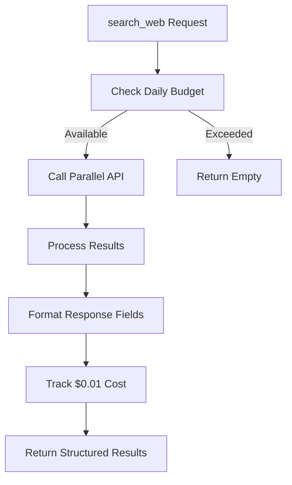
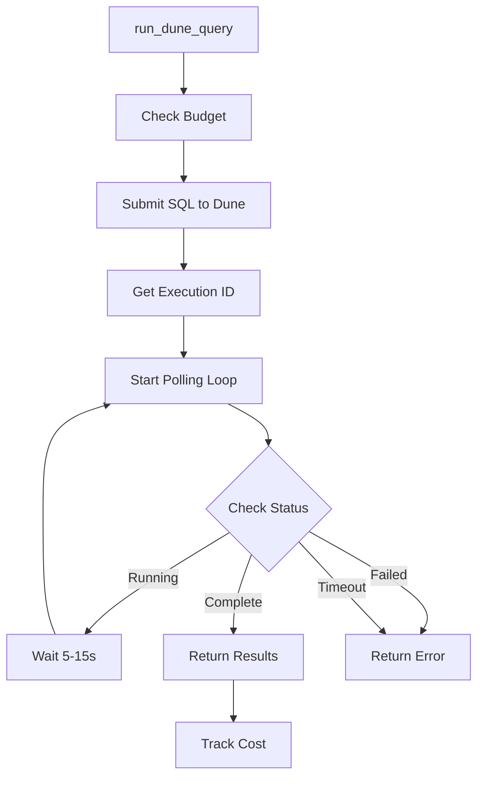

# MPP Library Analysis

## Architecture

The MPP (Machine Payments Protocol) library implements a **service-oriented architecture** with a central client class that acts as a gateway to multiple external data providers. The architecture follows a **proxy pattern** where the `MppClient` abstracts away the complexity of different APIs behind a unified interface, while implementing cost tracking and budget management as cross-cutting concerns.

The library is structured around a single monolithic client that provides access to five distinct data services:
- **Parallel** for web search
- **CoinGecko** for token prices and market data  
- **Codex** for DEX data as fallback
- **Allium** for wallet balance queries
- **Dune Analytics** for SQL-based blockchain queries

All requests are authenticated and paid for using Tempo stablecoins via the MPP protocol, with each query type having different cost structures ranging from $0.01 to $4.00.

## Key Components

1. **MppClient Class** (`client.py:62-513`): The main client class that orchestrates all API interactions, manages authentication, budget tracking, and provides unified methods for accessing market data services.

2. **Token Normalization System** (`client.py:20-45`): A mapping system that converts full token names (e.g., "SOLANA") to standard symbols ("SOL") and maps symbols to CoinGecko IDs for consistent data retrieval across services.

3. **Budget Management System** (`client.py:86-94`): Implements daily spending caps ($10 default) with automatic daily resets and per-query cost tracking to prevent runaway spending.

4. **Authentication Handler** (`client.py:75-84`): Lazy-loads the MPP private key from 1Password secrets only when needed, preventing initialization failures if secrets aren't configured.

5. **HTTP Request Handler** (`client.py:96-110`): Centralized HTTP client using httpx with MPP authentication headers and error handling for all external API calls.

6. **Web Search Interface** (`client.py:114-136`): Provides web search capabilities via Parallel API with structured result formatting including title, URL, text content, and publication dates.

7. **Token Price Services** (`client.py:140-253`): Dual-source price data using CoinGecko as primary source with Codex DEX data as fallback, including real-time prices, 24h changes, volume, and market cap.

8. **Price History Services** (`client.py:257-343`): Provides both simple price history for line charts and OHLC candlestick data with configurable time periods and automatic data point reduction.

9. **Market Overview Services** (`client.py:347-424`): Offers trending tokens and market snapshots including BTC dominance and total market cap calculations.

10. **Wallet Analysis Interface** (`client.py:428-459`): Queries wallet balances across different blockchains via Allium with USD value calculations and portfolio summaries.

11. **Dune SQL Engine** (`client.py:463-502`): Executes arbitrary SQL queries against Dune Analytics with async polling for results and comprehensive error handling.

12. **Price Formatting Utility** (`client.py:48-59`): Formats large numbers in human-readable format (K/M/B/T suffixes) for display purposes.

## Data Flows

### Token Price Query Flow

### Web Search Flow

### Dune SQL Execution Flow

## External Dependencies

### External Libraries

- **httpx** (>=0.27.0) [networking]: Modern async HTTP client library for making authenticated requests to MPP-enabled APIs. Used throughout the `_tempo_fetch` method for all external service calls. Provides timeout handling, connection pooling, and comprehensive HTTP error handling. Imported in: `client.py:15`.

- **centaur_sdk** [internal-framework]: Centaur's internal SDK providing the `secret` function for accessing 1Password-stored credentials. Used specifically for lazy-loading the MPP private key required for authenticated API requests. Imported in: `client.py:16`.

## API Surface

The MPP library exposes a comprehensive API for accessing paid market data services:

### Public Methods

- **`search_web(query: str, num_results: int = 5) -> list[dict]`**: Web search via Parallel ($0.01/query) returning structured results with title, URL, text, and date fields.

- **`get_token_price(token_name: str) -> dict`**: Current token price, 24h change, volume, and market cap using CoinGecko primary with Codex fallback ($0.06-0.12).

- **`get_price_history(token_name: str, days: int = 30) -> list[dict]`**: Historical price data for charting with configurable timeframes ($0.06 via CoinGecko).

- **`get_ohlc(token_name: str, days: int = 30) -> list[dict]`**: OHLC candlestick data for advanced charting ($0.06 via CoinGecko).

- **`get_trending() -> list[dict]`**: Top trending tokens from CoinGecko with rank, price, and 24h change data ($0.06).

- **`get_market_snapshot() -> dict`**: Market overview including BTC, ETH, SOL, HYPE prices plus BTC dominance and total market cap ($0.12).

- **`get_wallet(address: str, chain: str = "ethereum") -> dict`**: Wallet balance analysis via Allium with token balances and USD values ($0.03).

- **`run_dune_query(sql: str) -> dict`**: Execute SQL queries on Dune Analytics with async result polling ($0.05-4.00).

- **`get_spend() -> dict`**: Current daily spending and remaining budget information for cost monitoring.

### Factory Function

- **`_client() -> MppClient`**: Factory function that returns a new MppClient instance for use by other components.

The API is designed for consumption by trading bots, market analysis tools, and financial dashboards that require real-time and historical cryptocurrency market data with transparent per-query pricing.
