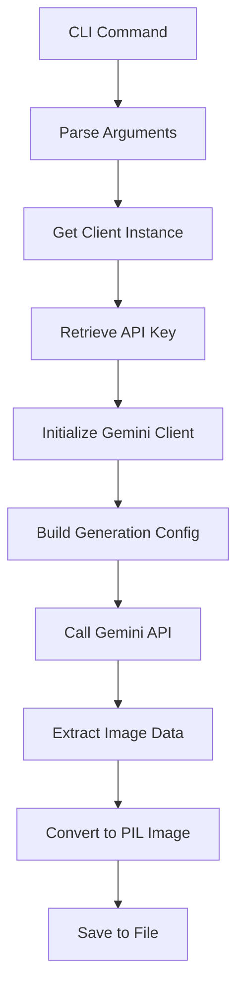
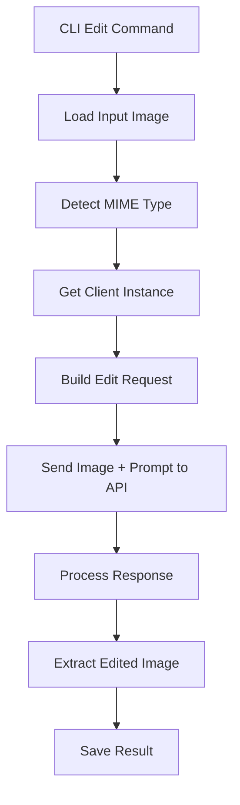
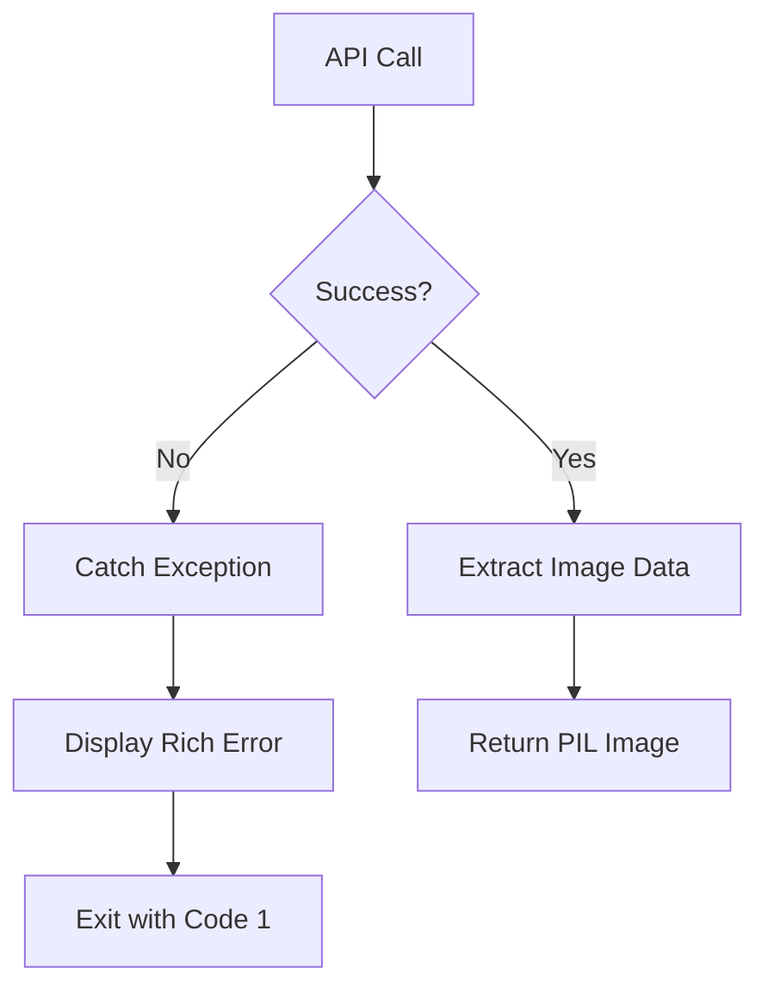

Now I have comprehensive information about the nano-banana component. Let me write the analysis.

# Nano Banana - Google Gemini Image Generation CLI

## Architecture

The nano-banana component implements a clean separation of concerns with a **layered architecture** pattern. It separates the core business logic (Google Gemini API client) from the command-line interface, following the principle of dependency inversion where the CLI depends on the client abstraction rather than concrete implementations.

The component provides both a Python library interface through `NanoBananaClient` and a command-line interface through Typer, making it accessible both programmatically and as a standalone tool. The architecture leverages the centaur-sdk for secure API key management while maintaining compatibility with standard environment variable configurations.

## Key Components

### NanoBananaClient (client.py)
The core client class that encapsulates all Google Gemini API interactions. It provides two primary capabilities: image generation from text prompts and image editing based on text instructions. The client supports both Gemini 2.5 Flash (fast) and Gemini 3 Pro (high quality) models with configurable aspect ratios and image sizes.

### CLI Interface (cli.py) 
A comprehensive command-line interface built with Typer that exposes three main commands: `generate`, `edit`, and `models`. The CLI provides rich terminal output with status indicators, error handling, and a tabular display for available models. It includes extensive help text and examples for user guidance.

### Model Configuration
Static configuration defining the available Gemini models with human-readable aliases. The system maps "flash" to "gemini-2.5-flash-image" for fast generation and "pro" to "gemini-3-pro-image-preview" for high-quality output with 4K support.

### Image Processing Pipeline
Handles image I/O operations using PIL (Python Imaging Library) for loading, processing, and saving images in multiple formats (PNG, JPEG, GIF, WebP). The system automatically detects MIME types based on file extensions.

### Authentication Layer
Integrates with the centaur-sdk's secret management system for secure API key handling, with fallback to environment variables for development and standalone usage scenarios.

## Data Flows

### Image Generation Flow

### Image Editing Flow

### Error Handling Flow

## External Dependencies

### google-genai (>=1.0.0) [ai-sdk]
The official Google Generative AI Python SDK that provides access to Gemini models. Used throughout the client for API authentication, content generation requests, and response processing. Imported in client.py for the core genai.Client and types.GenerateContentConfig.

### typer (>=0.12.0) [cli]
Modern CLI framework that provides argument parsing, command routing, and help generation. Powers the entire command-line interface with decorators for commands and automatic help text generation. Used in cli.py for the main app, commands, and all argument/option definitions.

### rich (>=13.0.0) [cli]
Terminal formatting library that provides colored output, progress indicators, and table formatting. Used in cli.py for the Console, status displays during API calls, error formatting, and the models command table display.

### httpx (>=0.27.0) [networking]
HTTP client library used as a dependency by google-genai for making requests to the Gemini API endpoints. While not directly imported in the component code, it's required for the Google SDK functionality.

### Pillow (>=10.0.0) [image-processing]
Python Imaging Library for image manipulation and I/O operations. Used in client.py for opening image data from API responses, loading input images for editing, and handling various image formats (PNG, JPEG, GIF, WebP).

### python-dotenv (>=1.0.0) [configuration]
Environment variable management for loading .env files during development. Used in cli.py to automatically load environment variables, particularly for the GOOGLE_API_KEY configuration.

### centaur_sdk (internal) [secrets]
Internal Centaur framework SDK for secure secret management. Used in client.py for retrieving the GOOGLE_API_KEY through the secret() function, providing secure access to API credentials in production environments.

## API Surface

### NanoBananaClient Class
- **`__init__(api_key: str | None = None)`**: Initialize client with optional API key
- **`generate(prompt: str, model: str = "flash", aspect_ratio: str | None = None, image_size: str | None = None) -> Image.Image`**: Generate image from text prompt
- **`edit(image_path: str | Path, prompt: str, model: str = "flash", aspect_ratio: str | None = None) -> Image.Image`**: Edit existing image with text instructions
- **`list_models() -> dict[str, str]`**: Get available model mappings

### CLI Commands
- **`generate PROMPT [OPTIONS]`**: Generate image from text description with model, output, aspect ratio, and size options
- **`edit IMAGE PROMPT [OPTIONS]`**: Edit existing image with text prompt and configuration options
- **`models`**: Display available models in formatted table

### Configuration Options
- **Models**: "flash" (fast) or "pro" (high quality/4K)
- **Aspect Ratios**: 1:1, 3:4, 4:3, 9:16, 16:9
- **Image Sizes**: 1K, 2K, 4K (pro model only)
- **Output Formats**: PNG, JPEG, GIF, WebP

## External Systems

### Google Generative AI API
The component connects to Google's Generative Language API at `generativelanguage.googleapis.com` for image generation and editing services. Authentication is handled via API key in the `x-goog-api-key` header, as configured in the centaur tool secrets section.

### File System
Direct integration with the local file system for reading input images and writing generated/edited images. Supports standard image formats and handles path resolution through Python's pathlib.

## Component Interactions

This component has no internal dependencies within the centaur-src codebase. It operates as a standalone library that integrates with the centaur-sdk for secret management but does not call other centaur components or services.

The component follows the centaur framework's secret management patterns by declaring HTTP-based secrets in pyproject.toml and using the centaur_sdk.secret() function for secure API key retrieval in production environments.
