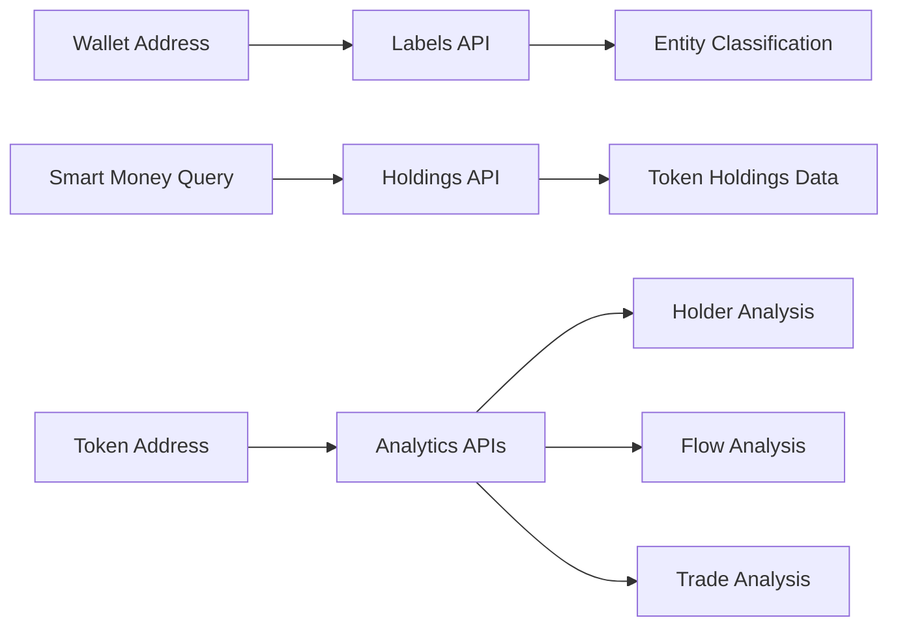

# Nansen CLI Tool Analysis

## Architecture

The nansen component follows a clean CLI architecture with a clear separation of concerns between API client functionality and command-line interface presentation. The design follows a standard pattern for blockchain analytics tools, with a client-server model where the local CLI acts as a user-friendly wrapper around the Nansen REST API.

The architecture consists of two main layers:
- **API Client Layer**: `NansenClient` class that handles all HTTP communication with the Nansen API
- **CLI Interface Layer**: Typer-based command structure that provides user-friendly commands and output formatting

The component uses a lazy initialization pattern for the HTTP client and supports multiple output formats (rich tables, markdown, JSON) to accommodate different use cases from interactive terminal usage to automated workflows.

## Key Components

### 1. NansenClient (client.py)
The core API client that encapsulates all interactions with the Nansen blockchain analytics API. Provides methods for wallet analysis, smart money tracking, token analytics, and entity searches. Supports 41 different blockchain networks including Ethereum, Solana, Bitcoin, and various Layer 2 solutions.

### 2. CLI Application (cli.py) 
Typer-based command-line interface with 12 main commands for different analytics workflows. Handles argument parsing, output formatting, and error presentation with rich console styling.

### 3. Labels Command (lines 50-106)
Retrieves and displays Nansen's proprietary wallet labels for blockchain addresses, showing categorization like "Smart Money", "Fund", "Exchange" with entity details and definitions.

### 4. Balance Command (lines 108-174)
Fetches current token balances for wallet addresses or named entities, displaying holdings with USD valuations across supported chains.

### 5. Smart Money Commands (lines 176-303)
Three related commands for Smart Money analytics: holdings tracking, net flows analysis, and DEX trades monitoring. These provide insights into institutional and sophisticated trader behavior.

### 6. Token Analytics Commands (lines 370-551)
Commands for token-focused analysis including screener for discovering tokens with Smart Money activity, holder analysis, and flow tracking by entity type.

### 7. Wallet Analysis Commands (lines 554-653)
PnL tracking and related wallet discovery functionality for understanding wallet performance and connection patterns.

### 8. Entity Search (lines 656-704)
Search functionality for finding blockchain entities by name with wallet count metrics.

### 9. Output Formatting System (lines 20-48)
Utility functions for number formatting with K/M/B/T suffixes, markdown table generation, and string truncation for consistent presentation across all commands.

### 10. Raw API Access (lines 707-729)
Direct API endpoint access for advanced users or debugging, allowing arbitrary calls to the Nansen API with JSON request bodies.

## Data Flows

```mermaid
graph TD
    A[CLI Command] --> B[Argument Parsing]
    B --> C[NansenClient.get_client()]
    C --> D[API Key Resolution]
    D --> E[HTTP Request to Nansen API]
    E --> F[JSON Response Processing]
    F --> G{Output Format?}
    G -->|JSON| H[Direct JSON Output]
    G -->|Markdown| I[Markdown Table Formatting]
    G -->|Default| J[Rich Console Table]
    
    K[API Key Sources] --> D
    K --> L[Instance Variable]
    K --> M[NANSEN_API_KEY Secret]
    
    N[Error Handling] --> O[HTTP Status Errors]
    N --> P[Request Timeout]
    N --> Q[Missing API Key]
    N --> R[Typer Exit with Code]
```

The primary data flow starts with CLI command invocation, proceeds through argument validation and API client initialization, makes authenticated HTTP requests to the Nansen API, and concludes with formatted output presentation. Error handling is integrated throughout the flow with appropriate user feedback.



## External Dependencies

### External Libraries

- **httpx** (>=0.27.0) [networking]: Modern HTTP client for Python with async support and HTTP/2 capabilities. Used exclusively by NansenClient for all API communication with connection pooling and timeout management. Imported in: `tools/crypto/nansen/client.py`.

- **typer** (>=0.12.0) [cli]: Modern CLI framework for Python with automatic help generation and type hints. Provides the entire command structure and argument parsing for all 12 CLI commands. Imported in: `tools/crypto/nansen/cli.py`.

- **rich** (>=13.0.0) [cli]: Advanced terminal formatting library for Python. Used for console output styling, table rendering, and colored text display across all commands. Provides the Console class and Table formatting. Imported in: `tools/crypto/nansen/cli.py`.

- **python-dotenv** (>=1.0.0) [configuration]: Environment variable management for Python applications. Listed as dependency but not directly imported in the codebase, likely used by the centaur_sdk for secret management. No direct imports found in source files.

## API Surface

The component exposes a comprehensive CLI interface for Nansen blockchain analytics with the following main command categories:

### Address Analytics Commands
- `labels <address>` - Get Nansen labels for wallet addresses
- `balance <address>` - Get current token balances 
- `pnl <address>` - Get profit/loss analysis
- `related-wallets <address>` - Find connected wallets

### Smart Money Analytics Commands  
- `smart-money` - Get Smart Money token holdings
- `netflows` - Get Smart Money buying/selling flows
- `dex-trades` - Get Smart Money DEX trades (24h)

### Token Analytics Commands
- `screener` - Discover tokens with Smart Money activity
- `holders <token>` - Get top token holders
- `flows <token>` - Get token inflows/outflows by entity type

### Entity Management Commands
- `entity-search <query>` - Search entities by name

### Utility Commands
- `raw <endpoint>` - Direct API access for advanced usage

All commands support multiple output formats:
- Default: Rich formatted tables for terminal display
- `--json`: JSON output for programmatic consumption  
- `--markdown`: Markdown tables for documentation

Common options across commands include:
- `--chain/-c`: Specify blockchain (default: ethereum)
- `--limit/-n`: Limit number of results (default: 20)
- Chain support includes 41+ networks from Ethereum to Bitcoin, Solana, and various L2s

The CLI also provides the NansenClient class as a programmatic interface, though this is primarily used internally by the CLI commands rather than as a public library API.

## External Systems

The component integrates with the following external systems:

### Nansen API (api.nansen.ai)
Primary integration for all blockchain analytics data. The component makes authenticated HTTP requests to various Nansen API endpoints including profiler, smart-money, and token analytics services. Requires NANSEN_API_KEY for authentication via API key header.

### Centaur SDK Integration
Uses the centaur_sdk for secret management (API key retrieval) and table formatting utilities. The SDK provides the `secret()` function for secure credential access and `Table` class for rich formatting.

## Component Interactions

This component has no internal dependencies on other centaur components, functioning as a standalone CLI tool. However, it integrates with the broader centaur ecosystem through:

### Centaur SDK Usage
- **Target**: centaur_sdk
- **Type**: imports  
- **Protocol**: Python module imports
- **Description**: Uses SDK for secret management (`secret()` function) and table formatting (`Table` class) utilities

The component is designed to be self-contained for blockchain analytics workflows while leveraging shared infrastructure patterns from the centaur SDK.
