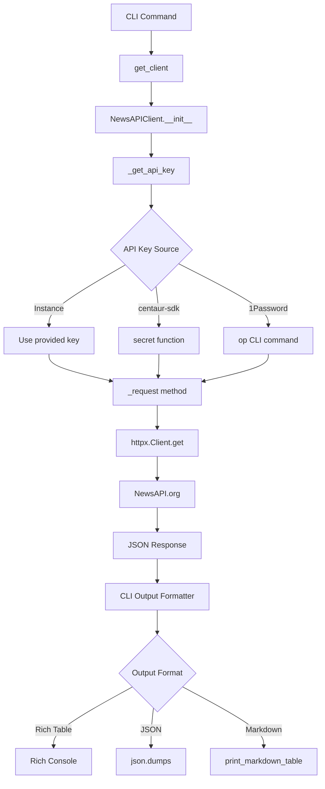

Now I have thoroughly explored the newsapi component. Let me write the comprehensive analysis.

# NewsAPI Component Analysis

## Overview

The NewsAPI component is a Python library that provides both a programmatic client and CLI interface for accessing NewsAPI.org's news aggregation service. It implements a clean separation between the HTTP client logic and CLI interface, with robust error handling and multiple output formats for news headlines, article search, and source listings.

## Architecture

The component follows a **layered architecture** pattern with clear separation of concerns:

- **Client Layer** (`client.py`): Handles HTTP communication with NewsAPI.org
- **CLI Layer** (`cli.py`): Provides command-line interface with multiple output formats
- **Configuration Layer**: Integrates with centaur-sdk for secret management

The design emphasizes reusability, with the client class (`NewsAPIClient`) being fully usable as a library component independent of the CLI interface.

## Key Components

### NewsAPIClient Class
**Location**: `tools/research/newsapi/client.py`  
**Purpose**: Core HTTP client that wraps the NewsAPI.org REST API

The client provides three main API methods:
- `headlines()`: Fetches top headlines with country/category/source filtering
- `search()`: Full-text search across all articles with date ranges and sorting
- `sources()`: Lists available news sources with filtering capabilities

The client implements automatic API key resolution through multiple sources (instance variable, centaur-sdk secrets, 1Password CLI) and includes comprehensive error handling for HTTP and API-level errors.

### CLI Command Interface
**Location**: `tools/research/newsapi/cli.py`  
**Purpose**: Typer-based CLI providing three main commands

- **headlines**: Retrieves top headlines with filtering options
- **search**: Performs article search with comprehensive query parameters  
- **sources**: Lists available news sources with filtering

Each command supports multiple output formats: rich tables (default), JSON, and markdown tables.

### Output Formatting System
The CLI includes utility functions for consistent data presentation:
- `print_markdown_table()`: Generates markdown-formatted tables
- `truncate()`: Handles text truncation for display purposes
- Integration with Rich library for enhanced terminal output

### Secret Management Integration  
The component integrates with the centaur-sdk for secure API key management, supporting environment variables and 1Password CLI as fallback mechanisms.

## Data Flows



The primary data flow starts with CLI commands that instantiate the NewsAPIClient, which handles API key resolution through multiple sources. HTTP requests flow through httpx to NewsAPI.org, with responses processed and formatted according to user preferences.

## External Dependencies

### Runtime Dependencies

- **httpx** (>=0.27.0) [networking]: HTTP client library for making API requests to NewsAPI.org. Provides async/sync support and robust error handling. Used in: `client.py` for all API communication.

- **typer** (>=0.12.0) [cli]: Modern CLI framework built on Click. Provides command parsing, argument validation, and help generation. Used in: `cli.py` for all command definitions and parameter handling.

- **rich** (>=13.0.0) [cli]: Library for rich text and beautiful formatting in terminals. Provides table formatting and styled console output. Used in: `cli.py` for creating formatted tables and console output.

### Development Dependencies

- **python-dotenv**: Environment variable loading from .env files. Used in: `cli.py` for loading environment configuration.

### Internal SDK Dependencies

- **centaur_sdk**: Provides `secret()` function for secure credential management and `Table` class for rich table formatting. Used in: `client.py` for API key retrieval and `cli.py` for table display.

### External Tool Dependencies

- **1Password CLI** (op): Optional fallback for API key retrieval when other methods fail. Used in: `client.py` through subprocess calls.

## API Surface

### Public Client Interface

```python
class NewsAPIClient:
    def __init__(self, api_key: str | None = None, timeout: float = 30.0)
    def headlines(self, country: str | None = None, category: str | None = None, 
                 sources: str | None = None, q: str | None = None, 
                 page_size: int = 20, page: int = 1) -> dict
    def search(self, q: str, sources: str | None = None, domains: str | None = None,
              from_date: str | None = None, to_date: str | None = None,
              language: str | None = None, sort_by: str = "publishedAt",
              page_size: int = 20, page: int = 1) -> dict
    def sources(self, category: str | None = None, language: str | None = None,
               country: str | None = None) -> dict
    def close(self)
```

### CLI Interface

- **newsapi headlines** - Get top headlines with country/category/source filtering
- **newsapi search** - Search articles with full-text query and advanced filtering  
- **newsapi sources** - List available news sources with filtering options

All commands support `--json`, `--markdown`, and `--limit` flags for output customization.

## External Systems

### NewsAPI.org Integration
- **Base URL**: `https://newsapi.org/v2`
- **Authentication**: API key via X-Api-Key header
- **Endpoints Used**:
  - `/top-headlines` - Top headlines by country/category/source
  - `/everything` - Full article search with advanced parameters
  - `/top-headlines/sources` - Available news sources listing
- **Rate Limits**: Handled by API key tier (not enforced in client)

### Secret Management Systems
- **centaur-sdk**: Primary secret resolution mechanism
- **1Password CLI**: Fallback secret retrieval via `op://ai-agents/NewsAPI Key/credential`
- **Environment Variables**: NEWSAPI_KEY as fallback option
