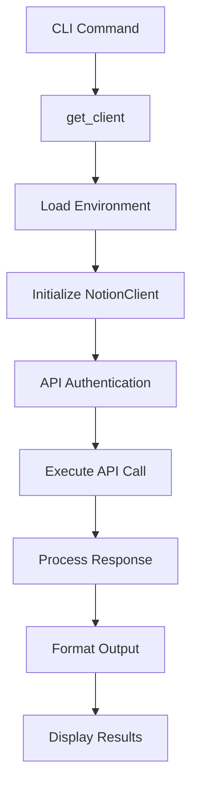
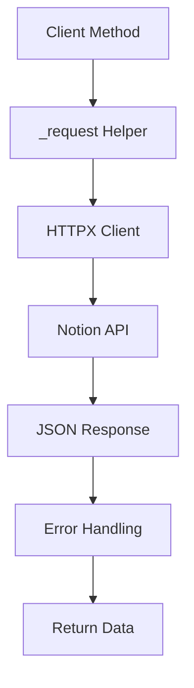
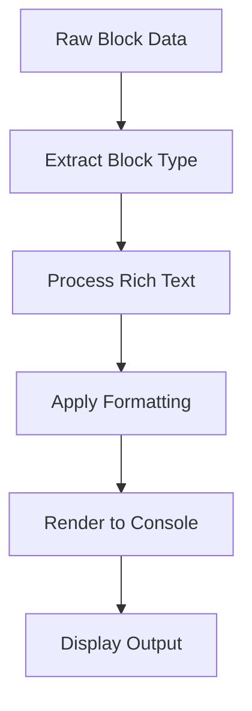

# Notion Component Analysis

The Notion component is a comprehensive CLI tool for interacting with Notion's REST API, providing command-line access to pages, databases, blocks, and comments functionality within the Notion workspace ecosystem.

## Architecture

The component follows a **layered architecture** pattern with clear separation of concerns:

- **CLI Layer**: Command definitions and user interface using Typer framework
- **Client Layer**: HTTP API wrapper for Notion's REST endpoints
- **Data Layer**: JSON-based data structures matching Notion's API schema

The architecture emphasizes modularity with the `NotionClient` providing a clean abstraction over HTTP operations, while the CLI layer focuses on user interaction and data presentation.

## Key Components

### NotionClient Class
The core API client that wraps Notion's REST API with comprehensive CRUD operations for all Notion entities. Handles authentication, request formatting, and response parsing through a unified HTTP interface using HTTPX.

### CLI Command Structure
A rich set of 17 commands organized into logical groups:
- **User commands**: `me`, `users` for workspace user management
- **Search functionality**: `search` with filtering capabilities
- **Database operations**: `db`, `query` for database schema and data access
- **Page management**: `page`, `read`, `create-page`, `append` for page lifecycle
- **Block manipulation**: `blocks`, `block`, `delete-block` for content structure
- **Comments system**: `comments`, `comment` for collaboration features
- **Archive operations**: `archive`, `restore` for content lifecycle

### Authentication System
Environment-based API key management with cascading .env file loading from CLI and repository levels, integrated with the centaur-sdk secret management system.

### Data Formatting Layer
Comprehensive text extraction and formatting utilities including rich text processing, date formatting, and ID extraction from URLs, ensuring consistent data presentation across all commands.

### Block Creation Helpers
Static factory methods for creating various Notion block types (paragraphs, headings, todos, bullets) with proper rich text formatting, enabling programmatic content creation.

## Data Flows

### Command Execution Flow

### API Request Flow

### Content Rendering Flow

## External Dependencies

### External Libraries

- **httpx** (>=0.27.0) [networking]: Modern async-capable HTTP client for making requests to Notion's REST API. Provides the underlying HTTP transport layer with automatic JSON handling and timeout management. Used in: `tools/productivity/notion/client.py`.

- **typer** (>=0.12.0) [cli]: FastAPI-based CLI framework that provides command parsing, argument validation, and help generation. Handles all CLI command definitions and user input processing. Used in: `tools/productivity/notion/cli.py`.

- **rich** (>=13.0.0) [cli]: Terminal formatting library for creating rich console output including tables, colors, and styled text. Provides the Table class and Console for formatted data display. Used in: `tools/productivity/notion/cli.py`.

- **python-dotenv** (>=1.0.0) [config]: Environment variable loader that reads .env files for configuration management. Used for loading NOTION_API_KEY from environment files in CLI context. Used in: `tools/productivity/notion/cli.py`.

## API Surface

### CLI Commands
The component exposes 17 primary commands through the `notion` CLI entry point:

- **User Management**: `me`, `users` - Display bot info and workspace users
- **Search Operations**: `search` - Query pages and databases with filtering
- **Database Operations**: `db`, `query` - Retrieve database schema and query data
- **Page Operations**: `page`, `read`, `create-page`, `append` - Full page lifecycle management
- **Block Operations**: `blocks`, `block`, `delete-block` - Content structure manipulation
- **Comment Operations**: `comments`, `comment` - Collaboration features
- **Archive Operations**: `archive`, `restore` - Content lifecycle management

### NotionClient Public API
The client class exposes methods for all major Notion API operations:

- **Search**: `search()` with query and filter parameters
- **Users**: `me()`, `users()`, `user()` for user management
- **Databases**: `database()`, `query_database()`, `create_database()`, `update_database()`
- **Pages**: `page()`, `create_page()`, `update_page()`, `archive_page()`, `restore_page()`
- **Blocks**: `block()`, `block_children()`, `append_block_children()`, `update_block()`, `delete_block()`
- **Comments**: `comments()`, `create_comment()`
- **Utilities**: `get_all_pages()`, `get_page_content()`, `extract_title()`, `extract_rich_text()`

All methods return structured JSON data matching Notion's API schema, with helper methods for common data extraction patterns.
