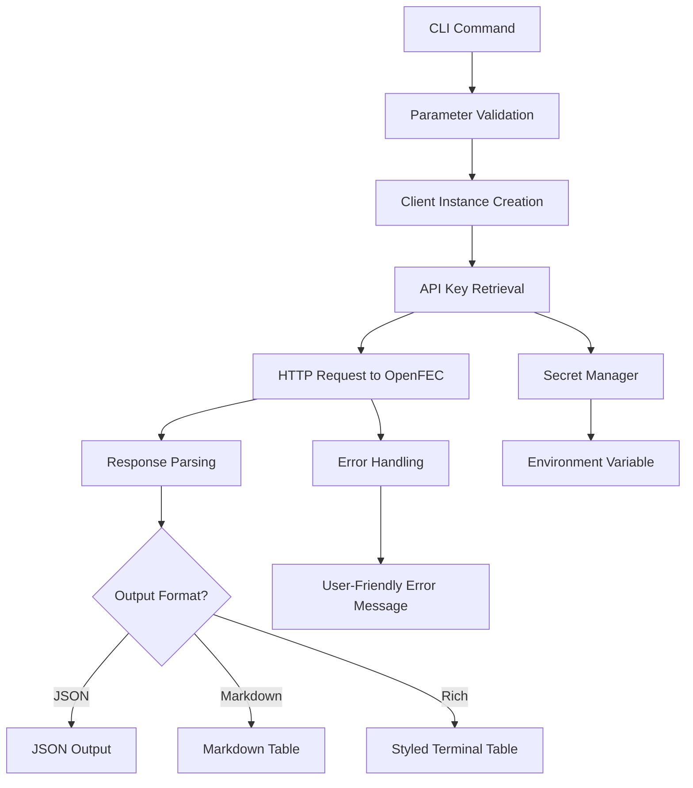

# OpenFEC Component Analysis

## Architecture

The OpenFEC component implements a **client-server library pattern** with a CLI wrapper around a REST API client. It follows a clear separation of concerns with three primary modules:

1. **Client Module**: HTTP client abstraction for the OpenFEC API
2. **CLI Module**: Command-line interface with rich output formatting
3. **Configuration Module**: Minimal configuration via environment variables

The architecture is structured as a thin wrapper around the Federal Election Commission's OpenFEC API (api.open.fec.gov), providing a Python-friendly interface for accessing federal election campaign finance data.

## Key Components

### 1. OpenFECClient (`client.py`)
The core HTTP client that manages authentication and API communication. It provides methods for searching candidates, committees, contributions, filings, and financial totals. The client uses lazy initialization for the HTTP connection and implements proper error handling with custom exceptions.

### 2. CLI Commands (`cli.py`)
A comprehensive command-line interface built with Typer that exposes six main commands:
- `candidates`: Search/list candidates with filtering options
- `candidate`: Get specific candidate by ID
- `committees`: Search committees with various filters
- `contributions`: Query itemized contributions (Schedule A data)
- `filings`: Get committee financial filings
- `totals`: Get candidate financial summaries

### 3. Output Formatting
Dual-mode output system supporting both rich terminal display and markdown tables. Uses Rich library for styled terminal output with color-coded columns and data truncation for readability.

### 4. API Authentication
Secure API key management through the Centaur SDK secret system, with fallback to environment variables. The API key is automatically appended to all requests as a query parameter.

### 5. Error Handling
Comprehensive error handling that catches HTTP status errors and request failures, converting them to user-friendly RuntimeError messages displayed in red terminal output.

### 6. Pagination Support
Built-in pagination support across all search endpoints with configurable page size and page number parameters for handling large result sets.

## Data Flows

The primary data flow follows a request-response pattern where CLI commands gather parameters, instantiate the client, make authenticated API requests, and format the response data for user consumption.

## External Dependencies

### External Libraries

- **httpx** (>=0.27.0) [networking]: Modern HTTP client library for making asynchronous and synchronous HTTP requests. Used throughout `client.py` for all API communication with the OpenFEC service. Provides better error handling and timeout support than requests. Integration points: `client.py:4`, `client.py:24-26`, `client.py:44-50`.

- **typer** (>=0.12.0) [cli]: Modern CLI framework that provides automatic help generation, type validation, and option parsing. Used to define all CLI commands and their parameters in `cli.py`. Handles command routing, argument parsing, and help text generation. Integration points: `cli.py:9`, `cli.py:13`, all command decorators `@app.command()`.

- **rich** (>=13.0.0) [cli]: Library for rich text and beautiful terminal output formatting. Used to create styled tables with colors and column formatting for displaying election data. Provides the `Console` class for error messages and `Table` class for data display. Integration points: `cli.py:10`, `cli.py:14`, table creation throughout CLI commands.

- **python-dotenv** (dev dependency): Environment variable loading from `.env` files. Used in `cli.py:5-7` to load environment variables before importing other modules. Enables local development with environment file configuration.

- **centaur-sdk** (internal): Centaur platform SDK providing secret management and CLI table utilities. Used for secure API key retrieval via `secret()` function and table formatting via `Table` class. Integration points: `client.py:5`, `cli.py:11`.

## API Surface

The component exposes two primary interfaces:

### Python API (Library Interface)
- **OpenFECClient**: Main client class with methods for all API operations
  - `search_candidates()`: Search for candidates with filtering
  - `get_candidate()`: Get specific candidate by ID
  - `search_committees()`: Search for committees
  - `get_contributions()`: Query itemized contributions
  - `get_filings()`: Get committee filings
  - `get_candidate_totals()`: Get financial summaries
  - Context manager support for resource cleanup

### CLI Interface
- **openfec**: Command-line tool with six subcommands
  - Rich terminal output with colored, formatted tables
  - JSON output option for programmatic consumption
  - Markdown table output for documentation
  - Comprehensive parameter filtering and pagination
  - Error handling with user-friendly messages

## External Systems

### OpenFEC API
The component integrates with the Federal Election Commission's OpenFEC API at `https://api.open.fec.gov/v1/`. This is a public REST API that provides access to federal election campaign finance data including:
- Candidate information and search
- Committee data and filings
- Contribution records (Schedule A)
- Financial totals and summaries

Authentication is handled via API key in query parameters, sourced from the `DATAGOV_API_KEY` environment variable managed through Centaur's secret system.

## Component Interactions

This component has no direct interactions with other components in the centaur-src codebase. It operates as a standalone library/CLI tool that only interacts with:
- The external OpenFEC API for data retrieval
- The Centaur SDK for secret management and CLI utilities
- Standard Python HTTP and CLI libraries

The component is designed to be consumed by other tools or used directly via the command line for federal election data research and analysis.
