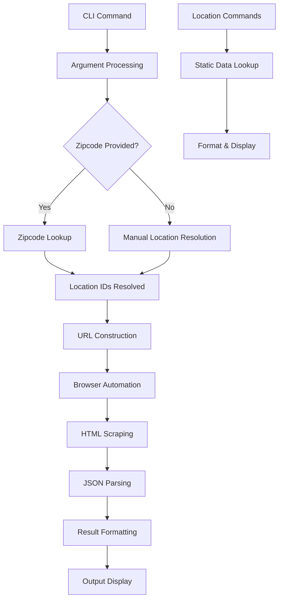

Now I have comprehensive information about the opentable component. Let me write the analysis:

# OpenTable CLI Analysis

## Architecture

The OpenTable component implements a **layered architecture** with clear separation of concerns across four main modules. The design follows a **command-action pattern** where CLI commands delegate to a client layer, which coordinates between location resolution and web scraping functionality. The architecture uses **browser automation** as the core data retrieval mechanism, scraping OpenTable's web interface rather than using official APIs.

The component employs **lazy loading** for the browser automation dependency to avoid configuration issues in sandboxed environments, and uses **synchronous wrappers** around asynchronous browser operations to maintain a simple CLI interface.

## Key Components

### CLI Interface (`cli.py`)
The primary user interface built with Typer, providing five main commands: `search`, `metros`, `regions`, `neighborhoods`, and `zipcodes`. Handles argument parsing, location resolution, output formatting (JSON, Markdown table, or rich console), and error handling. The search command supports flexible location specification via zipcode auto-configuration or manual metro/region/neighborhood selection.

### OpenTable Client (`client.py`)
A thin facade that coordinates between location services and web scraping. Provides a unified interface with methods for restaurant search and location lookups (`search`, `list_metros`, `list_regions`, `list_neighborhoods`, `list_zipcodes`, and various ID resolution methods). Acts as the main API surface for the component.

### Web Scraper (`scraper.py`)
Implements browser automation using the `browser-use` library to scrape OpenTable's search results. Contains URL construction logic, async restaurant search functionality with robust JSON parsing, and error handling for browser automation failures. Uses a cloud browser profile for consistent results.

### Location Database (`locations.py`)
Maintains static mappings for OpenTable's location hierarchy including metros (SF, NYC, LA), regions within metros, neighborhoods within regions, and zipcode-to-neighborhood mappings. Provides lookup functions for ID resolution and location enumeration across all supported geographic areas.

### Package Configuration (`pyproject.toml`)
Defines the Python package with dependencies on `typer`, `rich`, `browser-use`, and `python-dotenv`. Includes Centaur-specific configuration specifying the main module and target hosts.

## Data Flows

### Primary Search Flow
1. **Command Processing**: CLI parses arguments and validates inputs
2. **Location Resolution**: Converts zipcode/metro/region/neighborhood names to OpenTable IDs using static mappings
3. **URL Construction**: Builds OpenTable search URL with query parameters and location filters  
4. **Browser Automation**: Uses cloud browser to navigate to search page and wait for results
5. **Data Extraction**: Scrapes restaurant information using AI-powered browser agent
6. **JSON Processing**: Parses and cleans extracted data with multiple fallback strategies
7. **Output Formatting**: Renders results as rich console output, JSON, or Markdown table

### Location Lookup Flow
1. **Static Data Access**: Queries hardcoded location mappings
2. **Hierarchical Navigation**: Resolves metro → region → neighborhood relationships
3. **Output Generation**: Formats location data for display

## External Dependencies

### External Libraries

- **typer** (>=0.12.0) [cli]: Modern CLI framework providing command registration, argument parsing, type validation, and help generation. Used throughout `cli.py` for all command definitions and option handling via decorators like `@app.command()` and parameter annotations.

- **rich** (>=13.0.0) [cli]: Terminal formatting library for colored output, progress bars, and styled text. Used in `cli.py` for console output via `Console()` class and markup like `[bold cyan]` and `[yellow]` for user-friendly display formatting.

- **browser-use** (>=0.11.0) [web-automation]: AI-powered browser automation framework for web scraping. Used in `scraper.py` with lazy import to avoid configuration conflicts. Provides `Agent`, `Browser`, and `ChatBrowserUse` classes for automated web interaction and data extraction.

- **python-dotenv** (>=1.0.0) [configuration]: Environment variable management for loading `.env` files. Used in `cli.py` with `load_dotenv()` at module initialization to configure environment variables for the application.

## API Surface

### CLI Commands
- **`search`**: Main command for finding restaurant reservations with extensive filtering options (term, covers, date/time, location, sorting, output format)
- **`metros`**: Lists available metropolitan areas (sf, nyc, la) with their IDs and names
- **`regions`**: Shows regions within a specified metro area (e.g., manhattan, downtown, westside)  
- **`neighborhoods`**: Displays neighborhoods within a region with their OpenTable IDs
- **`zipcodes`**: Lists mapped zipcodes with associated neighborhood IDs, optionally filtered by metro

### Python API (OpenTableClient)
- **`search()`**: Core search method accepting location IDs, search terms, date/time, and filtering parameters
- **Location Resolution Methods**: `get_metro_id()`, `get_region_id()`, `get_neighborhood_ids()`, `get_zipcode_info()`
- **Location Listing Methods**: `list_metros()`, `list_regions()`, `list_neighborhoods()`, `list_zipcodes()`

## External Systems

### OpenTable Web Platform
The component integrates with OpenTable's public website (www.opentable.com) through browser automation, constructing search URLs with specific query parameters for filtering by location, date, party size, and search terms. No official API is used - all data retrieval occurs through web scraping.

### Cloud Browser Service  
Uses browser-use's cloud browser infrastructure with a hardcoded profile ID (`1da1d19b-4fa4-4f7a-bc2e-f3854df9db0b`) and US proxy settings for consistent browser environments and avoiding detection by anti-bot measures.

## Component Interactions

This component operates independently with no calls to other components in the centaur-src codebase. It functions as a standalone CLI tool that only interacts with external web services through browser automation.
